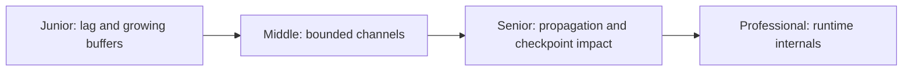
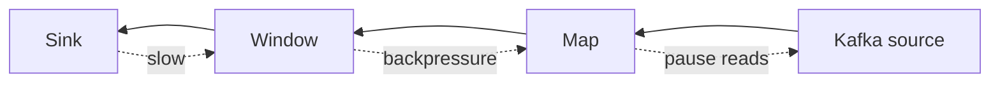

# Streaming Backpressure

> Streaming backpressure is the runtime response when a downstream operator
> cannot drain records as quickly as upstream operators produce them.

## Choose a level

| Level | Guide | You are done when |
|---|---|---|
| Junior | [When the sink slows](junior.md) | You can distinguish lag, buffering, and backpressure. |
| Middle | [Bounded operator channels](middle.md) | You can trace pressure through a Flink-style graph. |
| Senior | [Failure and tuning](senior.md) | You can diagnose skew, checkpoint delay, and source throttling. |
| Professional | [Runtime flow control](professional.md) | You can compare Flink, Reactive Streams, and Spark behavior. |

## Practice rule

Locate the first saturated downstream operator before scaling the source. More
input parallelism usually makes an uncorrected downstream bottleneck worse.

## Related

- [Generic Back-Pressure](../../asynchronism/03-back-pressure/README.md)
- [Stream Graph](../stream-graph/README.md)
