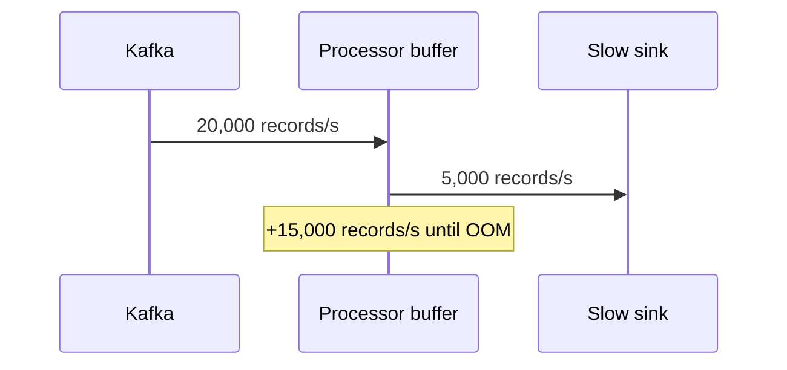

# Streaming Backpressure - Junior

> What happens when a warehouse sink can write 5,000 rows/s but Kafka supplies
> 20,000 events/s?

The naive pipeline keeps consuming and stores the difference in memory. The
backlog grows by 15,000 records every second. A temporary buffer absorbs a
short spike; it cannot solve sustained overload.

Three measurements describe different parts of the problem:

- **consumer lag** is durable input still waiting in Kafka;
- **buffer occupancy** is work already admitted into the job;
- **backpressure** is the mechanism that slows upstream admission when bounded
  downstream capacity is exhausted.

Without backpressure, the job may appear healthy while memory grows, then crash
and replay the same backlog. Silent dropping avoids memory failure but violates
data correctness. The open question is how to slow a source without blocking
every worker or losing records.

## Test yourself

1. At the stated rates, how many records accumulate after one minute?
2. Why can a larger buffer only delay a sustained-overload failure?
3. How does Kafka lag differ from in-process buffer occupancy?

Continue to [`middle.md`](middle.md).
