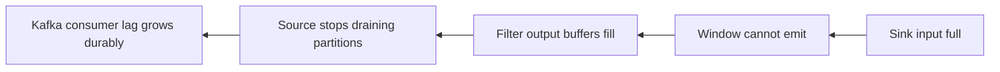

# Streaming Backpressure - Middle

> How do bounded channels propagate a slow sink's capacity upstream?

Flink connects tasks with bounded network buffers. When a sink stops consuming,
its input fills. The upstream task cannot obtain output buffers, becomes
backpressured, and eventually stops draining its own inputs. Pressure reaches the
Kafka source, which polls less aggressively while offsets remain safely in Kafka.

Use runtime metrics before changing capacity:

| Signal | Meaning |
|---|---|
| Sink busy near 100% | likely bottleneck |
| Upstream backpressured | symptom propagated from downstream |
| All tasks busy, no pressure | compute-bound graph |
| One subtask busy | partition or key skew |

A practical response is to increase safe sink batching, reduce per-record calls,
or scale sink partitions if the destination supports concurrent writes. Raising
Kafka source parallelism does not increase the sink's service rate.

Keep queues bounded. Kafka is already the durable backlog; duplicating hours of
records inside process memory makes recovery slower and less observable.

## Test yourself

1. Why does pressure travel opposite to record flow?
2. Where should backlog live when a Kafka-backed job is overloaded?
3. Which metric pattern suggests skew rather than total capacity shortage?

Continue to [`senior.md`](senior.md).
