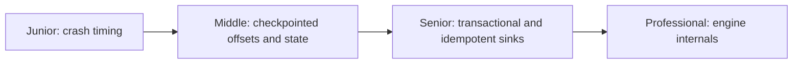
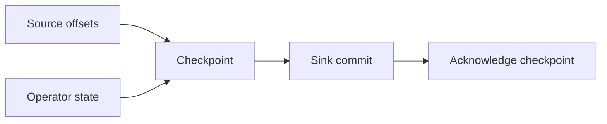

# Stream-Processing Delivery Guarantees

> End-to-end delivery is correct only when input progress, operator state, and
> sink effects cross failures as one consistent recovery boundary.

## Choose a level

| Level | Guide | You are done when |
|---|---|---|
| Junior | [The crash gap](junior.md) | You can explain loss and duplication around offset commits. |
| Middle | [Consistent checkpoints](middle.md) | You can restore source position and state together. |
| Senior | [End-to-end sink correctness](senior.md) | You can choose transactions, idempotency, or deduplication. |
| Professional | [Recovery protocols](professional.md) | You can compare Flink, Kafka Streams, and Spark guarantees. |

## Practice rule

Never label a job exactly-once until you can describe the crash between its sink
write and source-progress commit.

## Related

- [Broker Delivery Guarantees](../../asynchronism/05-delivery-guarantees/README.md)
- [Stateful Computation](../stateful-computation/README.md)
