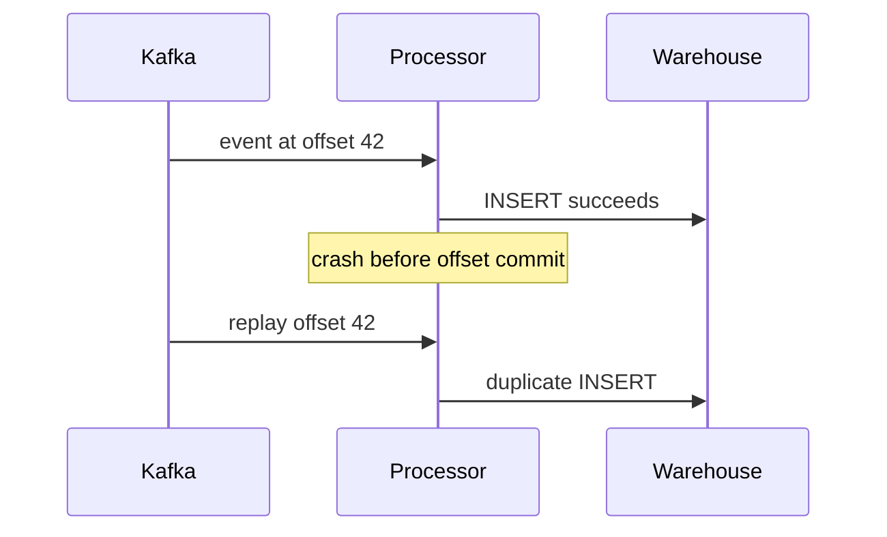

# Stream-Processing Delivery Guarantees - Junior

> Why can a Kafka-to-warehouse job duplicate or lose rows even when Kafka itself
> retains every event?

A naive consumer writes a row, then commits its Kafka offset. A crash between
those actions causes replay and a duplicate. Reversing the order creates loss:
the offset may be committed before the row exists.

At-most-once commits progress first and may lose effects. At-least-once commits
after processing and may repeat effects. Exactly-once **processing effect**
requires coordination or a sink that recognizes replayed writes.

The guarantee belongs to the whole path, not just Kafka or Flink. A broker can
deliver reliably while a non-idempotent warehouse statement duplicates data.

## Test yourself

1. Which crash point creates a duplicate in the sequence above?
2. Why can committing the offset first lose a warehouse update?
3. Why is a broker guarantee not an end-to-end pipeline guarantee?

Continue to [`middle.md`](middle.md).
