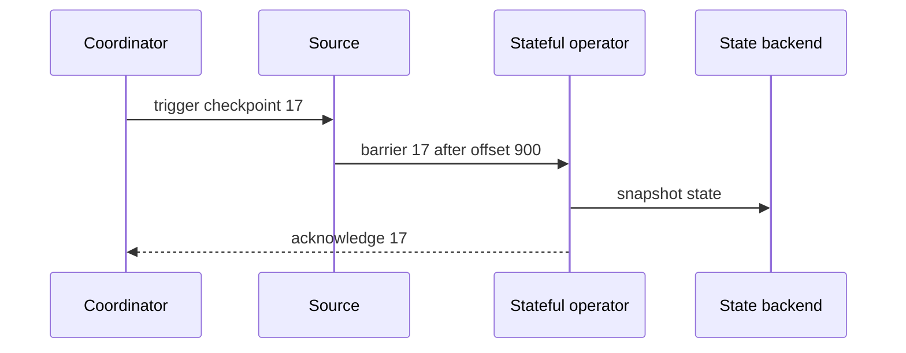

# Stream-Processing Delivery Guarantees - Middle

> How does a checkpoint restore source offsets and state to one logical instant?

Flink injects checkpoint barriers into source streams. Stateful operators
snapshot after receiving the barrier on each input, then forward it. A completed
checkpoint records both Kafka positions and operator state.



After failure, the job loads checkpoint 17 and resumes from its recorded offsets.
Events processed after that checkpoint replay, but state changes after it are
discarded, so source and state remain consistent.

```java
env.enableCheckpointing(30_000);
env.getCheckpointConfig().setCheckpointingMode(
    CheckpointingMode.EXACTLY_ONCE);
```

This setting does not automatically make an arbitrary sink exactly-once. It
protects engine-managed state and source progress. The sink still needs a commit
protocol or replay-safe effects.

## Test yourself

1. What two things must a checkpoint restore consistently?
2. Why do post-checkpoint events replay after failure?
3. What does Flink's exactly-once checkpoint mode not guarantee by itself?

Continue to [`senior.md`](senior.md).
