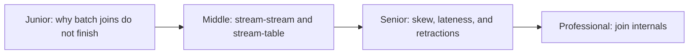
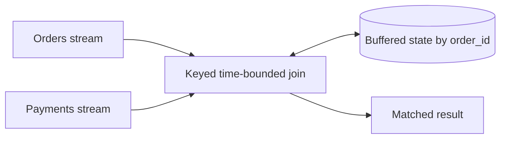

# Streaming Join Operations

> A streaming join must retain unmatched records long enough for their partners
> to arrive, while bounding state and defining what late corrections mean.

## Choose a level

| Level | Guide | You are done when |
|---|---|---|
| Junior | [The unbounded join problem](junior.md) | You can explain why unmatched stream records need retention. |
| Middle | [Join types](middle.md) | You can choose stream-stream, stream-table, or temporal joins. |
| Senior | [Correct and bounded joins](senior.md) | You can handle late matches, skew, nulls, and corrections. |
| Professional | [Join runtime internals](professional.md) | You can compare Flink, Kafka Streams, and Beam joins. |

## Practice rule

Every streaming join needs explicit keys, time bounds, version semantics, state
retention, unmatched-row policy, and output revision behavior.

## Related

- [Window Computation](../windown-computation/README.md)
- [Stateful Computation](../stateful-computation/README.md)
