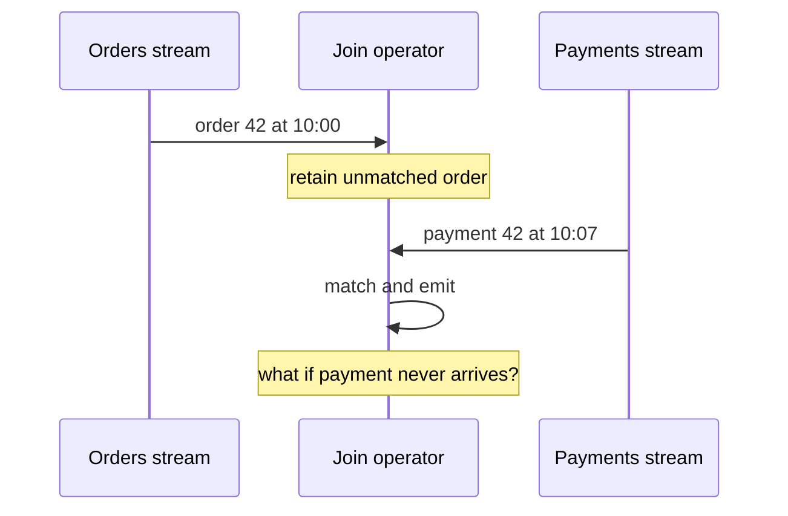

# Streaming Join Operations - Junior

> How long should an order wait for a payment that may arrive later?

In a batch join, both finite tables are available. In streaming, an order arrives
now, its payment may arrive minutes later, and neither input ever ends. A naive
dictionary keeps every unmatched row forever.

The join key decides which records can meet. A time bound decides how long the
engine retains candidates. Without a bound, state grows with every unmatched
order. With a bound, very late payments may miss their match.

Duplicate keys can also create many-to-many output: three order updates and four
payment updates can produce twelve pairs unless semantics identify current
versions.

## Test yourself

1. Why can a streaming join not wait for an input to finish?
2. What correctness trade-off does a time bound introduce?
3. How can duplicate keys multiply join output?

Continue to [`middle.md`](middle.md).
