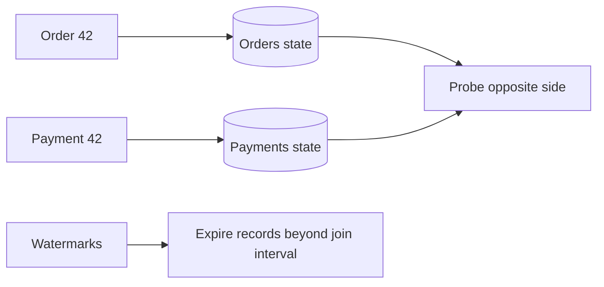

# Streaming Join Operations - Middle

> Which join model matches two changing streams versus a stream and reference
> state?

| Join | Stored state | Example |
|---|---|---|
| Stream-stream | recent records from both sides | orders with payments |
| Stream-table | latest table value | click enriched with current customer |
| Temporal table | version valid at event time | order with historical price |
| Broadcast | small reference copied to tasks | country-code lookup |

```sql
SELECT o.order_id, o.amount, p.payment_id
FROM orders o
JOIN payments p
ON o.order_id = p.order_id
AND p.event_time BETWEEN o.event_time AND o.event_time + INTERVAL '15' MINUTE;
```



Both inputs must be partitioned compatibly by `order_id`; otherwise a shuffle is
required. Watermarks and the interval allow cleanup once no on-time counterpart
can still match. A stream-table join instead probes the latest materialized
reference value and may not reproduce historical truth after reference changes.

## Test yourself

1. Why does a stream-stream join store both inputs?
2. When is a temporal-table join preferable to a latest-value join?
3. How do watermarks enable state cleanup?

Continue to [`senior.md`](senior.md).
