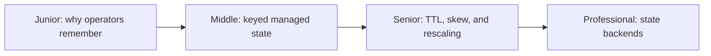
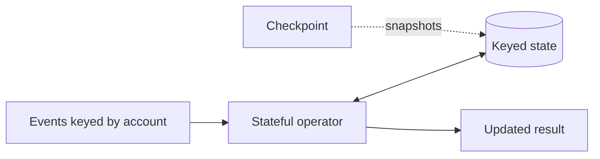

# Stateful Computation

> Stateful stream processing remembers information across records while making
> that memory partitionable, durable, recoverable, and eventually removable.

## Choose a level

| Level | Guide | You are done when |
|---|---|---|
| Junior | [Why state exists](junior.md) | You can identify state needed for aggregation and deduplication. |
| Middle | [Managed keyed state](middle.md) | You can implement keyed state and explain checkpoints. |
| Senior | [State lifecycle](senior.md) | You can handle TTL, skew, schema changes, and rescaling. |
| Professional | [Backend internals](professional.md) | You can compare Flink and Kafka Streams state architecture. |

## Practice rule

For every state entry, define its key, owner, update rule, recovery source,
maximum lifetime, schema version, and migration path.

## Related

- [Window Computation](../windown-computation/README.md)
- [Delivery Guarantees](../delivery-gurantees/README.md)
