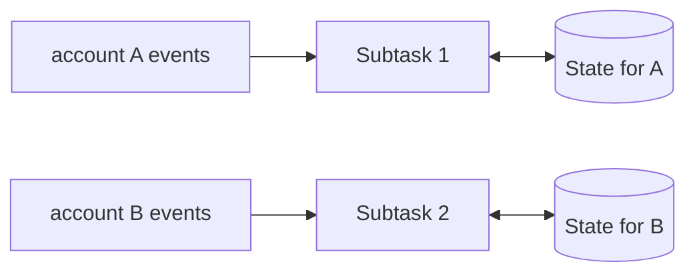

# Stateful Computation - Middle

> How does keyed managed state give each key one logical owner and durable
> recovery?

After `keyBy(account_id)`, Flink routes equal keys to the same subtask. Runtime
state APIs automatically scope values to the current key.

```java
public class RunningRevenue extends KeyedProcessFunction<String, Order, Total> {
  private ValueState<Long> cents;

  public void open(Configuration ignored) {
    cents = getRuntimeContext().getState(
        new ValueStateDescriptor<>("revenue-cents", Long.class));
  }

  public void processElement(Order order, Context ctx, Collector<Total> out)
      throws Exception {
    long next = (cents.value() == null ? 0 : cents.value()) + order.cents();
    cents.update(next);
    out.collect(new Total(ctx.getCurrentKey(), next));
  }
}
```



Checkpoints persist state plus source progress. On restart or rescale, the engine
restores the key ranges assigned to each task. Managed state can use heap or an
embedded backend; the API remains stable while performance changes.

## Test yourself

1. What does `keyBy` guarantee for one account's state updates?
2. Why is managed state easier to rescale than a private dictionary?
3. Which information must recover alongside the state snapshot?

Continue to [`senior.md`](senior.md).
