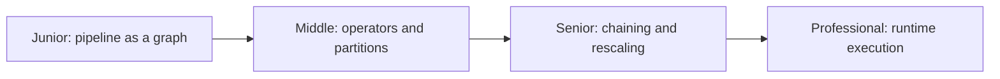
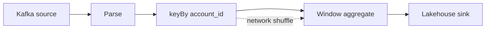

# Stream Graph

> A stream graph is the directed operator topology that turns source records
> into results; its edges determine partitioning, serialization, and failure
> boundaries as much as its nodes determine business logic.

## Choose a level

| Level | Guide | You are done when |
|---|---|---|
| Junior | [From steps to a graph](junior.md) | You can identify sources, transformations, and sinks in a streaming DAG. |
| Middle | [Operators and partitioning](middle.md) | You can explain operator parallelism, chaining, and shuffles. |
| Senior | [Safe topology evolution](senior.md) | You can reason about skew, rescaling, and state compatibility. |
| Professional | [Execution internals](professional.md) | You can compare Flink, Kafka Streams, and Beam execution models. |

## Practice rule

Draw every repartition edge. A hidden shuffle is often the largest latency,
network, state-movement, and recovery cost in the graph.

## Related

- [Backpressure](../backpressure/README.md)
- [Stateful Computation](../stateful-computation/README.md)
