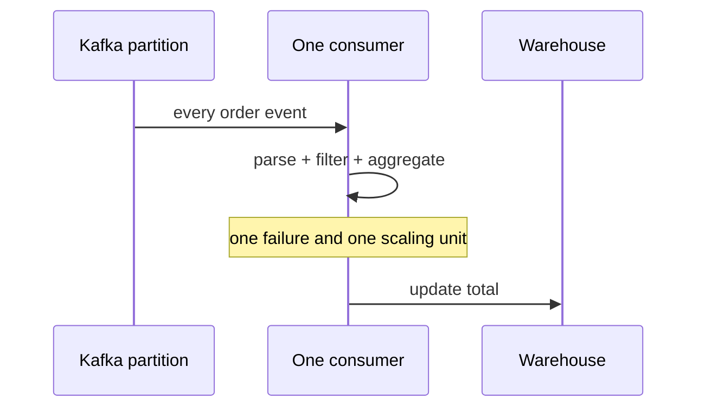

# Stream Graph - Junior

> Why is a streaming pipeline more than a list of functions?

Suppose a Debezium topic feeds a live order dashboard. The first design often
looks like one consumer function: parse an event, filter cancelled orders,
aggregate revenue, and write a result. That hides where data moves and where
state lives.

A stream graph makes each role explicit:

- a **source** reads records and tracks progress;
- a **transformation** maps, filters, or enriches records;
- a **keying edge** groups records that need the same state;
- a **stateful operator** updates aggregates or joins;
- a **sink** commits results to another system.

The naive single-function design breaks when parsing could scale to eight tasks
but one account's aggregate must remain ordered in one place. It also gives no
clear checkpoint boundary: after a crash, which source offsets correspond to
which warehouse updates?

The graph is therefore an execution contract, not merely documentation. It
reveals which steps can run independently and which require coordination.

## Test yourself

1. Identify the source, stateful operator, and sink in the order example.
2. Why can parsing and keyed aggregation need different parallelism?
3. Which correctness question is hidden by one large consumer function?

Continue to [`middle.md`](middle.md).
