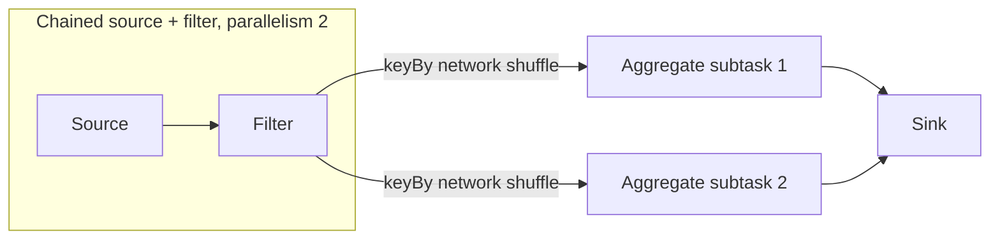

# Stream Graph - Middle

> How do operators, task slots, and partitioning edges turn a logical graph into
> physical execution?

In Flink, a logical operator can have many parallel subtasks. Compatible
one-to-one operators may be chained into one task and thread. `keyBy` introduces
a repartition: records are serialized and sent over the network so equal keys
reach the same downstream key group.

```java
DataStream<Order> orders = env.fromSource(source, watermarkStrategy, "orders");

orders
    .filter(order -> order.status() != CANCELLED)
    .keyBy(Order::accountId)
    .window(TumblingEventTimeWindows.of(Duration.ofMinutes(5)))
    .aggregate(new RevenueAggregate())
    .sinkTo(sink);
```



| Edge | Distribution | Typical use |
|---|---|---|
| Forward | Same upstream/downstream partition | Chain stateless operators |
| Rebalance | Round-robin | Evenly distribute independent work |
| Keyed | Hash/key-group routing | Colocate state for a key |
| Broadcast | Copy to every task | Rules or reference configuration |

Parallelism is not record-level concurrency everywhere. A keyed operator
serializes updates for each key even while different keys execute across many
subtasks. Kafka source parallelism is also capped by available partitions.

## Test yourself

1. Why does `keyBy` normally require serialization and a network shuffle?
2. When can Flink chain two operators into one task?
3. Why cannot 100 source subtasks fully consume a 12-partition Kafka topic?

Continue to [`senior.md`](senior.md).
