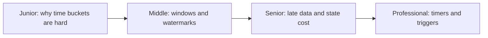
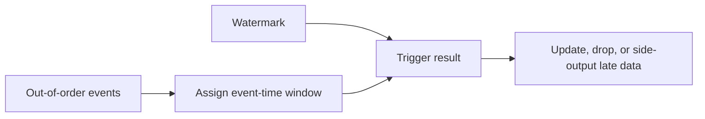

# Window Computation

> Windows turn an unbounded stream into finite groups, but event-time results are
> defined as much by watermarks and lateness policy as by window size.

## Choose a level

| Level | Guide | You are done when |
|---|---|---|
| Junior | [Processing time versus event time](junior.md) | You can explain why arrival-time buckets change after delays. |
| Middle | [Windows and watermarks](middle.md) | You can configure tumbling, sliding, and session windows. |
| Senior | [Lateness and correctness](senior.md) | You can choose triggers, allowed lateness, and retention. |
| Professional | [Runtime window internals](professional.md) | You can compare Flink, Beam, and Kafka Streams semantics. |

## Practice rule

Every window specification must include time domain, watermark strategy,
allowed lateness, trigger, accumulation mode, and finality contract.

## Related

- [Stateful Computation](../stateful-computation/README.md)
- [Join Operations](../join-operation/README.md)
