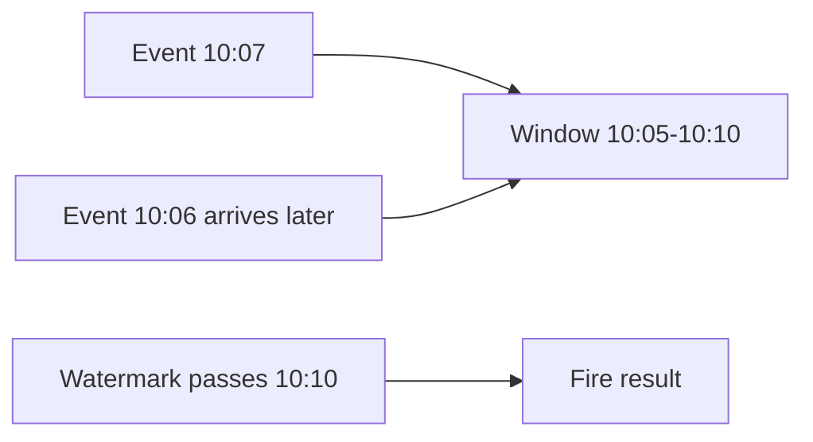

# Window Computation - Middle

> How do window assigners and watermarks produce finite event-time results?

| Window | Shape | Typical use |
|---|---|---|
| Tumbling | fixed, non-overlapping | revenue per minute |
| Sliding | fixed size, overlapping slides | rolling 15-minute rate |
| Session | gap-delimited per key | user activity sessions |
| Global | one logical window plus triggers | custom incremental logic |

```java
events
    .assignTimestampsAndWatermarks(
        WatermarkStrategy.<Event>forBoundedOutOfOrderness(Duration.ofMinutes(2))
            .withTimestampAssigner((event, previous) -> event.eventTime()))
    .keyBy(Event::accountId)
    .window(TumblingEventTimeWindows.of(Duration.ofMinutes(5)))
    .aggregate(new RevenueAggregate());
```

A watermark of 10:10 means the engine believes future events at or before 10:10
are unlikely. It is a progress estimate, not a guarantee. A five-minute window
ending at 10:10 can now fire according to its trigger.



Session windows may merge when a late event bridges two sessions, so their state
and output behavior are more complex than fixed windows.

## Test yourself

1. When would a sliding window contain one event multiple times?
2. What claim does a watermark make?
3. Why can a late event merge two session windows?

Continue to [`senior.md`](senior.md).
