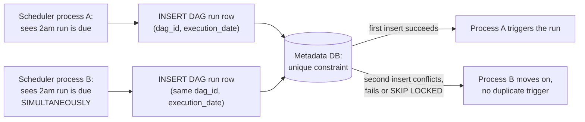
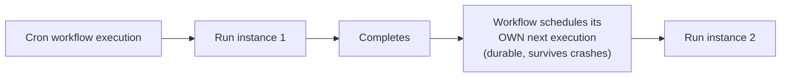

# Schedule-Driven Background Jobs — Professional

<!-- level-focus -->
At professional level, focus on this question:

> How does a production orchestrator actually guarantee exactly-once
> triggering across a cluster of scheduler processes, and what does
> Temporal's Cron implementation do differently from Airflow's model?

Prerequisite: [`senior.md`](senior.md).

---

## Airflow's actual triggering mechanism: a database, not a distributed lock

Airflow's scheduler achieves "exactly one trigger per interval" not
primarily through leader election in the classic sense, but through the
**metadata database's transactional guarantees**: multiple scheduler
processes can run concurrently (Airflow 2.0+'s HA scheduler), each
independently evaluating which DAG runs are due, but the actual **creation**
of a new DAG run row uses a database-level uniqueness constraint
(`dag_id` + `execution_date` as an effectively-unique key) combined with
row-level locking (`SELECT ... FOR UPDATE SKIP LOCKED`) — so even if two
scheduler processes simultaneously decide "the 2am run for this DAG is
due," only one successfully inserts the row; the other's insert fails
against the constraint (or it never even attempts to lock a row another
scheduler already claimed, thanks to `SKIP LOCKED`) and moves on. This is
the same database-as-coordinator pattern from the Locking & Concurrency
Control professional page, applied specifically to distributed scheduling
rather than requiring a separate consensus system.



## Temporal's Cron: scheduling as a durable workflow, not an external trigger

Temporal (a durable execution platform — see the Durable Execution
professional page for the broader concept) implements cron scheduling
fundamentally differently: a **cron workflow** is a single, long-lived
workflow execution that, upon completing one run, automatically schedules
its own next execution based on the cron expression — the "schedule" is
encoded as part of the workflow's own durable execution history, not as
external metadata a separate scheduler polls. This means catch-up
semantics, execution history, and failure handling for the *scheduling
itself* inherit Temporal's general durable-execution guarantees (the
workflow's state, including "what's the next scheduled fire time," survives
worker crashes exactly the same way any other workflow state does) —
rather than being a special-cased feature requiring its own separate
reliability engineering, as it is in most traditional schedulers.



## Production checklist (staff-level)

1. **Understand whether your scheduler's exactly-once guarantee comes from
   a database uniqueness constraint (Airflow-style) or a durable-execution
   model (Temporal-style)** before assuming a specific failure mode is
   handled — the operational recovery story differs between the two.
2. **Verify `SELECT ... FOR UPDATE SKIP LOCKED` (or your scheduler's
   equivalent concurrency-safe claiming mechanism) is actually in use**
   for any multi-scheduler-process deployment — a naive
   "check then insert" without this specific locking pattern reintroduces
   the exact race it's meant to prevent.
3. **Set `catchup`/backfill behavior explicitly per job**, per `senior.md`'s
   distinction, and audit existing jobs for an unconsidered default that
   might not match the job's actual semantics.
4. **For business processes where missing a scheduled trigger has real
   consequences (billing, compliance reporting), consider a durable-
   execution-based scheduler (Temporal)** over a traditional
   database-polling scheduler — the guarantee that scheduling state itself
   survives every failure mode a workflow does is a meaningfully stronger
   property for these specific use cases.
5. **In a postmortem for a missed or duplicated scheduled run, check the
   specific coordination mechanism (DB constraint, lock, durable workflow
   state) first**, rather than assuming a generic "scheduler bug" — the
   root cause is usually a specific, diagnosable gap in one of these
   mechanisms.

## Cheat Sheet

```text
+------------------------------------------------------------------+
|      SCHEDULE-DRIVEN BACKGROUND JOBS — INTERNALS & SCALE             |
+------------------------------------------------------------------+
| Airflow HA scheduler: multiple scheduler processes run concurrently,  |
| exactly-once triggering enforced via the METADATA DATABASE'S own      |
| uniqueness constraint + SELECT...FOR UPDATE SKIP LOCKED - a           |
| database-as-coordinator pattern, not a separate consensus system      |
+------------------------------------------------------------------+
| Temporal Cron: scheduling encoded as part of a DURABLE WORKFLOW's      |
| own execution history - the workflow schedules its own next run on     |
| completion, inheriting Temporal's general crash-survival guarantees   |
| rather than requiring separate scheduler-reliability engineering       |
+------------------------------------------------------------------+
| catchup=True/False is a BUSINESS-LOGIC decision per job, not a         |
| technical default - backfilling missed runs is correct for some       |
| jobs (must-process-every-interval) and actively wrong for others       |
| (time-sensitive checks that are meaningless once their window passes) |
+------------------------------------------------------------------+
```

## Test yourself

1. Explain precisely why `SELECT ... FOR UPDATE SKIP LOCKED` (rather than a
   plain `SELECT` followed by an `INSERT`) is necessary to prevent two
   concurrent Airflow scheduler processes from both triggering the same DAG
   run.
2. Why does Temporal's approach to cron scheduling not require a separate
   "what if the scheduler process crashes" failure-mode analysis, the way
   a traditional external scheduler does?
3. A billing job that must run exactly once per day, every day, missed 3
   days due to a scheduler outage. Which scheduling architecture from this
   page would you recommend for this specific use case, and why?

## Further Reading

- Apache Airflow documentation — "Scheduler HA" and "DAG Catchup" (the
  specific database-level concurrency mechanism and catchup semantics).
- Temporal documentation — "Cron Workflows" (durable-execution-based
  scheduling).
- See also: [Durable Execution (Temporal)](../05-durable-execution-temporal/README.md),
  [Leader Election — professional](../../consensus/leader-election/professional.md).
