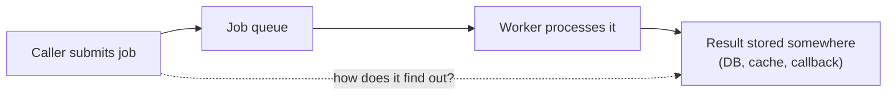

# Returning Results from Background Jobs

> A background job, by definition, doesn't return a value the way a normal
> function call does — the caller has already moved on. Getting the result
> back (or knowing when it's done) requires an explicit mechanism, and
> picking the wrong one is a common source of silently-lost work.

## Choose a level

| Level | Guide | You are done when |
|---|---|---|
| Junior | [Fire-and-forget vs. needing a result](junior.md) | You can identify which of your background jobs actually need to report a result back. |
| Middle | [Polling vs. callbacks](middle.md) | You can compare polling and webhook/callback patterns for retrieving a job's result. |
| Senior | [Result storage and TTLs](senior.md) | You can explain what happens if a caller checks for a result after it's already expired or been evicted. |
| Professional | [Result-backend internals at scale](professional.md) | You can design a result-retrieval system for a high-volume job queue (e.g. Celery's result backend). |

## Practice rule

Before submitting any background job, ask: "does anything actually need to
know the outcome of this specific job, and by when?" If the honest answer
is "no, it's genuinely fire-and-forget," don't build result-retrieval
machinery you don't need — it's a real, avoidable cost.

## Related

- [Event-Driven Background Jobs](../../event-streaming/events-driven/01-event-driven/README.md)
- [Retries & Idempotency](../04-retries-and-idempotency/README.md)
