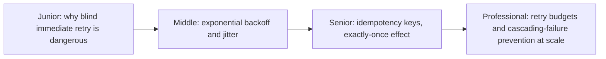
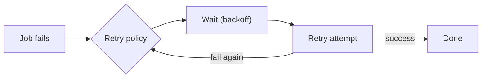

# Retries & Idempotency

> A failed job usually deserves another try — but retrying blindly can turn
> one failure into a cascading pile-on, and re-running a job that already
> partially succeeded can duplicate its side effects. Retries and
> idempotency are two techniques that must be designed together.

## Choose a level

| Level | Guide | You are done when |
|---|---|---|
| Junior | [Why blind retry is dangerous](junior.md) | You can explain why retrying immediately, without delay, can make an outage worse. |
| Middle | [Exponential backoff and jitter](middle.md) | You can explain why jitter is necessary in addition to exponential backoff. |
| Senior | [Idempotency keys](senior.md) | You can design an idempotency key so a retried job doesn't duplicate its side effects. |
| Professional | [Retry budgets at scale](professional.md) | You can design a retry policy that prevents cascading failure across a whole system, not just one job. |

## Practice rule

For any retry policy you configure, ask: "if every client hit this failure
at the same moment, what would the retry storm look like?" If you can't
answer with a specific, bounded number, you haven't designed the retry
policy — you've just hoped it works.

## Related

- [Event-Driven Background Jobs](../../event-streaming/events-driven/01-event-driven/README.md)
- [Circuit Breaker](../../distributed-system/reliability-patterns/01-circuit-breaker/README.md)
- [Idempotency Keys](../../distributed-system/coordination/01-idempotency-keys/README.md)
