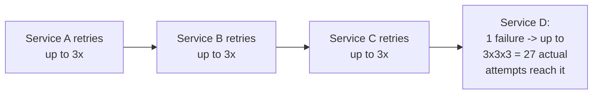
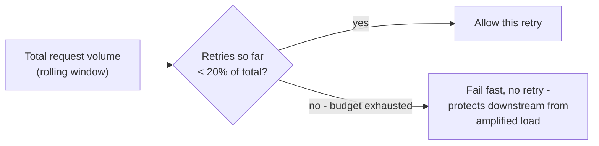

# Retries & Idempotency — Professional

<!-- level-focus -->
At professional level, focus on this question:

> How do you bound retry-amplification across an entire distributed call
> graph, not just at one client, and what is a "retry budget" concretely?

Prerequisite: [`senior.md`](senior.md).

---

## Retry amplification across a call graph

`middle.md`'s jitter fixes synchronization for **one hop**. In a multi-hop
call graph (A calls B calls C calls D), if every layer independently
retries a failure up to 3 times, the retry count **multiplies
geometrically** across hops: one failure at D can cause up to `3 × 3 × 3 =
27` actual attempts at D, and proportionally amplified load at every layer
in between — a failure that should have been contained becomes a
system-wide load spike precisely because well-intentioned per-hop retry
policies compound instead of coordinate.



## Retry budgets: capping total retry volume as a fraction of traffic

Google's SRE book and production systems at scale (Envoy proxy's
`retry_budget`, gRPC's retry throttling) implement a **retry budget**: cap
the ratio of retried requests to total requests over a rolling window
(e.g. "retries may not exceed 20% of total request volume in the last 10
seconds"), rather than a fixed per-request retry count. Once the budget is
exhausted, **further retry attempts are suppressed entirely** — the
calling service fails fast instead of retrying, specifically to prevent
the exact multi-hop amplification above from ever reaching the levels a
naive per-hop policy would allow.

```python
class RetryBudget:
    def __init__(self, window_seconds=10, max_retry_ratio=0.2):
        self.window = window_seconds
        self.max_ratio = max_retry_ratio
        self.total_requests = SlidingCounter(window_seconds)
        self.retry_requests = SlidingCounter(window_seconds)

    def allow_retry(self):
        total = self.total_requests.count()
        retries = self.retry_requests.count()
        if total == 0:
            return True
        return (retries / total) < self.max_ratio

    def record_attempt(self, is_retry):
        self.total_requests.increment()
        if is_retry:
            self.retry_requests.increment()
```



## Combining retry budgets with circuit breakers

A retry budget answers "should *this* retry attempt happen right now,"
while a [Circuit Breaker](../../20-reliability-patterns/01-circuit-breaker/README.md)
answers "should we even attempt calling this dependency at all right now."
Production resilience libraries (Envoy, resilience4j, Polly) typically
layer both: the circuit breaker provides a coarse, fast-failing gate when a
dependency is clearly unhealthy, while the retry budget fine-tunes
per-request retry behavior even while the circuit is closed (healthy) —
neither alone is sufficient: a retry budget without a circuit breaker still
sends the full first-attempt volume to a dependency that's completely
down; a circuit breaker without a retry budget doesn't prevent
amplification from many independent, small, per-hop retry policies while
the dependency is only partially degraded (not unhealthy enough to trip
the breaker).

## Production checklist (staff-level)

1. **Implement retry budgets (ratio-based, rolling-window) rather than
   fixed per-request retry counts**, for any service in a multi-hop call
   graph — fixed counts compound multiplicatively across hops in exactly
   the way this page describes.
2. **Coordinate retry policy across your call graph explicitly** — audit
   whether multiple layers are independently retrying the same underlying
   failure, and consider retrying at only one layer (typically the
   outermost client-facing one) rather than at every hop.
3. **Deploy retry budgets alongside circuit breakers, not as a substitute
   for one another** — they address different failure severities and
   compose to cover both a fully-down dependency and a partially-degraded
   one.
4. **Monitor actual retry ratio as a first-class SRE metric**, not just
   raw error rate — a rising retry ratio is a leading indicator of
   cascading risk building up before it manifests as a full outage.
5. **In a postmortem for a cascading-failure incident, map the actual
   retry multiplication across every hop in the call graph involved** —
   this is frequently the specific, quantifiable mechanism that turned a
   contained failure into a system-wide outage, and the retry-budget fix is
   usually directly actionable once the multiplication is made visible.

## Cheat Sheet

```text
+------------------------------------------------------------------+
|            RETRIES & IDEMPOTENCY — INTERNALS & SCALE                 |
+------------------------------------------------------------------+
| Retry amplification across a multi-hop call graph: per-hop retry       |
| counts MULTIPLY (3 hops x 3 retries each = up to 27x amplification    |
| at the deepest layer) - a well-intentioned per-hop policy compounds    |
| into a system-wide load spike from one contained failure                |
+------------------------------------------------------------------+
| Retry budget: cap retries as a RATIO of total request volume over a    |
| rolling window (e.g. Envoy retry_budget: retries <= 20% of traffic).   |
| Once exhausted, FAIL FAST instead of retrying further - bounds          |
| amplification structurally, unlike a fixed per-request retry count     |
+------------------------------------------------------------------+
| Retry budget != circuit breaker: budget fine-tunes per-request retry   |
| behavior even while the dependency looks healthy; circuit breaker      |
| coarsely stops calling a dependency that's clearly unhealthy - use     |
| BOTH together, they cover different failure severities                |
+------------------------------------------------------------------+
```

## Test yourself

1. In a 4-hop call graph where each hop independently retries up to 3
   times, what's the maximum amplification factor at the deepest hop, and
   why does this compound multiplicatively rather than additively?
2. Why is a retry budget's ratio-based cap fundamentally different from
   (and complementary to) a fixed "max 3 retries per request" policy?
3. Design the retry-budget and circuit-breaker configuration for a service
   calling a critical downstream dependency, explaining what each
   mechanism protects against that the other doesn't.

## Further Reading

- Google SRE Book — Chapter 22, "Addressing Cascading Failures" (retry
  budgets and cascading-failure prevention).
- Envoy proxy documentation — "Retry Policy" and `retry_budget`.
- AWS Architecture Blog — "Exponential Backoff and Jitter" (the original
  full-jitter recommendation referenced in `middle.md`).
- See also: [Circuit Breaker](../../20-reliability-patterns/01-circuit-breaker/README.md),
  [Idempotency Keys](../../18-concurrency-coordination/01-idempotency-keys/README.md).
