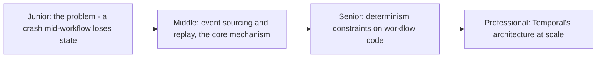
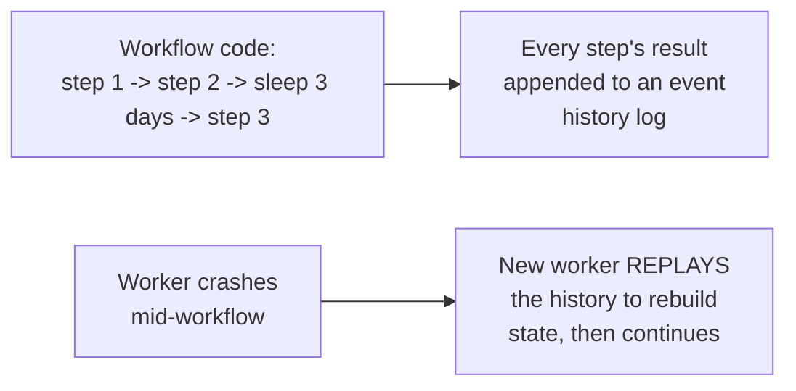

# Durable Execution (Temporal)

> Write a long-running, multi-step workflow as plain code — loops,
> conditionals, sleeps spanning days — and have the platform guarantee it
> survives crashes, deploys, and restarts, resuming exactly where it left
> off. Durable execution turns "reliability" from something you hand-code
> per workflow into a property of the runtime.

## Choose a level

| Level | Guide | You are done when |
|---|---|---|
| Junior | [The problem: crashes lose state](junior.md) | You can explain why a plain long-running script loses all progress on a crash, and why that's unacceptable for some workflows. |
| Middle | [Event sourcing and replay](middle.md) | You can explain how replaying a history of past events reconstructs a workflow's exact state after a crash. |
| Senior | [Determinism constraints](senior.md) | You can explain why workflow code can't call `random()` or the current time directly, and what to use instead. |
| Professional | [Temporal's architecture at scale](professional.md) | You can explain the roles of workers, the Temporal server, and task queues in a production deployment. |

## Practice rule

Before writing a long-running background process by hand (a loop with
sleeps, retries, and multi-day waits), ask: "if this process crashes at any
line, can it resume exactly where it left off without redoing completed
work or losing state?" If the honest answer is no, that's precisely the gap
durable execution platforms exist to close.

## Related

- [Schedule-Driven Background Jobs](../02-schedule-driven/README.md)
- [Saga: Orchestration vs Choreography](../../distributed-transaction/07-saga-orchestration-vs-choreography/README.md)
