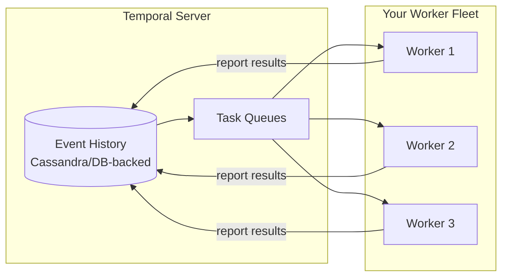
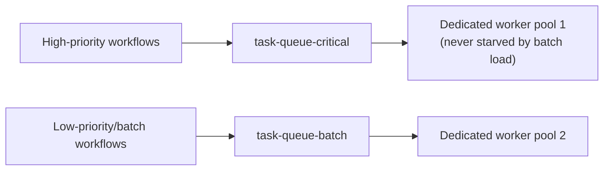
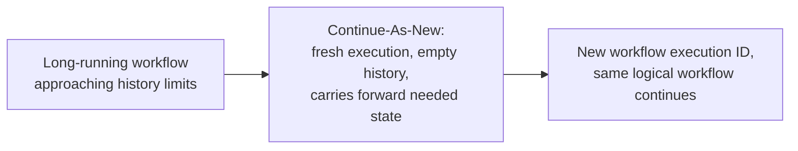

# Durable Execution — Professional

<!-- level-focus -->
At professional level, focus on this question:

> How does Temporal's actual production architecture (server, workers,
> task queues) separate durability from execution, and what does this mean
> for scaling and failure isolation?

Prerequisite: [`senior.md`](senior.md).

---

## Separation of concerns: the Temporal server owns history, workers own execution

Temporal's architecture cleanly separates two responsibilities that a
hand-rolled durable-execution system (`junior.md`'s manual approach) would
conflate:

- **The Temporal server** (backed by a durable datastore — Cassandra or a
  relational database) owns the **event history** exclusively — it never
  executes any of your business logic; its job is purely to durably persist
  events and hand out **tasks** (units of work: "this workflow needs its
  next decision" or "this activity needs to run") to workers via **task
  queues**.
- **Workers** (your own deployed processes, running the Temporal SDK)
  poll task queues, execute the actual workflow/activity code (including
  the replay mechanism from `middle.md`), and report results back to the
  server to be durably appended to history.



This separation is what makes **worker deployments and crashes
operationally uneventful**: workers are stateless with respect to any
individual workflow — any worker can pick up any task from a shared queue,
so deploying a new version of your worker code, scaling worker count up or
down, or losing workers to crashes never risks losing workflow progress,
because the server's durable history (not any individual worker's memory)
is the sole source of truth.

## Task queues as the scaling and isolation unit

Task queues are also the primary **capacity isolation** mechanism: routing
different workflow types (or different tenants, or different priority
tiers) to **different task queues**, each with its own dedicated worker
pool, means a slow or misbehaving workflow type consuming excessive worker
capacity doesn't starve unrelated workflow types — the same "blast radius
containment" principle from the Database Federation professional page,
applied to a workflow execution platform specifically.



## History size limits and Continue-As-New

A workflow's event history isn't unbounded in practice — Temporal
documents specific size/event-count limits (historically around 50,000
events or 50MB per workflow execution history), because replay cost
(`middle.md`) grows with history size, and an unbounded history eventually
makes replay itself prohibitively slow. Long-running or high-iteration
workflows (e.g. a loop processing millions of items over months) must use
**Continue-As-New**: the workflow explicitly starts a **fresh** execution
with a new, empty history, carrying forward only the specific state it
needs — a deliberate, application-level reset of the replay cost, analogous
to log compaction/snapshotting in the Raft professional page, just
initiated by the workflow author rather than automatically by the platform.



## Production checklist (staff-level)

1. **Design task queue topology deliberately around isolation
   requirements** (workflow type, tenant, priority tier) before deploying
   at scale — a shared task queue for everything reproduces the "one
   workload starves another" risk this architecture is specifically built
   to avoid.
2. **Monitor workflow history size proactively and implement
   Continue-As-New before hitting platform limits**, for any workflow with
   unbounded iteration or very long lifetimes — this is a known, documented
   limit, not a surprising failure mode to discover in production.
3. **Treat workers as fully stateless and disposable** in your deployment
   model — the architecture is specifically designed to make worker
   crashes/redeploys safe; building any out-of-band assumption about
   worker affinity to specific workflows undermines this guarantee.
4. **Size worker pool capacity per task queue based on the specific
   workflow/activity types routed to it**, not a single global pool
   sizing — different workflow types have different resource and
   concurrency profiles.
5. **In an architecture review for adopting durable execution, explicitly
   evaluate it against the manual persistence approach from `junior.md`
   for your specific workflow's complexity and lifetime** — durable
   execution platforms have real operational overhead (running the
   Temporal server, worker fleets); simple, short-lived workflows may not
   need this machinery, while complex, long-running ones benefit
   substantially.

## Cheat Sheet

```text
+------------------------------------------------------------------+
|            DURABLE EXECUTION — INTERNALS & SCALE                     |
+------------------------------------------------------------------+
| Temporal server: owns EVENT HISTORY only (durable datastore),          |
| never executes business logic. Workers: poll TASK QUEUES, execute      |
| workflow/activity code, report results back. Workers are STATELESS    |
| with respect to individual workflows - any worker can pick up any      |
| task -> crashes/deploys/scaling are operationally uneventful           |
+------------------------------------------------------------------+
| Task queues = the capacity ISOLATION unit: route different             |
| workflow types/tenants/priorities to separate queues + dedicated       |
| worker pools, so one workload can't starve another                     |
+------------------------------------------------------------------+
| History has real SIZE LIMITS (~50k events/50MB) because replay cost    |
| grows with history size. Long-running/high-iteration workflows use     |
| CONTINUE-AS-NEW: explicitly start a fresh execution with empty          |
| history, carrying forward needed state - an author-initiated reset    |
| of replay cost, analogous to log compaction/snapshotting              |
+------------------------------------------------------------------+
```

## Test yourself

1. Why does the Temporal server never executing business logic itself make
   worker deployments and crashes operationally uneventful, in a way a
   monolithic "the server runs your code" architecture wouldn't?
2. Design a task-queue topology for a system running both critical,
   latency-sensitive workflows and large, long-running batch workflows on
   the same Temporal deployment.
3. Why does an unbounded-iteration workflow eventually need Continue-As-New,
   and what specific cost does it reset?

## Further Reading

- Temporal documentation — "Temporal Platform architecture," "Task Queues,"
  and "Continue-As-New."
- Uber Engineering blog — "Cadence" (Temporal's predecessor/origin at
  Uber) architecture and production lessons.
- See also: [Raft — professional](../../consensus/raft/professional.md)
  (log compaction, an analogous pattern), [Saga: Orchestration vs
  Choreography](../../distributed-transaction/07-saga-orchestration-vs-choreography/README.md).
