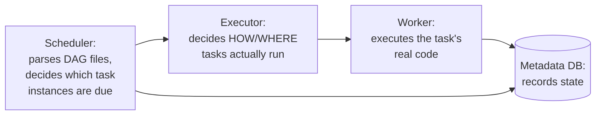
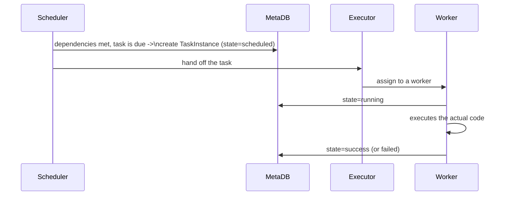

# Airflow — Middle

<!-- level-focus -->
At middle level, focus on this question:

> How does a task actually get from "scheduled" to "running," through
> Airflow's scheduler, executor, and worker components?

Prerequisite: [`junior.md`](junior.md).

---

## The three components

- **Scheduler**: continuously parses every DAG file, evaluates each DAG's
  schedule (per [Schedule-Driven Background Jobs](../17-background-jobs/02-schedule-driven/README.md)),
  and creates **task instances** in the metadata database once they're due
  and their dependencies are satisfied.
- **Executor**: a pluggable component deciding **how** tasks actually get
  run — `LocalExecutor` runs them as local subprocesses; `CeleryExecutor`
  distributes them across a Celery worker pool; `KubernetesExecutor` spins
  up a dedicated pod per task.
- **Worker**: the process/pod that actually executes the task's code
  (your Python function, your Bash command) and reports the result back.

## Tracing one task's lifecycle

Every state transition (`scheduled` → `queued` → `running` → `success`/
`failed`) is recorded in the **metadata database** — this is Airflow's
single source of truth for "what happened and when," which is why the
metadata database's health and performance (`professional.md`'s subject)
is so central to the whole system's reliability.

> 🎓 **Takeaway:** the scheduler decides *what's due*; the executor
> decides *how/where* it runs; the worker actually *runs* it; the metadata
> database records *what happened*. Understanding this separation is
> essential for diagnosing "why isn't my task running" — the answer lives
> in a different component depending on which stage is stuck.

## Test yourself

1. If a task instance is stuck in `queued` state for a long time, which
   component would you investigate first — the scheduler, the executor,
   or the worker?
2. Why is the choice of executor (`LocalExecutor` vs. `CeleryExecutor` vs.
   `KubernetesExecutor`) a deployment-scale decision, not just a
   configuration detail?
3. Why does the metadata database need to be highly available for
   Airflow to function reliably?

Continue to [`senior.md`](senior.md).
