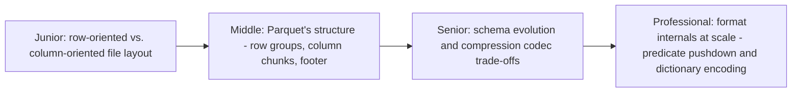
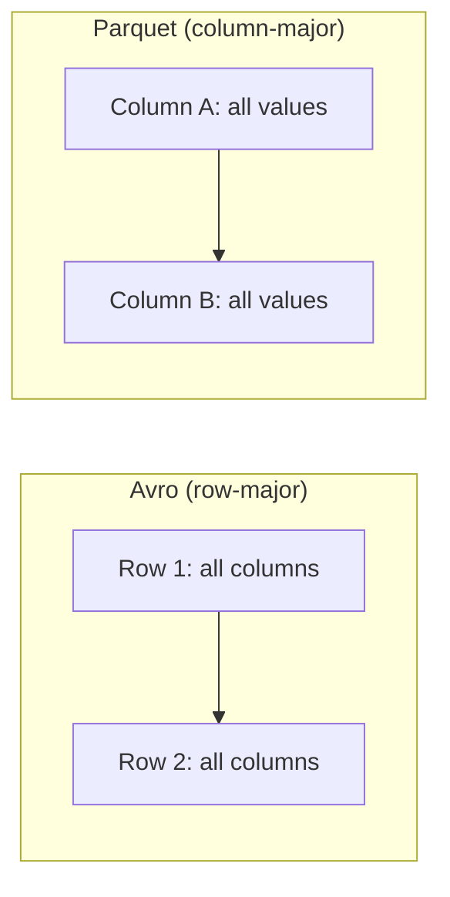

# File Format

> How bytes are physically laid out inside a file — row-major vs.
> column-major, schema embedding, compression — determines whether reading
> "one column out of fifty" costs almost nothing or costs a full-file scan.
> Parquet, Avro, and ORC each made different trade-offs here on purpose.

## Choose a level

| Level | Guide | You are done when |
|---|---|---|
| Junior | [Row-major vs. column-major layout](junior.md) | You can explain why reading one column is cheap in Parquet but not in Avro. |
| Middle | [Parquet's internal structure](middle.md) | You can describe row groups, column chunks, and the footer's role. |
| Senior | [Schema evolution and compression](senior.md) | You can explain how Avro handles schema evolution differently from Parquet, and why codec choice matters. |
| Professional | [Predicate pushdown and encoding at scale](professional.md) | You can explain how min/max statistics and dictionary encoding let engines skip data without decompressing it. |

## Practice rule

Before picking a file format for a new pipeline, ask: "will this data
mostly be read column-by-column for analytics (favor Parquet/ORC), or
written and read as whole records for streaming/RPC (favor Avro)?" The
answer should drive the format choice, not familiarity or default tooling.

## Related

- [Query Optimization](../../databases/performance/15-query-optimization/README.md)
- [Table Format: Delta Lake](../table-format/delta-lake/README.md)
