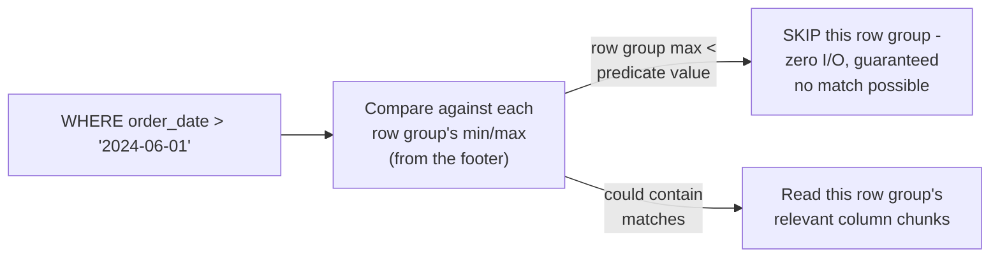
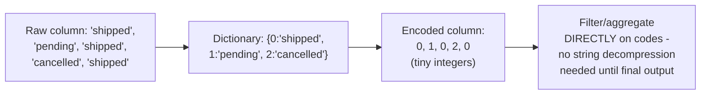

# File Format — Professional

<!-- level-focus -->
At professional level, focus on this question:

> How do min/max statistics and dictionary encoding let a query engine
> skip and decompress less data, and what real production tuning follows
> from understanding these mechanisms precisely?

Prerequisite: [`senior.md`](senior.md).

---

## Min/max statistics and predicate pushdown, precisely

Recall Parquet's footer statistics from `middle.md` — for each column
chunk, the footer stores the **minimum and maximum value** present. A
query engine evaluating `WHERE order_date > '2024-06-01'` compares this
predicate against each row group's min/max for `order_date` **before**
reading any actual data: if a row group's max is `'2024-05-15'`, the
engine knows with certainty **no row in that group can match**, and skips
reading it entirely — this is the exact same physical mechanism as
partition pruning (per the Query Optimization professional page), just
applied at the row-group granularity within a single file rather than at
the whole-partition-file granularity.



This statistics-driven pruning is **most effective when data is
physically sorted or clustered by the filtered column** — an unsorted
dataset's row groups each span the full value range, defeating min/max
pruning almost entirely (every row group's min/max range overlaps the
predicate) — this is why data engineering pipelines writing Parquet files
often deliberately sort/cluster output by common filter columns (date,
customer segment) specifically to make this pruning mechanism effective,
not as an incidental side effect.

## Dictionary encoding: operating on codes, not raw values

For low-cardinality columns (a `status` field with 5 possible values),
Parquet uses **dictionary encoding**: store the distinct values once (the
dictionary) and replace each occurrence with a small integer **code**
referencing the dictionary — this dramatically shrinks storage, and
critically, lets a vectorized engine (per the OLTP vs OLAP professional
page's vectorization discussion) apply filters and even some aggregations
**directly on the small integer codes** without ever decompressing the
full string values, a significant CPU savings on top of the storage
savings.



## Production checklist (staff-level)

1. **Sort or cluster write output by your most commonly filtered
   columns** (date, key segments) before writing Parquet files at scale —
   this is what actually makes min/max-based pruning effective; unsorted
   data largely defeats it regardless of format choice.
2. **Verify dictionary encoding is actually being applied** for your
   low-cardinality columns (most Parquet writers do this automatically
   below a cardinality threshold, but verify via file metadata inspection
   for critical, high-volume columns) — this affects both storage and
   query CPU cost.
3. **Choose row group size deliberately** — too small means excessive
   per-row-group metadata overhead and less-effective batch processing;
   too large means coarser pruning granularity (a huge row group spanning
   a wide value range prunes poorly even when sorted). Tune against your
   actual query filter selectivity.
4. **Measure actual pruning effectiveness via query engine metrics**
   (bytes scanned vs. total dataset size for a filtered query) rather than
   assuming sorting/clustering is working as intended — verify the
   theoretical benefit is being realized in practice.
5. **In a data pipeline design review for a new analytical dataset,
   require an explicit answer for the intended write-time sort/cluster
   key**, tied directly to expected downstream query filter patterns —
   this is a foundational decision that's expensive to retrofit after
   large volumes of unsorted data have already accumulated.

## Cheat Sheet

```text
+------------------------------------------------------------------+
|                   FILE FORMAT — INTERNALS & SCALE                    |
+------------------------------------------------------------------+
| Min/max statistics (Parquet footer, per row group per column):        |
| query engine compares predicate against min/max BEFORE reading any     |
| data - skips row groups with NO POSSIBLE match, zero I/O for them      |
| MOST EFFECTIVE when data is SORTED/CLUSTERED by the filtered column -  |
| unsorted data means every row group's range overlaps, defeating        |
| pruning almost entirely - a deliberate write-time design decision      |
+------------------------------------------------------------------+
| Dictionary encoding: low-cardinality columns stored as {dictionary +   |
| small integer codes} - filters/aggregations can operate DIRECTLY on    |
| codes without decompressing full string values - storage AND CPU       |
| savings                                                                |
+------------------------------------------------------------------+
| Row group size: tune against query filter selectivity - too small =    |
| metadata overhead; too large = coarse pruning granularity even when    |
| sorted                                                                 |
+------------------------------------------------------------------+
```

## Test yourself

1. Why does min/max-based row-group pruning become nearly useless if the
   underlying data isn't sorted or clustered by the filtered column?
2. Why can a vectorized engine filter/aggregate dictionary-encoded data
   without decompressing it first, and what does this save beyond storage?
3. Design the write-time partitioning/sorting strategy for an events
   table that's almost always queried with a `WHERE event_date = X AND
   event_type = Y` filter.

## Further Reading

- Apache Parquet documentation — "File Format" (footer, row groups,
  column chunks, statistics) and "Encodings" (dictionary encoding
  details).
- Apache Avro documentation — "Schema Resolution."
- See also: [Query Optimization — professional](../../databases/performance/15-query-optimization/professional.md),
  [OLTP vs OLAP — professional](../../databases/operation/21-oltp-vs-olap/professional.md).
