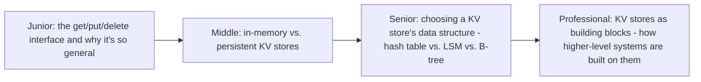
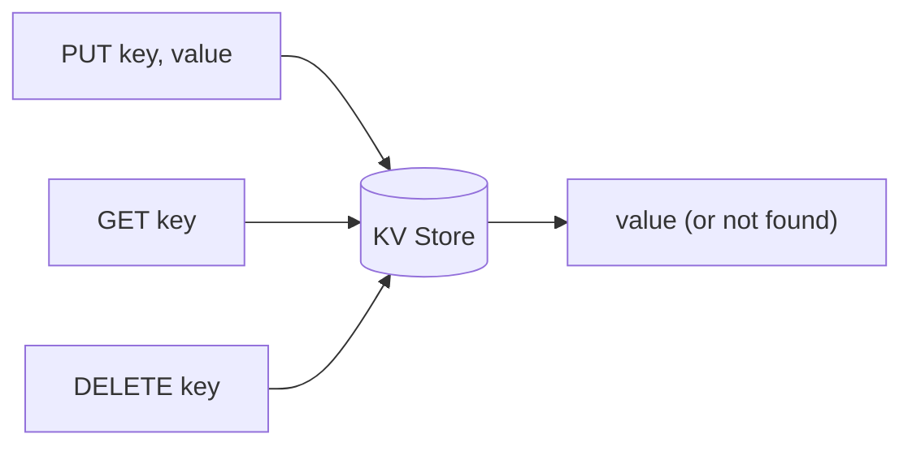

# KV Store

> The simplest possible data model — get/put/delete by key — is also the
> foundation almost every other storage system in this tree is built on
> top of (LSM-trees, object storage's own metadata layer, coordination
> services). Understanding a KV store on its own terms clarifies what
> every more complex system is adding on top of this base case.

## Choose a level

| Level | Guide | You are done when |
|---|---|---|
| Junior | [The get/put/delete interface](junior.md) | You can explain why this minimal interface is general enough to build almost anything on top of. |
| Middle | [In-memory vs. persistent](middle.md) | You can choose between Redis-style in-memory and RocksDB-style persistent KV stores for a given use case. |
| Senior | [Choosing the underlying data structure](senior.md) | You can choose between a hash table, LSM-tree, and B-tree backing structure based on access pattern. |
| Professional | [KV stores as building blocks](professional.md) | You can explain how higher-level systems (databases, coordination services, object storage metadata) are themselves built on KV store primitives. |

## Practice rule

Before reaching for a full relational database or a specialized NoSQL
system, ask: "does my actual access pattern reduce to get/put/delete by a
single key, with no need for range queries or joins?" If yes, a plain KV
store is likely simpler, faster, and sufficient — don't reach for more
machinery than the problem requires.

## Related

- [LSM-Tree](../../databases/performance/indexing/lsm-tree/README.md)
- [B+Tree](../../databases/performance/indexing/b+tree/README.md)
- [NoSQL Modeling](../../databases/data-modeling/03-nosql-modeling/README.md)
