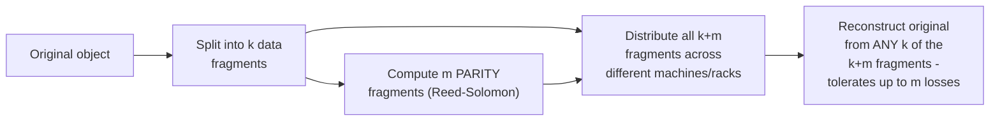

# Object Storage — Professional

<!-- level-focus -->
At professional level, focus on this question:

> How does object storage achieve "11 nines" durability without simple 3x
> replication, and what does erasure coding actually trade off?

Prerequisite: [`senior.md`](senior.md).

---

## Erasure coding: durability without tripling storage cost

Simple 3x replication (storing 3 full copies, per the Replication
professional page's model) provides good durability but at **3x** the raw
storage cost. Object storage systems at scale (S3's documented general
approach, and explicitly detailed in systems like Azure Storage and
open-source equivalents like MinIO) instead commonly use **erasure
coding**: split each object into `k` data fragments plus additional
**parity** fragments (computed via Reed-Solomon or similar algorithms),
such that the original object can be reconstructed from **any** `k` of
the total `k+m` fragments — tolerating up to `m` fragment losses while
using dramatically less total storage overhead than full replication for
an equivalent durability level (e.g. a common erasure-coding scheme
achieves comparable or better durability than 3x replication at roughly
1.5x storage overhead instead of 3x).



The trade-off: erasure coding's **reconstruction cost** (CPU work to
recompute a lost fragment from the remaining ones) is higher than simple
replication's "just read another full copy" recovery — a real, deliberate
trade of storage efficiency against recovery-time computational cost,
appropriate for object storage's typical access pattern (relatively
infrequent reads of any specific object, compared to a database's
constant read/write traffic on hot rows).

## Consistency at scale: the 2020 S3 strong-consistency change, architecturally

The `middle.md`-referenced move to strong read-after-write consistency
was a genuinely significant internal architecture change for AWS S3,
publicly described (in general terms) as requiring updates to how S3's
internal metadata subsystem tracks and serializes object state changes
across its distributed infrastructure — a professional-level illustration
that "eventual to strong consistency" is not always a purely additive
change; it can require deep architectural rework of how a distributed
system's internal metadata layer coordinates, directly echoing the
BASE & Eventual Consistency professional page's broader theme that
moving along the consistency spectrum has real, sometimes substantial,
engineering cost.

## Production checklist (staff-level)

1. **Understand your object storage provider's actual durability
   mechanism (replication vs. erasure coding) and its recovery-time
   implications**, especially for self-hosted/on-premise object storage
   where you may be choosing this configuration yourself (MinIO and
   similar systems expose erasure-coding parameters directly).
2. **Never assume a non-AWS-S3 object storage provider has the same
   strong consistency guarantee** — verify explicitly per provider, per
   `middle.md`'s guidance, since this is a real architectural capability
   that varies.
3. **Design key-naming schemes with hot-partitioning awareness
   (`senior.md`) especially for self-hosted or less mature object storage
   systems**, which may have less sophisticated automatic partition
   management than AWS S3's current implementation.
4. **For self-hosted object storage, size erasure-coding parameters (k
   and m) deliberately against your durability requirements and available
   node/rack count** — this is a real, consequential capacity-planning
   decision analogous to choosing a replication factor.
5. **In a platform review evaluating object storage providers, require
   explicit documentation of durability mechanism, consistency model, and
   partition-management sophistication** — these three factors have the
   most practical consequence for a data platform built on top.

## Cheat Sheet

```text
+------------------------------------------------------------------+
|                OBJECT STORAGE — INTERNALS & SCALE                    |
+------------------------------------------------------------------+
| Erasure coding: object split into k data fragments + m PARITY          |
| fragments (Reed-Solomon) - reconstruct from ANY k of k+m fragments -   |
| comparable/better durability than 3x replication at ~1.5x storage      |
| overhead instead of 3x. Trade-off: higher RECONSTRUCTION CPU cost       |
| than simple "read another full copy" replication recovery              |
+------------------------------------------------------------------+
| Strong read-after-write consistency (modern S3, since 2020) required   |
| deep internal metadata-architecture rework, not just a config flip -   |
| a real illustration that moving along the consistency spectrum has     |
| substantial engineering cost, not just a documentation update          |
+------------------------------------------------------------------+
| For self-hosted object storage (MinIO, etc.): erasure-coding           |
| parameters (k, m) and consistency model are CONFIGURATION DECISIONS    |
| you own - size and verify them deliberately, don't assume AWS S3       |
| defaults apply universally                                             |
+------------------------------------------------------------------+
```

## Test yourself

1. Why does erasure coding achieve comparable durability to 3x replication
   at roughly half the storage overhead, and what does it cost you in
   exchange?
2. Why was AWS S3's move to strong read-after-write consistency a
   significant internal architecture change, rather than a simple
   configuration update?
3. For a self-hosted MinIO deployment across 12 nodes, what erasure-coding
   parameters (k, m) would you consider, and what durability/overhead
   trade-off are you making?

## Further Reading

- AWS News Blog — "Amazon S3 Update – Strong Read-After-Write Consistency"
  (2020, the consistency model change).
- MinIO documentation — "Erasure Coding" (a concrete, configurable
  implementation you can inspect directly).
- See also: [File System — professional](../file-system/professional.md),
  [Replication — professional](../../databases/scaling/16-replication/professional.md).
