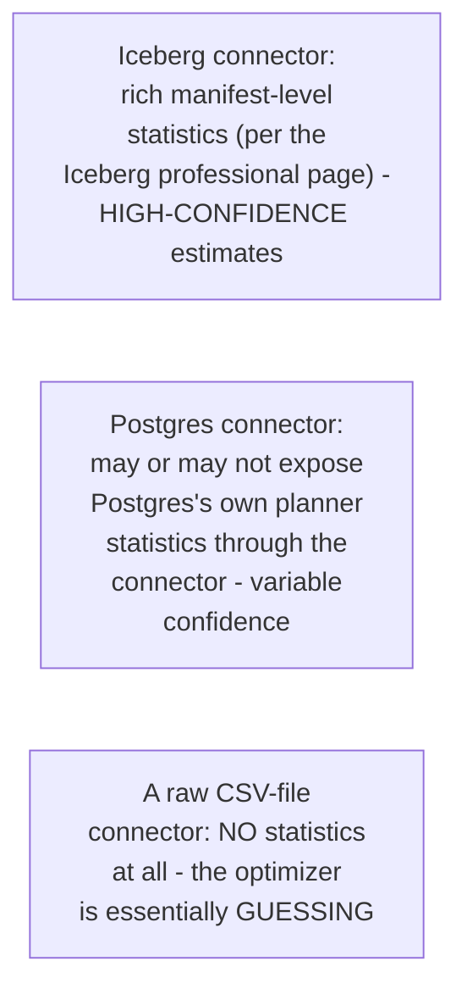
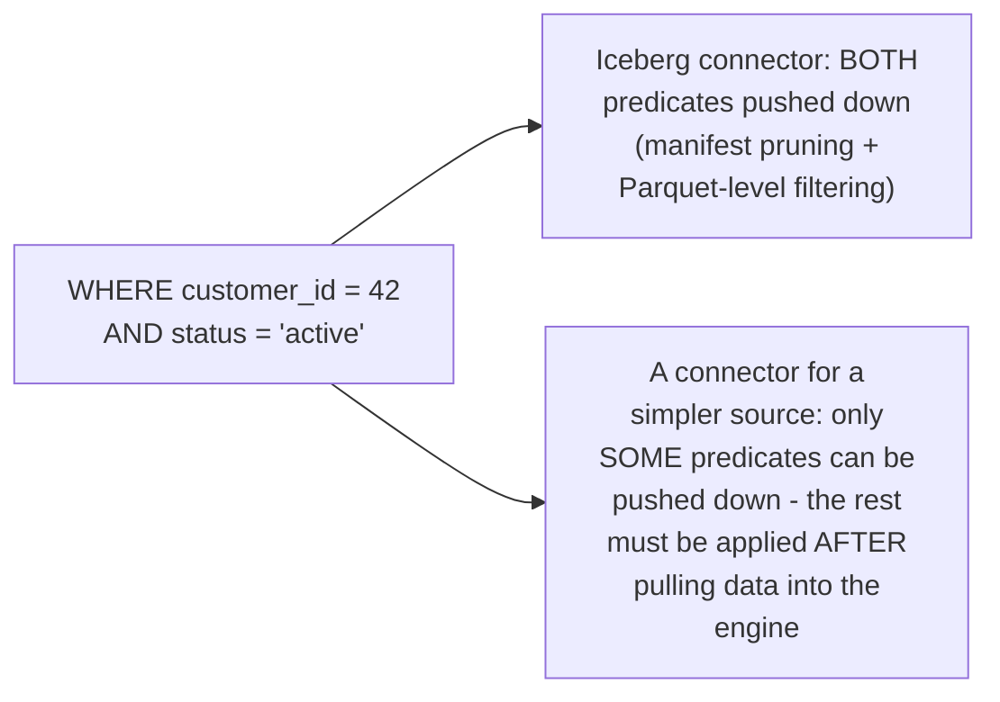

# Query Engine — Professional

<!-- level-focus -->
At professional level, focus on this question:

> How does a distributed query engine's cost-based optimizer reason about
> join order and strategy when the tables being joined live in
> fundamentally different, heterogeneous storage systems with wildly
> different cost profiles?

Prerequisite: [`senior.md`](senior.md).

---

## Heterogeneous cost estimation: not every connector's statistics are equal

A cost-based optimizer (per the Query Optimization professional page's
System-R-style dynamic programming and Catalyst discussion) needs
**cardinality and cost estimates** for every table involved in a query —
but when tables come from different connectors, those estimates have
wildly different reliability and availability:



A professional-level query engine's optimizer must reason about **cost
estimation confidence** per source, not just raw estimated row counts —
some engines (Trino among them) allow connectors to report whether their
statistics are exact, estimated, or entirely absent, and the optimizer
can fall back to more conservative, less aggressive optimization
decisions (e.g. preferring a safer, adaptive strategy over committing
early to a specific join order) when statistics confidence is low across
one or more sources in the query.

## Pushdown varies dramatically by connector, and the optimizer must know this



This is the direct professional-level extension of the Database
Federation professional page's pushdown discussion: a query engine's
optimizer must model, **per connector, per predicate type**, whether
pushdown is even possible — and when it isn't, account for the real cost
of pulling unfiltered data across the network before applying the filter
locally, which can dramatically change the optimal join order (a source
with poor pushdown support should often be filtered/joined **last**, after
its result set has already been narrowed by cheaper, better-pushdown-capable
sources).

## Federated query performance is bounded by the weakest connector's capability

> 🎯 **Professional-level insight:** just as `senior.md`'s join strategy
> choice can be undermined by stale statistics from any single source, a
> federated query's overall performance is frequently bounded by
> whichever connector in the query has the **weakest** pushdown/statistics
> capability — echoing the exact "weakest link" theme from the Delivery
> Guarantees professional page's pipeline-guarantee discussion, just
> applied to query performance across heterogeneous sources instead of
> message delivery guarantees across pipeline stages.

## Production checklist (staff-level)

1. **Verify each connector's actual pushdown and statistics capability**
   before assuming a federated query across multiple sources will perform
   well — this varies enormously per connector/source type and is rarely
   uniform.
2. **Order joins deliberately in federated queries against
   poor-pushdown-capability sources**, filtering/joining through
   strong-pushdown sources first to narrow the result set before touching
   the weak source, rather than trusting the optimizer's default choice
   when source statistics confidence is known to be low.
3. **Prefer materializing (caching) results from poor-statistics/
   poor-pushdown sources into a well-indexed intermediate location**
   (a table format, per the sibling storage-system topics) for
   repeated federated queries, rather than re-querying the weak source
   directly on every run.
4. **Monitor per-connector query latency and bytes-transferred as
   distinct metrics** in a federated query engine deployment — this
   reveals which specific source is the actual bottleneck in a slow
   cross-source query, rather than treating "the query is slow" as one
   undifferentiated signal.
5. **In a design review for a new federated data-access pattern, require
   an explicit answer for each source's pushdown/statistics capability**
   before approving the query design — this is the single most
   consequential, and most commonly overlooked, factor in federated query
   performance.

## Cheat Sheet

```text
+------------------------------------------------------------------+
|                QUERY ENGINE — INTERNALS & SCALE                     |
+------------------------------------------------------------------+
| Coordinator: plans, splits work into tasks. Workers: execute tasks,    |
| read via CONNECTORS (pluggable per-source logic). Compute and          |
| storage scale INDEPENDENTLY - the engine owns no data itself           |
+------------------------------------------------------------------+
| Broadcast join: small table sent to every worker, avoids shuffling     |
| the large table. Shuffle join: both sides redistributed by join key -  |
| same data-skew risk as Spark. Engine chooses automatically based on    |
| stats, but stale stats can pick the WRONG strategy - verify/override   |
+------------------------------------------------------------------+
| Federated query cost estimation confidence VARIES BY CONNECTOR         |
| (rich Iceberg manifest stats vs. a stats-less CSV connector) -          |
| pushdown capability ALSO varies wildly per connector - a federated      |
| query's real performance is bounded by its WEAKEST connector,          |
| the same "weakest link" theme as pipeline delivery guarantees          |
+------------------------------------------------------------------+
```

## Test yourself

1. Why must a federated query optimizer treat cost estimates differently
   depending on whether they come from a rich-statistics connector (like
   Iceberg) versus a stats-less one (like a raw CSV connector)?
2. Why should a join against a poor-pushdown-capability source generally
   happen last in a federated query plan, after other sources have
   already narrowed the result set?
3. Design a monitoring dashboard for a federated query engine that would
   let you quickly identify which specific connector is the bottleneck in
   a slow cross-source query.

## Further Reading

- Trino documentation — "Connectors" and "Cost-based optimizer" (per-
  connector statistics reporting and join distribution strategy).
- Presto/Trino engineering papers — "Presto: SQL on Everything" (the
  original architecture paper describing coordinator/worker/connector
  design).
- See also: [Query Optimization — professional](../../databases/performance/15-query-optimization/professional.md),
  [Database Federation — professional](../../databases/scaling/18-database-federation/professional.md),
  [Spark — senior/professional](../../distributed-system/spark/senior.md).
