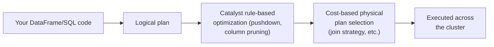
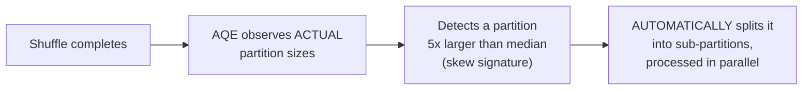

# Spark — Professional

<!-- level-focus -->
At professional level, focus on this question:

> How do the Catalyst optimizer and Adaptive Query Execution (AQE) actually
> change a Spark job's execution plan, and how does AQE address skew
> automatically at runtime?

Prerequisite: [`senior.md`](senior.md).

---

## Catalyst: the logical-to-physical plan optimizer

Spark SQL/DataFrame operations are compiled through **Catalyst**, Spark's
query optimizer (conceptually similar to the query planners covered in the
Query Optimization professional page, but for a distributed compute
engine rather than a single database): your chain of transformations
becomes a **logical plan**, Catalyst applies rule-based optimizations
(predicate pushdown, column pruning, constant folding) to produce an
optimized logical plan, then a **cost-based optimizer** selects among
candidate **physical plans** (which join strategy, which shuffle
partitioning) using the same kind of statistics-driven cardinality
estimation covered in that professional page — meaning Spark jobs are
subject to the identical "stale statistics produce a bad plan" risk as a
traditional database, just at cluster scale.



## Adaptive Query Execution: fixing `senior.md`'s skew problem at runtime

This is precisely the AQE mechanism introduced in the Query Optimization
professional page: after a shuffle stage completes, Spark has **actual**
observed partition sizes (not pre-execution estimates) and can react —
AQE specifically implements **skew join optimization**: it detects
partitions significantly larger than the median partition size and
automatically **splits** them into smaller sub-partitions, processed in
parallel, before the join — this is an **automatic, runtime version** of
the manual salting technique from `senior.md`, applied without requiring
you to hand-write the salt logic yourself.



AQE also handles the small-partition-coalescing case (merging many
small post-shuffle partitions into fewer, right-sized ones, reducing
task-scheduling overhead) and can dynamically switch a sort-merge join to
a broadcast join if a table turns out, after filtering, to be smaller than
initially estimated — directly addressing the compounding cardinality-
estimation-error problem from the Query Optimization professional page,
using real observed data from completed stages rather than pre-execution
statistics for every remaining decision.

## Production checklist (staff-level)

1. **Enable AQE (`spark.sql.adaptive.enabled=true`, default since Spark
   3.2) for any production workload** — it directly mitigates skew and
   cardinality-misestimation risk automatically, reducing the manual
   salting/broadcast-hint tuning burden from `senior.md`.
2. **Understand AQE's skew-detection thresholds**
   (`spark.sql.adaptive.skewJoin.skewedPartitionFactor` and
   `...skewedPartitionThresholdInBytes`) and tune them against your actual
   data's skew characteristics rather than leaving defaults unexamined for
   a known-skewed workload.
3. **Still design explicit broadcast joins for genuinely small dimension
   tables** (`senior.md`) rather than relying entirely on AQE's dynamic
   join-strategy switching — an explicit hint is more predictable and
   avoids depending on runtime statistics being available in time to make
   the switch.
4. **Keep table/file statistics current** (`ANALYZE TABLE` for Spark SQL
   tables) — Catalyst's cost-based physical plan selection depends on
   accurate statistics exactly as a traditional query optimizer does, per
   the Query Optimization professional page's compounding-error discussion.
5. **In a performance review of a slow Spark job, check the Spark UI's
   stage/task duration distribution first** — a single straggler task is
   the skew signature; a uniformly slow stage points to a different
   bottleneck (I/O, insufficient parallelism, an expensive UDF) entirely.

## Cheat Sheet

```text
+------------------------------------------------------------------+
|                     SPARK — INTERNALS & SCALE                       |
+------------------------------------------------------------------+
| Catalyst: logical plan -> rule-based optimization (pushdown, column   |
| pruning) -> cost-based PHYSICAL plan selection (join strategy) -      |
| subject to the SAME stale-statistics risk as a traditional DB          |
| optimizer, just at cluster scale                                      |
+------------------------------------------------------------------+
| AQE (Adaptive Query Execution): re-plans MID-EXECUTION using REAL      |
| observed post-shuffle statistics -                                    |
|   SKEW JOIN OPTIMIZATION: auto-splits oversized partitions           |
|     (automatic version of manual salting)                             |
|   coalesces small partitions, switches join strategy dynamically      |
|     if a table turns out smaller than estimated                       |
+------------------------------------------------------------------+
| Diagnose slow jobs via Spark UI stage/task duration distribution:      |
|   ONE straggler task = skew signature                                 |
|   UNIFORMLY slow stage = different bottleneck (I/O, parallelism, UDF) |
+------------------------------------------------------------------+
```

## Test yourself

1. Why is AQE's skew-join optimization described as an "automatic version"
   of manual salting, and what does it still require (accurate runtime
   statistics) to work correctly?
2. Why should you still use explicit broadcast join hints for known-small
   dimension tables, rather than relying entirely on AQE's dynamic
   switching?
3. In the Spark UI, one task in a stage takes 40 minutes while all 199
   others finish in under 30 seconds. Diagnose the likely cause and
   propose two independent fixes.

## Further Reading

- Databricks Engineering Blog — "Adaptive Query Execution: Speeding Up
  Spark SQL at Runtime" (the original detailed AQE explanation).
- Apache Spark documentation — "Performance Tuning" and "Adaptive Query
  Execution."
- Armbrust et al. — "Spark SQL: Relational Data Processing in Spark"
  (the original Catalyst optimizer paper).
- See also: [Query Optimization — professional](../../databases/performance/15-query-optimization/professional.md).
