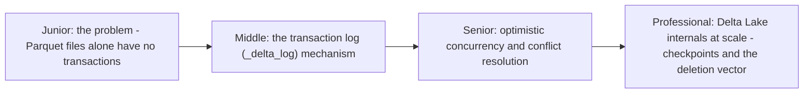
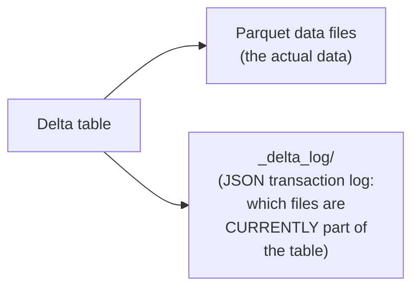

# Delta Lake

> A transaction log layered on top of plain Parquet files in object
> storage — turning a folder of immutable files with no atomicity
> guarantees at all into a table with ACID transactions, time travel, and
> schema enforcement, without needing a traditional database.

## Choose a level

| Level | Guide | You are done when |
|---|---|---|
| Junior | [Why plain Parquet files have no transactions](junior.md) | You can explain the specific atomicity gap a folder of Parquet files has. |
| Middle | [The transaction log mechanism](middle.md) | You can trace how the `_delta_log` determines a table's current state. |
| Senior | [Optimistic concurrency](senior.md) | You can explain what happens when two writers commit to the same table concurrently. |
| Professional | [Checkpoints and deletion vectors at scale](professional.md) | You can explain why the log needs periodic checkpointing and how deletion vectors avoid full-file rewrites. |

## Practice rule

Before treating a folder of Parquet files as "a table" with any kind of
atomicity or consistency guarantee, ask: "is there a transaction log
governing which files are actually part of this table right now?" If the
answer is no, you have a directory of files, not a table — this is
exactly the gap table formats close.

## Related

- [File System — professional](../../file-system/professional.md)
- [Iceberg](../iceberge/README.md)
- [Transactions & ACID](../../../databases/transaction/07-transactions-and-acid/README.md)
