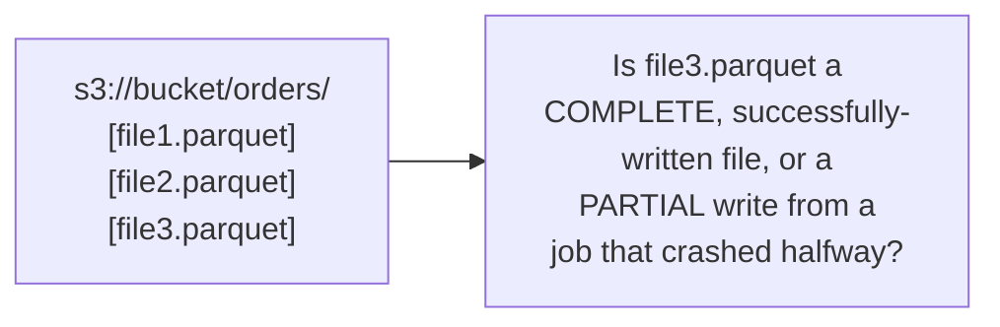
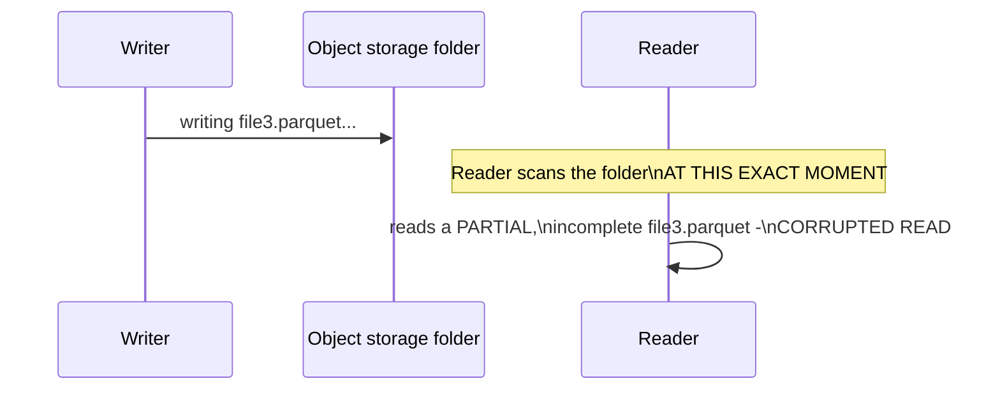

# Delta Lake — Junior

<!-- level-focus -->
At junior level, focus on this question:

> What specific problem does a folder full of Parquet files, with no
> additional structure, actually have?

---

## A folder of files has no concept of "the current, correct state"

Object storage (per [File System — professional](../../file-system/professional.md))
has no built-in notion of "this set of files together represents one
consistent table version." If a writing job crashes halfway through
writing `file3.parquet`, a reader scanning the folder has no way to know
whether that file is safe to read, partially written, or should be
ignored entirely — there's no transaction boundary, no "this write either
fully happened or didn't happen at all" guarantee.

## The specific failure this causes

A reader querying the table **while** a write is in progress can see a
partially-written file, or see some but not all of a multi-file write's
new files, producing an inconsistent, incorrect view of the data — there's
no atomicity across the write, unlike a traditional database's transaction
guarantee (per [Transactions & ACID](../../../databases/transaction/07-transactions-and-acid/README.md)).

> 🎓 **Takeaway:** "just write Parquet files to a folder" gives you no
> transactional guarantee at all — readers can see partial writes, and
> there's no reliable way to know which files currently constitute the
> table's valid state. Delta Lake exists specifically to add this missing
> layer.

## Test yourself

1. Why does object storage's lack of a transaction concept mean a reader
   can see a partially-written file?
2. Why is this problem specific to **multi-file** writes, and would a
   single-file write to object storage have the same issue? (Hint: think
   about atomic single-object PUT operations.)
3. What would a "transaction log" need to record to solve this problem —
   what question must it be able to answer?

Continue to [`middle.md`](middle.md).
