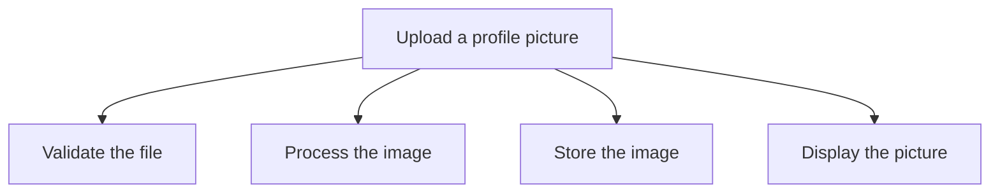
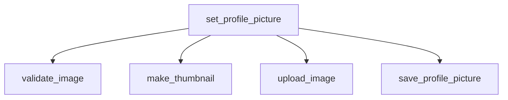

# Decomposition — Junior

Decomposition means breaking a large problem into smaller problems that are easier to understand and solve.

Instead of asking:

> How do I build this entire feature?

Ask:

> What smaller results must happen for this feature to work?

This skill helps you plan work, write clearer code, test smaller pieces, and find bugs faster.

---

## 1. Why large problems feel difficult

Imagine receiving this ticket:

> Allow users to upload a profile picture.

It sounds like one task, but it hides many smaller tasks:



Trying to solve everything at once makes it easy to miss requirements. After decomposition, each part has a clear purpose.

The goal is not to create as many tasks as possible. The goal is to create pieces small enough to understand, build, and verify.

---

## 2. A repeatable six-step method

Use this process whenever a task feels vague or too large:

### Step 1: Define the outcome

Write one sentence describing what success looks like.

```text
A user uploads an image and sees it as their new profile picture.
```

Avoid describing implementation details yet. Focus on the result for the user.

### Step 2: Identify inputs and outputs

Ask what enters the process and what should come out.

| Question | Profile-picture example |
|---|---|
| What is the input? | User and uploaded file |
| What is the output? | Saved image URL and updated profile |
| What can fail? | Invalid type, large file, failed upload |

### Step 3: List the main steps

Write the actions as short verb phrases:

1. Receive the file.
2. Validate the file.
3. Resize the image.
4. Upload the image.
5. Save the URL.
6. Show the updated picture.

Verbs such as **validate**, **resize**, **upload**, and **save** often reveal useful boundaries.

### Step 4: Split unclear steps again

“Validate the file” is still vague, so split it:

- Confirm that a file exists.
- Check that its type is allowed.
- Check that its size is below the limit.

Continue until you can explain each piece in one sentence.

### Step 5: Find dependencies

Some pieces must happen before others. You cannot save the image URL until storage returns it.

The dependencies are:

- Receive the file before validating it.
- Validate the file before resizing it.
- Resize the image before uploading it.
- Receive the storage URL before saving it.
- Save the URL before displaying the new picture.
- Stop and show a clear error if validation or upload fails.

This diagram shows both the normal path and important failure paths.

### Step 6: Build and verify one piece at a time

Finish one small result before moving to the next when possible:

- Validate files with small test examples.
- Confirm resizing produces the correct dimensions.
- Test storage with a known image.
- Verify the returned URL is saved.
- Check that the UI displays the saved URL.

Small feedback loops make problems easier to locate.

---

## 3. Turn the parts into code

Decomposition often becomes a group of focused functions:

```python
def set_profile_picture(user, uploaded_file):
    validate_image(uploaded_file)
    thumbnail = make_thumbnail(uploaded_file)
    image_url = upload_image(thumbnail)
    save_profile_picture(user, image_url)
    return image_url
```

The top-level function reads like a summary of the feature. Each helper handles one smaller problem.



Good pieces usually have:

- One clear responsibility.
- A name that explains the action.
- Small inputs and outputs.
- A way to verify them independently.

Do not split every line into its own function. Split when a piece has its own purpose, rule, or reason to change.

---

## 4. Know when a piece is small enough

A piece is probably small enough when you can answer “yes” to these questions:

- Can I explain it in one sentence?
- Can I give it a clear name?
- Do I know what it receives and returns?
- Can I verify it without running the entire feature?
- Does it have one main reason to change?

Compare these pieces:

| Too vague | More actionable |
|---|---|
| Handle image | Check image type |
| Process user | Load user by ID |
| Build checkout | Calculate order total |
| Fix login | Reproduce expired-session failure |
| Improve performance | Measure checkout response time |

If you cannot tell when a task is finished, it probably needs another split.

---

## 5. Apply decomposition to a vague ticket

Suppose a ticket says:

> Add checkout to the store.

Do not immediately start coding. Turn the ticket into questions:

1. What must the customer be able to do?
2. What information is needed?
3. What rules can prevent checkout?
4. Which external systems are involved?
5. What confirms success?

A first breakdown might be:

- Review the cart.
- Collect the shipping address.
- Calculate tax, shipping, and the final total.
- Confirm inventory.
- Take payment and handle rejection.
- Create the order.
- Send confirmation.

### Make the breakdown actionable

Turn each leaf into a result that can be demonstrated:

| Work item | Evidence that it works |
|---|---|
| Calculate tax | Known address and cart return expected tax |
| Confirm inventory | Out-of-stock item blocks checkout |
| Take payment | Approved payment returns a transaction ID |
| Create order | Order is stored with the correct lines and total |
| Send confirmation | Message is queued for the customer's email |

This turns “add checkout” into work that can be estimated, assigned, implemented, and reviewed.

---

## 6. Apply decomposition when debugging

Decomposition is useful when you do not know where a problem lives.

Suppose the profile page shows a broken image. The full flow is:


Check the boundaries one at a time:

1. Can the stored image be opened directly?
2. Is the correct URL in the database?
3. Does the API return that URL?
4. Does the browser receive it?
5. Does the page render the correct HTML?

Start near the middle when that check is cheap. Each answer removes part of the search area.

Actionable debugging rule:

> Draw the data path, inspect one boundary, and use the result to choose the next smaller area.

---

## 7. Split by action or by data

Most application features are split by **action**:

```text
validate → calculate → save → notify
```

Sometimes work is split by **data** instead. For example, a large CSV file may be divided into chunks that run through the same operation.

For example, split ten million CSV rows into four independent partitions, then apply the same processing rule to each partition.

| Split by | Use it when | Example |
|---|---|---|
| Action | The system performs different steps | Validate, resize, upload |
| Data | The same step runs over independent chunks | Process CSV partitions |

As a beginner, start by splitting by action. It fits most feature work.

---

## 8. Avoid common mistakes

### Splitting by technical layer too early

“Frontend, backend, and database” may describe ownership, but it does not explain the user flow. First understand the outcome and actions. Then decide which layer owns each action.

### Creating pieces that are still vague

“Handle payment” is not yet actionable. Split it into validating payment details, requesting authorization, handling rejection, and recording the result.

### Creating pieces that depend on everything

If a function needs the user, database connection, storage client, HTTP request, configuration, and UI state, it may own too many responsibilities.

### Forgetting failure paths

For every important step, ask:

- What can fail?
- How will we detect it?
- What should the user see?
- Can we retry safely?

### Decomposing forever

Stop when a piece is clear, testable, and small enough to complete. More pieces are not automatically better.

---

## 9. A template for real work

Copy this template into a ticket, pull request description, or planning note:

```markdown
## Outcome
What should the user or system be able to do?

## Inputs
What information enters the process?

## Outputs
What result should be produced?

## Main steps
1. ...
2. ...
3. ...

## Dependencies
Which step must finish before another can begin?

## Failure cases
- ...
- ...

## Verification
- How will we prove each part works?
- How will we prove the full flow works?
```

### Questions to ask in a planning meeting

- What exact outcome are we trying to produce?
- What happens before and after this feature?
- Which rules must always be true?
- Which part is still unclear?
- Can two parts be built or tested independently?
- What is the smallest useful result we can deliver first?

These questions turn a vague conversation into an executable plan.

---

## 10. Final checklist

Before implementing a large task, confirm:

- [ ] I can describe the desired outcome in one sentence.
- [ ] I know the important inputs and outputs.
- [ ] The main steps are written as clear verb phrases.
- [ ] Vague steps have been split again.
- [ ] Each piece has one primary purpose.
- [ ] Dependencies between pieces are visible.
- [ ] Important failure paths are included.
- [ ] Each piece has a clear way to verify it.
- [ ] I know how the pieces combine into the complete result.

The central idea is simple:

> Do not solve the entire problem in your head at once. Find the next small, clear result, solve it, verify it, and connect it to the rest.

---

## 11. Continue learning

- [Middle level](middle.md) — learn cohesion, coupling, and module boundaries.
- [Senior level](senior.md) — find architectural seams and hide information.
- [Problem-solving](../../02-problem-solving/) — use decomposition as part of a complete problem-solving process.
- [Modeling a problem in code](../05-modeling-a-problem-in-code/) — turn decomposed parts into code structures.
