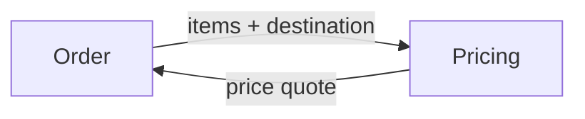
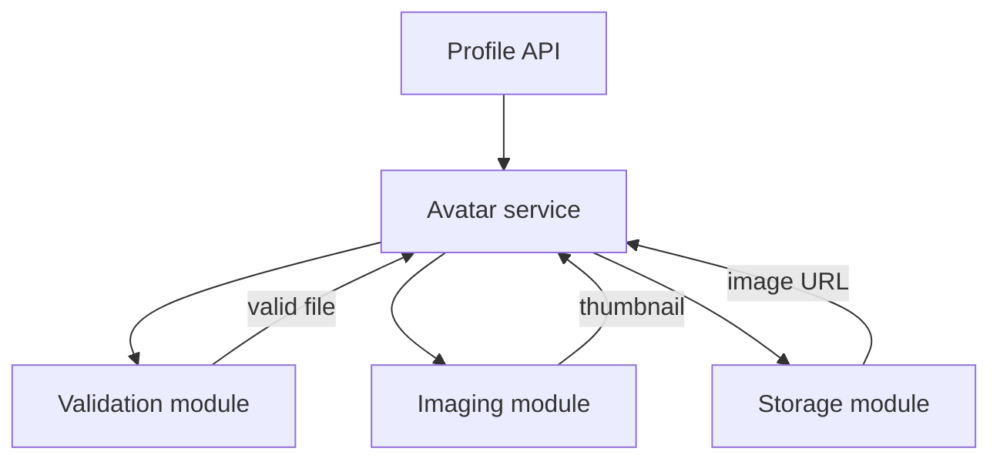
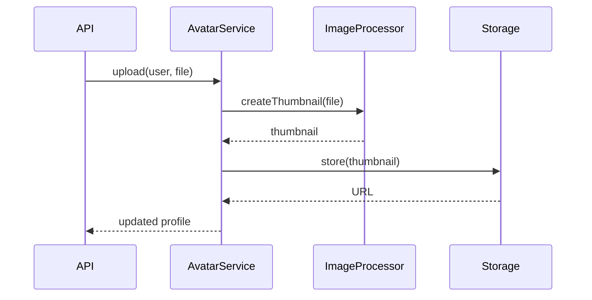

# Decomposition — Middle

At junior level, you learned to split a large task into smaller steps. At middle level, the question changes:

> Where should I draw the boundaries so each piece is easy to understand, change, and test?

Good boundaries create focused pieces with simple connections. Poor boundaries merely move complexity around.

---

## 1. Use cohesion and coupling to judge a split

Two ideas help you evaluate a decomposition:

- **Cohesion:** how strongly the things inside one piece belong together. Higher is better.
- **Coupling:** how much one piece knows about or depends on another. Lower is usually better.

The `Utils` module has low cohesion because its responsibilities change for unrelated reasons. Focused modules make ownership and testing clearer.

Use this rule:

> Keep things together when they change for the same reason. Separate them when they change for different reasons.

---

## 2. Inspect what crosses a boundary

Every boundary creates an interface. A smaller, more stable interface usually means lower coupling.



For each connection, ask:

1. What data crosses this boundary?
2. Does the receiver need all of it?
3. Does one piece know the other's internal details?
4. Will a common change require editing both sides?

Do not minimize an interface blindly. It must still express the real business need.

---

## 3. Move from functions to modules

The junior profile-picture flow used several functions. At middle level, group those functions into focused modules:

```text
avatar/
├── validation.py  # file rules
├── imaging.py     # resize and format
├── storage.py     # upload and retrieve URL
└── service.py     # coordinates the workflow
```



The leaf modules do not call each other. The service coordinates them. This keeps dependencies easy to follow.

### Apply this in a real codebase

When a file is difficult to change:

1. List its responsibilities.
2. Group functions that use the same rules and data.
3. Give each group a clear name.
4. Define what each group exposes.
5. Move one group at a time.
6. Run tests after every move.

Refactor incrementally; do not rewrite the whole feature at once.

---

## 4. Choose top-down or bottom-up deliberately

Use **top-down** when the desired flow is clear. Start with the outcome, then define the responsibilities needed to produce it.

Use **bottom-up** when the low-level behavior is uncertain. Prove risky primitives first, then compose them.

Most real work uses both:

- Sketch the overall flow top-down.
- Build uncertain or reusable pieces bottom-up.
- Adjust the design when the two views meet.

---

## 5. Find the useful size

Too few pieces create a tangled system. Too many pieces make the connections harder than the work.

### Signs of under-decomposition

- One file changes for unrelated features.
- Tests require the entire application.
- Many developers frequently edit the same code.
- A class or function needs many unrelated dependencies.

### Signs of over-decomposition

- Understanding one flow requires opening many tiny files.
- Most functions contain one line and have one caller.
- Interfaces contain more code than the business logic.
- Simple changes require updating several wrappers.

Keep a separate piece when its name improves understanding, it can change independently, or it creates a useful test boundary.

---

## 6. Design recomposition before finishing the split

Pieces must work together. Trace a real scenario across the proposed boundaries before committing to them.



While tracing, ask:

- Are there too many calls across one boundary?
- Is the same data repeatedly translated?
- Do two pieces need shared mutable state?
- Is failure handling clear at every call?
- Could one piece be tested with a fake implementation of another?

If integration is harder than the internal logic, reconsider the cut.

---

## 7. Apply decomposition to debugging

Treat a failing flow as connected stages and inspect their boundaries.

Actionable method:

1. Draw the stages.
2. Choose a boundary near the middle.
3. Inspect the data there.
4. Eliminate the healthy half.
5. Repeat inside the failing half.

Clear module boundaries make these checkpoints possible.

---

## 8. Estimate by decomposing deliverables

“How long will profile-picture upload take?” is difficult to answer. Smaller deliverables are easier to estimate and expose missing work.

| Deliverable | Done when | Dependency |
|---|---|---|
| File validation | Invalid files return clear errors | Requirements confirmed |
| Thumbnail creation | Test image becomes 128×128 | Image library selected |
| Storage | Image upload returns a URL | Storage credentials available |
| Profile update | URL persists on the user | Database migration complete |
| UI display | New picture appears after upload | API response available |

Include testing, failure handling, deployment, monitoring, and documentation. Decomposition that lists only coding steps produces unreliable estimates.

---

## 9. Boundary review template

Use this in a design note or pull request:

```markdown
## Responsibility
What single job does this module own?

## Inputs and outputs
What crosses its boundary?

## Hidden details
What can change without affecting callers?

## Dependencies
Which other modules does it need, and why?

## Failure behavior
What can fail, and who handles it?

## Verification
How can this module be tested independently and in the full flow?
```

---

## 10. Middle-level checklist

- [ ] Each piece has one clear responsibility.
- [ ] Things that change together live together.
- [ ] Connections use small, clear interfaces.
- [ ] Dependencies point in an understandable direction.
- [ ] The design is neither one giant piece nor many meaningless fragments.
- [ ] One real flow has been traced across every boundary.
- [ ] Failure behavior is defined at the boundaries.
- [ ] Each piece can be verified independently.

The central lesson is:

> A good decomposition does not only create smaller pieces. It creates focused pieces that can change without surprising each other.

Next: [Senior level](senior.md) — find natural seams, hide volatile decisions, and protect business invariants.

---
## Check your understanding

Try to answer these questions from memory:

1. What does Parnas's 1972 paper actually say, and why does it still matter?
2. What's a "seam," and how do you find one?
3. Top-down vs bottom-up decomposition — which do you use?
4. What is over-decomposition and why is it sometimes *worse* than under-decomposition?
