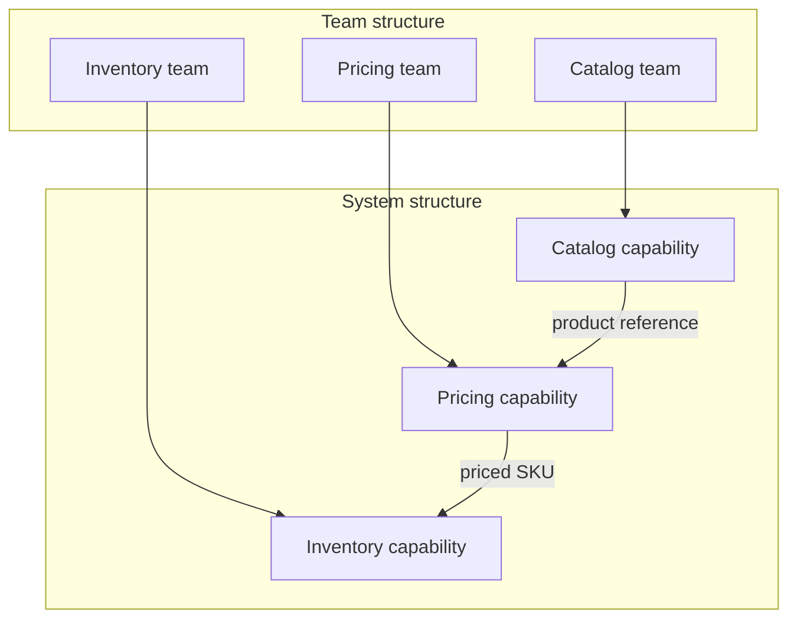
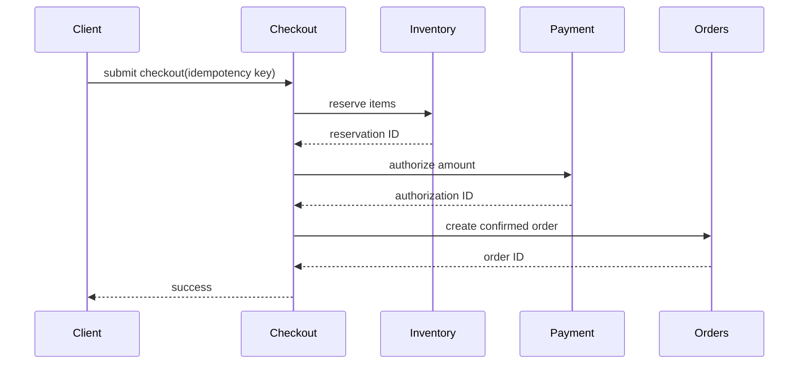
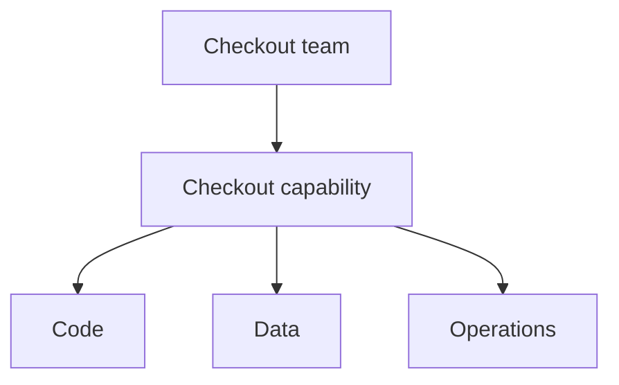

# Decomposition — Professional

At professional or staff/principal level, decomposition connects three systems:

- The software architecture.
- Team ownership and communication.
- The sequence in which a large initiative delivers value.

The goal is not a perfect diagram. It is an operating model in which teams can deliver safely with little coordination and learn before the largest risks arrive.

---

## 1. Architecture and communication shape each other

Conway's law says systems tend to mirror the communication structures of the organizations that build them.



If two teams must coordinate for most changes, their technical boundary is probably misplaced or their ownership is incomplete.

Apply the inverse Conway maneuver deliberately:

1. Identify the domain boundaries you want.
2. Give one team end-to-end ownership of each capability.
3. Define contracts between teams.
4. Remove shared write ownership.
5. Measure how often delivery still requires cross-team coordination.

Organization changes alone do not fix architecture. Teams also need authority over code, data, deployment, observability, and on-call.

---

## 2. Size a boundary to team cognitive load

A piece should fit in one team's working understanding: domain, code, data, operations, and failure modes.

Use evidence rather than service count:

| Signal | Keep together | Consider separating |
|---|---|---|
| Business change | Usually changes together | Changes independently |
| Consistency | Shares an atomic invariant | Can tolerate async coordination |
| Scaling | Similar traffic pattern | Clearly different load pattern |
| Failure | Acceptable shared blast radius | Must fail independently |
| Ownership | One team has the expertise | Stable independent ownership exists |
| Compliance | Same controls | Different legal/security boundary |

Several signals should support a split. One unusual traffic spike rarely justifies a new team and service by itself.

---

## 3. Prefer modules before services

Network boundaries add latency, partial failures, contract versioning, observability, and operational ownership.

Professional heuristic:

> Modularize early. Distribute only when independent operation is worth the permanent integration cost.

Before extraction, verify that the module already has a clear API, tests, explicit data ownership, and minimal backdoor dependencies.

---

## 4. Measure recomposition through coordination

At this scale, integration cost appears both in runtime behavior and in calendars.

Track signals such as:

- Percentage of changes requiring multiple teams.
- Waiting time at handoffs.
- Number of contracts changed per feature.
- Cross-team incident escalations.
- Shared database writes.
- Releases that must be synchronized.

Frequent coordination is architectural data. It may indicate a boundary, ownership, platform, or contract problem.

---

## 5. Decompose initiatives into vertical slices

A multi-quarter plan can be split horizontally by component or vertically by user value.

Compare the two planning styles:

- **Horizontal plan:** build the database, backend, and UI separately, then integrate at the end. User value and integration evidence arrive late.
- **Vertical plan:** deliver one small flow end to end, observe it under real traffic, expand it, then retire the old path. Value and learning arrive with every slice.

A useful slice:

- Works end to end.
- Delivers user value or decisive learning.
- Is small enough to observe.
- Can be reversed or stopped safely.
- Reduces uncertainty for the next slice.

Do not confuse a technical milestone with a shippable increment. “Database complete” provides little evidence that the full customer flow works.

---

## 6. Order slices by risk and learning

Do not automatically implement the easiest slice first. Test assumptions that could invalidate the plan.

For every initiative, identify:

- **Value risk:** will users benefit?
- **Technical risk:** can the system meet correctness and scale needs?
- **Migration risk:** can data and traffic move safely?
- **Operational risk:** can teams observe and support it?
- **Organizational risk:** can ownership work without constant escalation?

Place high-impact, high-uncertainty assumptions early enough to change direction cheaply.

---

## 7. Worked scenario: extract checkout safely

Goal: move checkout from a monolith to a dedicated capability and team.

### Define the safe boundary

Checkout coordinates pricing, inventory, payment, and order creation. The critical rule is that customers must not be charged without a recoverable order outcome.



The checkout team must own orchestration, idempotency, recovery, observability, and on-call. Dependencies own stable reserve/authorize/create contracts.

### Migrate in reversible slices

Migration sequence:

1. Define internal contracts inside the monolith.
2. Shadow requests without affecting customers.
3. Route one low-risk checkout flow.
4. Ramp traffic with automatic rollback.
5. Migrate the remaining flows.
6. Remove the old path.

Each slice has an exit condition:

| Slice | Evidence before proceeding |
|---|---|
| Contracts | Consumer and compatibility tests pass |
| Shadow traffic | Results match within agreed tolerance |
| First live flow | Error and conversion rates remain healthy |
| Traffic ramp | Rollback works and on-call can diagnose failures |
| Remaining flows | Each flow meets business metrics |
| Old-path removal | No traffic or dependencies remain |

---

## 8. Make ownership explicit

Use a capability ownership map:



For each capability, name one accountable team and record:

- Code and repositories owned.
- Source-of-truth data.
- Public contracts and consumers.
- Service-level objectives.
- Security and compliance duties.
- On-call and incident authority.
- Dependencies the team consumes.

Shared accountability often becomes missing accountability.

---

## 9. Initiative decomposition template

```markdown
## Outcome and measures
What user/business result changes, and how will we measure it?

## Capability boundary
What code, data, invariants, and operations belong together?

## Ownership
Which team owns delivery and operation end to end?

## Coordination map
Which teams/contracts are involved? How will handoffs be reduced?

## Risks and assumptions
Rank each by impact and uncertainty.

## Vertical slices
For each slice: value, scope, evidence, rollback, and exit criteria.

## Migration and retirement
How will traffic/data move, and when can the old path be removed?
```

Review this artifact with engineering, product, operations, security, and affected team leads. Their disagreements often reveal hidden coupling.

---

## 10. Professional checklist

- [ ] Architecture and team ownership reinforce each other.
- [ ] One team can own each capability end to end.
- [ ] Cognitive load fits the owning team.
- [ ] Multiple evidence-based forces justify every service boundary.
- [ ] Data and critical invariants have one clear owner.
- [ ] Cross-team coordination is measured and reduced.
- [ ] The initiative uses independently valuable vertical slices.
- [ ] High-impact uncertainty is tested early.
- [ ] Every migration slice has observable exit and rollback criteria.
- [ ] The plan retains value if funding or priorities stop it early.

The central lesson is:

> Professional decomposition aligns software, teams, and delivery sequence so each piece can create value, operate safely, and evolve with minimal coordination.

Return to [junior](junior.md), [middle](middle.md), or [senior](senior.md), or continue with [systems thinking](../../03-systems-thinking/) and [problem-solving](../../02-problem-solving/).

---
## Check your understanding

Try to answer these questions from memory:

1. Explain Conway's law and what it means for how you decompose a system.
2. You're told to break a monolith into microservices. What's your first question?
3. How do you decompose a multi-quarter initiative?
4. Give a quick example of a *bad cut* and how you'd fix it.
