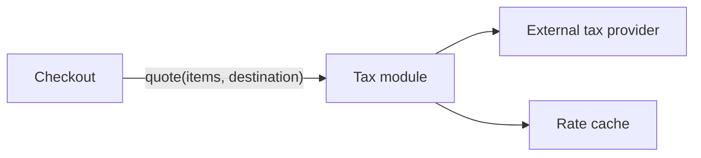
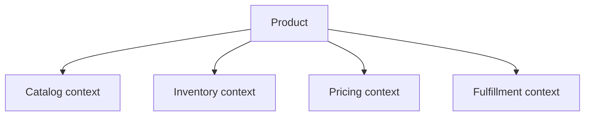
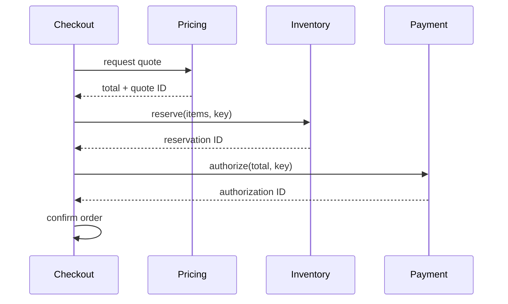
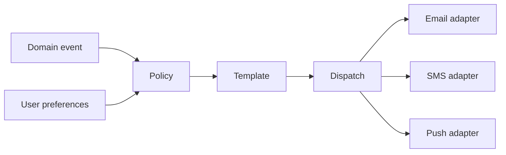

# Decomposition — Senior

At middle level, you learned to optimize cohesion and coupling. At senior level, focus on a deeper question:

> Which boundaries match the system's natural seams and contain future change?

A natural seam lets one side change without forcing unrelated changes on the other. Senior decomposition protects business rules, hides volatile decisions, and considers integration cost before splitting.

---

## 1. Find seams by looking for independent change

A seam is a boundary where responsibilities, language, data, or change patterns naturally separate.

### Seam vs. cohesion and coupling

These concepts have different roles:

| Concept | Question it answers |
|---|---|
| **Seam** | Where should we split the system? |
| **Cohesion** | Do the responsibilities inside each piece belong together? |
| **Coupling** | How strongly do the pieces depend on each other? |

A seam is a **candidate boundary**. Cohesion and coupling help you decide whether that boundary is good.

For example, suppose you place a seam between `Checkout` and `Pricing`:

- `Pricing` contains only price, tax, and discount rules, so it has high cohesion.
- `Checkout` sends items and a destination, then receives a price quote.
- Neither side needs to know the other's internal implementation, so coupling is low.

That is likely a useful seam. If `Pricing` also manages inventory, sends email, and creates orders, its cohesion is low. If every checkout change requires changing both modules, their coupling is high. In either case, reconsider the boundary.

Use this process:

1. Propose a seam based on responsibilities, language, data, or change patterns.
2. Check cohesion inside each resulting piece.
3. Check coupling across the boundary.
4. Move or remove the seam if cohesion is low or coupling is unnecessarily high.

> A seam is the line you draw. Cohesion and coupling tell you whether you drew it in the right place.

Look at repository history and team behavior:

- Which files repeatedly change together?
- Which rules have different owners?
- Where does vocabulary change meaning?
- Which parts scale or fail independently?
- Which third-party dependency changes frequently?

A diagram can suggest a boundary. Change evidence validates it.

---

## 2. Hide volatile decisions

Information hiding means exposing a stable capability while keeping changeable details private.

Suppose checkout needs tax calculation. Callers should request a tax quote; they should not know vendor endpoints or response formats.



When the provider changes, only the tax module should change.

For every proposed module, complete this sentence:

> This module prevents the rest of the system from knowing ______.

If there is no meaningful answer, the boundary may only mirror an execution step rather than hide a decision.

---

## 3. Use domain language to locate boundaries

The same word can mean different things in different business areas.



Forcing every area to share one giant `Product` model couples unrelated changes.

Apply this during discovery:

1. List important business terms.
2. Ask different stakeholders to define each term.
3. Mark where definitions or rules differ.
4. Treat those language changes as candidate context boundaries.
5. Define explicit translations between contexts.

Domain boundaries are stronger than folders named `controllers`, `services`, and `repositories` because they organize code around business change.

---

## 4. Keep invariants inside a boundary

An invariant is a rule that must remain true. A boundary that cuts through an invariant creates coordination and consistency problems.

Example invariant:

> An order must not be confirmed unless payment is authorized and inventory is reserved.

Before creating a module or service boundary:

1. Write the invariant in one sentence.
2. Trace every state change needed to protect it.
3. Identify which data must be consistent together.
4. Prefer keeping that logic and ownership together.
5. If distribution is necessary, design idempotency and compensation explicitly.

Do not choose a service split first and discover the distributed transaction later.

---

## 5. Design recomposition before decomposition

Every split adds a contract, failure point, and translation. Trace real operations across the boundary before approving it.



Review the trace:

- How many synchronous round trips occur?
- Who owns retries and timeouts?
- Are requests idempotent?
- Which system owns each fact?
- Can contracts evolve independently?
- What happens when a dependency succeeds but the next one fails?

If ordinary operations require chatty calls or shared writes, the seam is weak.

---

## 6. Choose the decomposition lens deliberately

| Lens | Best fit | Main risk |
|---|---|---|
| Functional | Pipelines and transformations | Stages share internal representations |
| Data | Parallel work and scale | Cross-partition operations become expensive |
| Domain | Business modules and services | Boundary ignores shared invariants |

These lenses can combine. Pricing may be a domain boundary, use a functional calculation pipeline internally, and partition data by region.

---

## 7. Worked scenario: notification platform

Requirement:

> Send email, SMS, and push notifications for events such as password reset, shipment, and promotions.

Splitting only by channel duplicates policy and rendering logic. Instead, hide independent decisions:



This design localizes change:

| Change | Expected owner |
|---|---|
| Add quiet hours | Policy |
| Rewrite shipment message | Template |
| Replace SMS vendor | SMS adapter |
| Add retry backoff | Dispatch |
| Add WhatsApp | New channel adapter |

### Actionable design exercise

For each module, document:

- The decision it hides.
- Its stable public contract.
- Data it owns.
- Failure modes it contains.
- Changes that should remain local.

Then test the design against three likely future changes. If every change crosses several modules, revisit the boundaries.

---

## 8. Decide whether a module should become a service

Start with an in-process module because its boundary is cheap to move. Add a network boundary only when there is evidence.

Evidence includes different scaling profiles, clear data ownership, separate release cadence, required failure isolation, or stable team ownership. “Microservices are modern” is not evidence.

Keep the code as an in-process module unless several forces justify extraction:

- Independent ownership is stable.
- Scaling or release needs differ significantly.
- Failure isolation is valuable.
- Data and invariants fit inside the boundary.
- The network and operational costs are acceptable.

---

## 9. Senior boundary decision record

Use this before a significant module or service split:

```markdown
## Candidate boundary
What responsibilities and data are inside?

## Seam evidence
Which independent changes, language differences, or ownership patterns support it?

## Hidden decision
What volatile detail is protected behind the interface?

## Invariants
Which rules must stay entirely inside? Does any rule cross the boundary?

## Recomposition
Trace one normal flow and one partial-failure flow.

## Contract
What data and operations cross? Who owns versioning?

## Alternatives
Why is a smaller refactor or in-process module insufficient?
```

---

## 10. Senior checklist

- [ ] Repository and domain evidence support the seam.
- [ ] Each module hides a specific volatile decision.
- [ ] Business language is consistent inside each boundary.
- [ ] Critical invariants do not accidentally cross boundaries.
- [ ] Normal and failure flows have been traced end to end.
- [ ] Data ownership and contract evolution are explicit.
- [ ] The integration cost is lower than the independence gained.
- [ ] A module remains a module unless distribution has a concrete benefit.

The central lesson is:

> Cut where change, language, ownership, and invariants naturally separate—and calculate the cost of reconnecting the pieces before making the cut.

Next: [Professional level](professional.md) — align architecture, team ownership, and multi-stage delivery.
