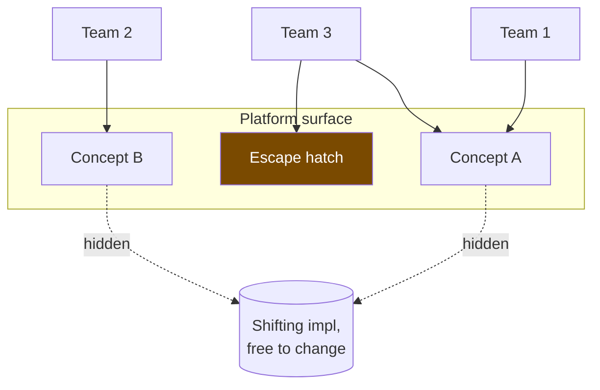

# Abstraction and Generalization — Professional

> **What?** At staff/principal level, abstraction is the central instrument of platform and API design: the set of concepts your platform *exposes* becomes the vocabulary — and the constraints — of every team that builds on it. A wrong abstraction here is not a refactor; it's a multi-quarter migration affecting dozens of teams, and sometimes an unfixable legacy you carry for years.
>
> **How?** You choose which abstractions a platform commits to, you price the cost of a wrong one at org scale, you run the deprecation of leaky abstractions as programs, and you decide where generalization is leverage versus where it's a coordination tax. The output is not code; it's the conceptual surface everyone else thinks inside of.

---

## 1. The abstraction *is* the platform

A platform is, operationally, a set of abstractions plus the guarantees behind them. AWS isn't servers; it's `S3.put`, `Lambda.invoke`, `SQS.send` — a vocabulary. Kubernetes isn't containers; it's `Pod`, `Service`, `Deployment` — a vocabulary. Once an abstraction is exposed and adopted, it is **load-bearing for every consumer**, and you can no longer change it freely. The most consequential decision you make at this level is *which concepts to admit into the vocabulary at all*.

Two failure modes bracket the decision:

- **Too few / too leaky** — the platform forces every team to re-solve the same hard thing (auth, retries, idempotency). The abstraction exposed the complexity instead of hiding the decision.
- **Too many / too clever** — the platform invents concepts no team's mental model contains, and adoption stalls because the abstraction doesn't match how people think about the problem.

The right surface is the smallest set of concepts that lets a competent consumer express what they need **without** reaching for an escape hatch in the common case — and **with** a clean escape hatch for the uncommon one.



## 2. Pricing a wrong abstraction at org scale

At the senior level the wrong-abstraction cost was super-linear *within a codebase*. At platform scale it's super-linear *across the org*, and the exit is gated by other people's roadmaps.

Make the cost explicit before you commit:

| Dimension | Right abstraction | Wrong abstraction (exposed widely) |
|-----------|-------------------|-----------------------------------|
| Change a shared decision | one place, ship | impossible without N-team migration |
| Divergent need appears | new param or sibling concept | flags accrete; or teams fork/escape |
| Removal | deprecate cleanly | years; possibly never (frozen by adoption) |
| Coordination | none | every consumer in the blast radius |

The principal-level discipline: **the wider the adoption, the higher the bar for committing the abstraction.** A concept used by one team can be wrong cheaply. A concept in the platform vocabulary that 40 teams import is, once wrong, a tax you pay every quarter until you can run a migration. This is why mature platforms ship abstractions **late and behind versioning**, and prefer to expose a thin, honest, slightly-too-low-level primitive over a thick, clever, slightly-wrong one. (Hyrum's Law makes this worse: with enough consumers, *every observable behavior* — even ones you never promised — becomes a depended-upon part of the contract.)

## 3. Don't make the platform a single wrong abstraction

The catastrophic version of the wrong abstraction at this level is the **"unified everything" concept** — one model meant to cover all of payments, or all of identity, or all of "resources" — that fits nobody after the second consumer. Symptoms:

```
config:
  mode: "legacy" | "v2" | "enterprise" | "eu" | "partner"   # the flag swamp, now org-wide
  overrides: { ... 200 keys, one per consumer's special case }
```

When the platform's central abstraction is governed by a mode enum and an overrides bag, the abstraction has stopped hiding decisions and started *cataloguing* every consumer's divergence. The correct move mirrors Metz's unwind, but at architecture scale: **split the over-unified concept into the few distinct concepts the consumers actually have** (transactional vs subscription vs marketplace payments are different abstractions; stop pretending they're one). Sometimes the honest answer is *more* concrete primitives and *less* unification.

## 4. Deprecating a leaky abstraction as a program

Every non-trivial platform abstraction leaks (Spolsky), and some leaks are bad enough — or some abstractions wrong enough — that you must remove them while consumers depend on them. This is a *program*, not a code change. The playbook:

1. **Quantify the blast radius.** Who calls it, how, on which behaviors (including the unintended ones — Hyrum's Law)? Instrument before you announce.
2. **Build the replacement and a bridge.** Ship the new abstraction; provide an adapter so old call sites keep working. Never deprecate without a migration path that exists today.
3. **Make the new path the path of least resistance.** Defaults, codegen, lints that flag the old one. Migrations succeed by gradient, not by memo.
4. **Stage the cutover.** Soft-deprecate (warn) → block new usage → migrate existing → remove. Each stage has metrics and a rollback.
5. **Carry the tail consciously.** There is always a long tail. Decide explicitly whether you fund the last 5% of migration or freeze the old abstraction behind a clearly-marked legacy boundary. Pretending the tail doesn't exist is how you get a "temporary" compatibility shim that outlives its authors.

The leak that triggers a deprecation is usually an abstraction that hid something consumers *need to control*: a connection pool that hid timeouts they must tune, a retry layer that hid idempotency they must own, an ORM-style data API that hid the query plan they must optimize. The fix is rarely "hide it better" — it's "expose the right control at the right level."

## 5. Generalization as leverage vs. as tax

Generalization is the lever a platform pulls to turn one team's solution into the org's default. Pulled at the right time it's enormous leverage; pulled early it's the org-wide wrong abstraction from §2. The principal judgment is *which*:

- **Leverage** when: ≥3 teams have independently built the same thing, their needs share a *reason to change*, and a generalization removes real toil. (The classic "extract a platform capability from three internal copies" — feature flags, auth, the deploy pipeline.)
- **Tax** when: you're generalizing on *anticipated* demand, the consumers' needs only *look* alike, or the generalization couples deploy/coordination across previously-independent teams. Speculative generality at platform scale is the most expensive speculation in the building.

A useful gate: **don't platform-ize a capability until at least three teams have shipped their own version in production.** The independently-evolved copies *are* your requirements document; they tell you the true axis of variation. Building the platform abstraction first means guessing it.

## 6. Designing the abstraction's altitude for its consumers

A platform abstraction must match the **mental model of its intended consumer**, not the implementer's. The same capability is exposed at different altitudes for different audiences, and offering the wrong altitude is a defect even if the code is correct:

| Consumer | Right altitude | Wrong altitude (a defect) |
|----------|----------------|---------------------------|
| App team | `payments.charge(order)` | "assemble a PCI-scoped tokenization request" |
| Infra team | `pod.spec.resources` | "write a cgroup v2 controller file" |
| Data team | `table.query(sql)` | "manage your own LSM compaction" |

When app teams are forced to reason about idempotency keys, currency minor-units, or retry budgets, the platform leaked implementer concerns upward. Layering helps here *only if each layer hides a decision the layer above shouldn't make* — otherwise you've built the indirection tax (Lampson) into the org's critical path, where every team pays it forever.

## 7. Governing the abstraction surface over time

Principal work is as much *curation* as creation: keeping the vocabulary small, coherent, and honest as it ages.

- **Resist concept proliferation.** Every new exposed concept is a permanent maintenance and teaching cost. Two overlapping concepts that do almost the same thing are worse than one slightly-imperfect one; consolidate before they both calcify.
- **Make leaks contractual.** Document consistency models, latency SLOs, failure semantics. A leak that's in the contract is a feature; a leak that surprises is an incident.
- **Version the vocabulary, not just the bytes.** Concept-level changes need a migration story, not a minor-version bump.
- **Prefer composable primitives to bespoke endpoints.** A few orthogonal primitives that compose beat fifty special-purpose abstractions that don't — fewer concepts to learn, fewer to deprecate.
- **Keep an escape hatch, and watch it.** A frequently-used hatch is a signal the abstraction is at the wrong altitude; treat hatch usage as product feedback.

## 8. Heuristics at staff/principal level

1. **The wider the adoption, the higher the bar to commit an abstraction.** Ship late, behind versioning.
2. **Three production copies before you platform-ize.** The copies are your spec.
3. **Expose honest primitives over clever, slightly-wrong unifications.** A thin true thing beats a thick false one.
4. **Run deprecations as programs:** quantify → bridge → make-it-the-easy-path → stage → fund-or-freeze the tail.
5. **Match the abstraction's altitude to the consumer's mental model;** upward leaks of implementer concerns are defects.
6. **Curate the vocabulary.** Fewer, composable, well-named concepts; kill overlaps before they calcify.
7. **Put the leaks in the contract.** Documented degradation is a feature; surprising degradation is an outage.

---

### Related

- Where boundaries and seams live in code: [`../05-modeling-a-problem-in-code/`](../05-modeling-a-problem-in-code/).
- Recurring shapes that justify a platform concept: [`../02-pattern-recognition/`](../02-pattern-recognition/).
- Decomposing a domain into platform-sized parts: [`../01-decomposition/`](../01-decomposition/).
- Reasoning from essentials when an inherited abstraction is wrong: [`../../05-first-principles-thinking/`](../../05-first-principles-thinking/).
- DRY vs the wrong abstraction across teams: [`../../../code-craft/design-principles/`](../../../code-craft/design-principles/) · Migration/inline/extract mechanics: [`../../../code-craft/refactoring/`](../../../code-craft/refactoring/).
- Section overview: [`../`](../) · Roadmap home: [`../../README.md`](../../README.md).

---
## Check your understanding

Try to answer these questions from memory:

1. Walk me through unwinding a wrong abstraction you've inherited.
2. When does concrete beat abstract?
3. At platform scale, why is the bar for committing an abstraction higher?
4. How does abstraction relate to the other pillars of computational thinking?
