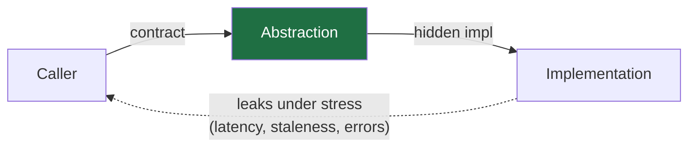

# Abstraction and Generalization — Senior

> **What?** At senior level, abstraction is the load-bearing decision of system design: *which* details a boundary hides, *which* it must expose, and *how* it leaks under stress. Generalization becomes a risk-managed bet — you weigh the carrying cost of a wrong abstraction against the cost of duplication, across a codebase that several teams change concurrently.
>
> **How?** You design the contracts at module and service boundaries, you choose where the seams go, you decide what gets parameterized and what stays concrete, and you own the long-term consequences: leaks discovered in production, abstractions that ossified into the wrong shape, and the migration cost of fixing them.

---

## 1. The essence is *what's left*, and choosing it is a design act

The deepest framing of abstraction: the essence isn't what you keep on purpose — it's whatever *survives* deleting the irrelevant. So the real work is choosing what counts as irrelevant for *this* boundary, *this* set of callers, *this* expected axis of change.

Two engineers abstracting "a notification" will produce different essences:

```python
# Essence A: a notification is a (channel, recipient, message) tuple.
Notification(channel="email", to=user.email, body=render(template, ctx))

# Essence B: a notification is an intent; channel is a routing decision.
notify(user, Event.PASSWORD_RESET, ctx)   # channel chosen downstream
```

Neither is universally right. A wins if channel is a caller concern (transactional email vs SMS OTP are genuinely different call sites). B wins if channel is a *policy* concern (user preferences, fallback, quiet hours) that should be hidden from callers. **The choice of essence encodes a bet about what will change.** Senior judgment is making that bet consciously, with the change history and the roadmap in view — not by default.

This is Parnas's information hiding read at scale: a module's boundary should be drawn around the **decisions most likely to change**, so that change is contained. If you draw the boundary around something stable and expose something volatile, every volatility ripples across the boundary forever.

## 2. Abstraction as the design of *what leaks*

You cannot make a non-trivial abstraction non-leaky (Spolsky). So senior design is not "prevent leaks," it's **choose the leaks**. Every boundary leaks *something*; your job is to make it leak the right thing, predictably.

Frame each boundary with three buckets:

| Bucket | Rule | Example (a key-value store API) |
|--------|------|-------------------------------|
| **Hidden** | Free to change, never observable | on-disk format, compaction strategy |
| **Exposed (contract)** | Promised, callers depend on it | `get/put/delete`, consistency model |
| **Leaks under stress** | Hidden, but surfaces in extremes | tail latency under compaction, eventual-consistency windows |

The third bucket is where senior engineers earn their pay. Junior code treats the contract as the whole truth; production teaches you the leak bucket. A "simple `get(key)`" leaks p99 latency spikes during compaction, leaks staleness during failover, leaks a thundering-herd when a hot key expires. Good abstraction design **names and bounds** these leaks (SLOs, documented consistency model, a `getWithFreshness()` hatch) rather than pretending they don't exist.



## 3. The wrong abstraction: a cost model, not a slogan

Sandi Metz: *"duplication is far cheaper than the wrong abstraction."* At senior level you should be able to say *why*, quantitatively.

A **duplication** has cost `O(k)` to change a shared decision, where `k` = number of copies — but each copy is **independent**, so a divergence in one costs nothing to the others. Risk is local and bounded.

A **shared abstraction** has cost `O(1)` to change the shared decision — *if the decision is truly shared*. But when callers diverge, you pay a different cost: each new special case is a flag, and `n` flags create up to `2^n` interacting paths, all coupled through one module. A change to satisfy caller A can break callers B…Z, none of whom you were thinking about. Risk is global and super-linear.

> The wrong abstraction trades a small, linear, local cost (duplication) for a large, super-linear, global one (coupling). That's the trade you're avoiding.

### The honest unwind

The dangerous part of the wrong abstraction is that the *exit* is expensive. Metz's prescription is worth internalizing: when an abstraction has acquired too many conditionals, **re-inline it** — push the abstraction's code back into each caller, restoring the duplication — *then* re-extract the abstraction that the now-visible cases actually share. Inlining first is what makes the new, correct abstraction discoverable. Senior engineers schedule this as real work, not a guilty hack.

```python
# Symptom: one shared function, many flags, callers fighting over it.
def price(order, *, b2b=False, promo=False, legacy_tax=False, eu=False): ...

# Cure: inline back into the 3 real call sites, see what truly differs,
# then extract the small thing they share (e.g. just `apply_tax(region)`).
```

## 4. Layers and the indirection tax at system scale

Lampson: *"…except for the problem of too many levels of indirection."* At system scale the indirection tax compounds:

- **Debuggability** — an incident at 3am means tracing a request through gateway → BFF → service → adapter → repo → ORM → driver. Each hop is a place the abstraction can be lying to you.
- **Latency** — each boundary that copies, serializes, or allocates adds to the tail. Five "thin" layers each adding 2ms is a 10ms floor you can't optimize away without removing layers.
- **Change amplification** — adding one field to a domain model that passes through DTO → entity → wire → view objects means editing the same concept in five places. The layers were supposed to *decouple*; instead they multiplied the edit.

The senior question for any proposed layer: **what decision does this hide, and who needs that?** A layer that hides nothing — a pass-through `ServiceImpl`, a repository that forwards directly to the ORM with no domain logic, a wrapper that renames methods — is negative value. Delete-on-sight. The "hexagonal/ports-and-adapters everywhere" cargo cult is the most common source of tax-without-benefit; apply ports where you have a *real* second adapter or a real test seam, not prophylactically (see [`../05-modeling-a-problem-in-code/`](../05-modeling-a-problem-in-code/)).

## 5. Generalization across teams: the coupling you can't see

When your abstraction is consumed by other teams, premature generalization gets worse, because the cost of a wrong shared abstraction is now **organizational**: every consuming team must change in lockstep when you fix it. The shared library that "helpfully" generalized three callers' needs becomes a coordination bottleneck — you can't change it without N teams' sign-off.

Two senior moves:

1. **Generalize late and behind a versioned boundary.** Ship the specific thing each team needs; extract the shared abstraction only when three real consumers exist *and* you can version it so consumers migrate on their own schedule.
2. **Prefer copied-then-converged over shared-too-early.** Across team boundaries, a little duplication preserves autonomy. (This is the same logic that pushes microservices to duplicate small models rather than share a "common" library that couples deploys.)

## 6. Naming as the public face of an abstraction

A boundary's names *are* its abstraction; a wrong name is a leak that ships forever. `getUser()` that silently does a network call and may throw is mis-named — the name promises a cheap accessor, the behavior is an I/O operation with failure modes. Senior naming makes the *cost and failure surface* legible:

```python
user = cache.get_user(id)        # implies cheap, local, may miss
user = await api.fetch_user(id)  # implies remote, async, can fail
```

Renaming a public abstraction after the fact is a breaking change with migration cost, which is exactly why the name deserves design effort up front. A precise name is the cheapest abstraction you'll ever build and the most expensive one to fix.

## 7. When concrete wins at senior level

- **Performance-critical paths.** In a hot loop, an abstraction that allocates or dispatches virtually per element is a real cost; inlining the concrete operation is the right call, documented as such.
- **One genuine caller, no foreseeable second.** YAGNI beats speculative generality. Build the abstraction when the second case arrives.
- **The variation isn't stable yet.** If you can't name the axis of change confidently, you can't draw the boundary correctly. Stay concrete and let the requirements teach you the shape.
- **Throwaway / spike code.** Abstraction is an investment that pays off over a maintenance lifetime. Code with no maintenance lifetime shouldn't pay the premium.

## 8. Heuristics for senior abstraction work

1. **Draw boundaries around volatility.** Hide what changes; expose what's stable.
2. **Design the leaks.** Name how each boundary degrades under stress; bound it with SLOs and escape hatches.
3. **Cost the abstraction both ways.** Linear-local (duplication) vs super-linear-global (wrong abstraction). Choose with eyes open.
4. **Inline before re-extracting.** The honest unwind of a wrong abstraction starts by restoring duplication.
5. **One genuine second case before generalizing; three before sharing across teams.**
6. **Kill pass-through layers.** A layer that hides no decision is negative value.
7. **Name for cost and failure, not just for "what."**

---

### Related

- Where seams go in code: [`../05-modeling-a-problem-in-code/`](../05-modeling-a-problem-in-code/).
- Recognizing the recurring shapes worth a boundary: [`../02-pattern-recognition/`](../02-pattern-recognition/).
- Decomposition (drawing the parts the abstractions live in): [`../01-decomposition/`](../01-decomposition/).
- Reasoning up from essentials when an abstraction misleads: [`../../05-first-principles-thinking/`](../../05-first-principles-thinking/).
- DRY vs the wrong abstraction: [`../../../code-craft/design-principles/`](../../../code-craft/design-principles/) · Inline/extract mechanics: [`../../../code-craft/refactoring/`](../../../code-craft/refactoring/).
- Section overview: [`../`](../) · Roadmap home: [`../../README.md`](../../README.md).

---
## Recall and apply

**Practice loop:** Apply one idea to a current task. State the decision it hides, the variation it exposes, and the result.

Try to answer these questions from memory:

1. "Every problem can be solved by another layer of indirection" — what's the catch?
2. How do you choose the right level of abstraction for an API?
3. How is a good name an abstraction?
4. What is speculative generality / over-engineering, and how do you spot it?
