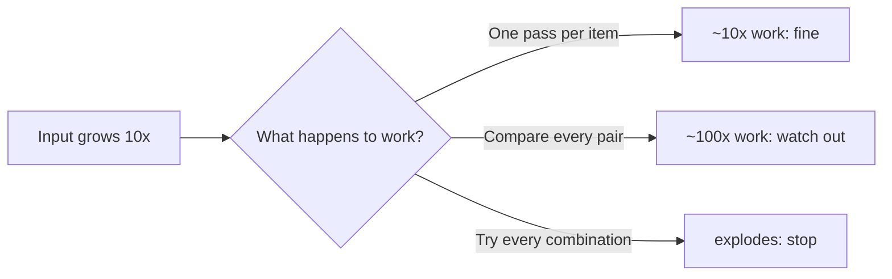

# Algorithmic Thinking — Junior

> **What?** Algorithmic thinking is the habit of turning a fuzzy "I'll just write some code" into a *precise, ordered, finite procedure* that produces the right answer for **every** valid input — not only the one you happened to test.
>
> **How?** Before you type, you state what goes in and what must come out, write the steps in plain language (pseudocode), then check the procedure against the nasty inputs: empty, one element, huge, and malformed.

---

This is one of the four pillars of computational thinking, alongside [decomposition](../01-decomposition/), [pattern recognition](../02-pattern-recognition/), and [abstraction](../03-abstraction-and-generalization/). It is a *thinking discipline*, not a catalogue of algorithms. We are learning **how to reason about procedures**, not memorising sorting routines — for those, see the Data Structures & Algorithms roadmap.

## 1. What actually makes something an algorithm?

Most beginners think "algorithm" means "fancy code." It doesn't. An algorithm is just a recipe — but a recipe with strict properties. Donald Knuth, in *The Art of Computer Programming*, lists the classic ones. An algorithm must be:

| Property | Plain meaning | What breaks it |
| --- | --- | --- |
| **Finite** | It always stops. | A loop that never ends. |
| **Definite** | Each step is unambiguous. | "Mix until it feels right." |
| **Has input** | Zero or more well-defined inputs. | "Take the data" (which data? what shape?). |
| **Has output** | One or more well-defined outputs. | A procedure that runs but tells you nothing. |
| **Effective** | Each step is doable with basic operations. | "Compute the optimal solution" as if that's one step. |

A cooking recipe fails "definite" the moment it says *salt to taste*. A program fails "finite" the moment a loop's exit condition can never be met. Algorithmic thinking is the reflex of checking your procedure against these properties **before** you trust it.

### "I have an idea" is not "I have an algorithm"

> *"I'll find the largest number by looking through the list and keeping the biggest one."*

That's an idea. It's fuzzy. Watch what happens when an adversary hands you inputs:

- **Empty list** — "the biggest one" of nothing? Your idea has no answer here.
- **All negative numbers** — if you start your "biggest so far" at `0`, you wrongly return `0`.
- **One element** — does your loop even run?

An *idea* sounds right when you say it out loud. An *algorithm* survives a hostile input. The whole skill is closing that gap.

## 2. Specify before you code: inputs, outputs, pre/postconditions

The single most useful habit you can build now: **write the contract before the code.**

- **Input** — what you receive, and its exact shape and constraints.
- **Output** — what you must produce.
- **Precondition** — what must be true for the procedure to even make sense.
- **Postcondition** — what is guaranteed true when it finishes.

For "find the largest number":

```
PROCEDURE max_of(list)
  INPUT:         a list of integers
  PRECONDITION:  list is non-empty          <-- this decision matters!
  OUTPUT:        an integer m
  POSTCONDITION: m is in list, AND
                 m >= every element of list
```

Notice the precondition forced a real decision: *what does `max_of([])` mean?* You have three honest choices — require non-empty (precondition), return a sentinel, or signal an error. Writing the contract **surfaced the edge case before it became a crash.** That is algorithmic thinking doing its job.

## 3. Express the steps in pseudocode first

Pseudocode is the discipline of stating *what* the steps are before fighting your language's *syntax*. It is language-agnostic on purpose.

```
PROCEDURE max_of(list):
    biggest <- list[0]              # start with a real element, not 0
    FOR each x in list[1..end]:
        IF x > biggest:
            biggest <- x
    RETURN biggest
```

Read it against the contract. Precondition (non-empty) means `list[0]` is safe. The `biggest <- list[0]` choice quietly killed the all-negatives bug — we never assume `0` is in the data. Pseudocode let us see that *as a reasoning step*, not discover it later in a debugger.

> Rule of thumb: if you cannot write the procedure in five lines of pseudocode, you do not yet understand it well enough to code it. Go back and decompose.

## 4. Correctness: think about the four ugly inputs

For any procedure, deliberately ask: what happens on the **empty**, the **single**, the **huge**, and the **malformed** input?

| Input class | The question to ask | Example for `max_of` |
| --- | --- | --- |
| Empty | Does it have a sensible answer at all? | `[]` → precondition forbids it. |
| Single | Does the loop body even run? | `[7]` → returns `7`. Good. |
| Huge | Does it stay fast / not run out of memory? | a million items → one pass, fine. |
| Malformed | What if the input isn't what I assumed? | `["a", 3]` → not all integers; out of contract. |

This is not paranoia; it is method. The happy path (a normal list of three positive numbers) almost always works. Bugs live in the corners. Train yourself to *visit the corners on purpose*.

## 5. Termination: does the loop ever stop?

"Finite" from Knuth's list deserves its own habit. Every loop needs a reason it must end. Usually that reason is a quantity that *strictly moves toward a limit* every iteration:

```
i <- 0
WHILE i < length(list):
    ... do something ...
    i <- i + 1            # i ALWAYS grows, length is fixed -> must hit length
```

Here `i` increases by 1 every pass and `length(list)` never grows, so `i < length` must eventually fail. The loop terminates. Now a broken version:

```
WHILE x != 0:
    x <- x - 2            # if x starts ODD, it skips past 0 forever
```

If `x` starts at `5`, it goes `5, 3, 1, -1, -3 ...` and never equals `0`. It never terminates. Spotting "is there always a step that moves me closer to stopping?" is a core algorithmic-thinking reflex.

## 6. A first taste of cost: "how does this scale?"

You don't need formal big-O yet. You need the *instinct to ask the question*: **if the input gets 10× bigger, what happens to the work?**



- `max_of` looks at each item **once**. Input 10× bigger → about 10× the work. That scales well.
- A procedure that compares **every pair** of items does roughly *n×n* work. Input 10× bigger → about **100×** the work.
- A procedure that tries **every possible combination** explodes so fast it's unusable past tiny inputs.

You'll formalise this as big-O later (and in the DSA roadmap). For now, just build the habit of mentally 10×-ing the input and asking whether the work merely grows or *explodes*.

## 7. Brute force first — then make it fast

A trap juniors fall into: trying to write the clever, fast version immediately, getting it subtly wrong, and never being sure it's correct.

The professional order is the reverse:

1. **Write the obvious, slow, clearly-correct version.** It's your reference truth.
2. **Confirm it passes the four ugly inputs.**
3. **Only then** optimise — and check the fast version against the slow one on many inputs.

"Make it work, make it right, make it fast — in that order" (a maxim usually credited to Kent Beck). A correct slow algorithm beats a fast wrong one every single time, because a wrong answer delivered quickly is still wrong.

## 8. Putting it together: a worked example

**Problem (the fuzzy idea):** "Check if two words are anagrams."

**Step 1 — Contract.**
```
INPUT:         two strings a, b
PRECONDITION:  none (any strings allowed)
OUTPUT:        true if b is a rearrangement of a's letters, else false
```

**Step 2 — Ugly inputs, decided up front.**
- Empty + empty → anagrams of each other? Yes (vacuously). Decide: `true`.
- Different lengths → can't be anagrams. Decide: `false` fast.
- Same letters, different case (`"Tea"`, `"Eat"`) → do we ignore case? *This is a real spec question — ask before coding.* Assume case-sensitive for now and write it down.

**Step 3 — Pseudocode.**
```
PROCEDURE is_anagram(a, b):
    IF length(a) != length(b): RETURN false
    count <- empty map default 0
    FOR each ch in a: count[ch] <- count[ch] + 1
    FOR each ch in b: count[ch] <- count[ch] - 1
    RETURN all values in count are 0
```

**Step 4 — Scale check.** One pass over each string → grows linearly with word length. Fine.

We never wrote a line of real code, yet we already know the contract, the edge cases, the termination (both loops walk a fixed-length string), and the cost. That is what "having an algorithm" feels like.

---

## Where to go next

- Practice in [check your understanding](#check-your-understanding) — most tasks here are about *specifying and reasoning*, not just coding.
- The thinking method behind problem-solving in general: [problem-solving](../../02-problem-solving/).
- The next pillar — turning an algorithm into real, structured code: [modelling a problem in code](../05-modeling-a-problem-in-code/).
- For the actual algorithms (sorting, searching, graphs), see the **Data Structures & Algorithms** roadmap at [../../../../Data/datastructures-and-algorithms/](../../../../Data/datastructures-and-algorithms/). This pillar teaches you how to *think about* them.

---
## Recall and apply

**Practice loop:** For one task, write the input, output, and steps before coding; test the smallest and edge cases.

Use these prompts to check your understanding and choose one action to try in your next task.

Try to answer these questions from memory:

1. What actually makes a procedure an "algorithm"?
2. You're given an unseen algorithmic problem. Walk me through your approach before writing any code.
3. Should you really write brute force first? Isn't that wasting interview time?
