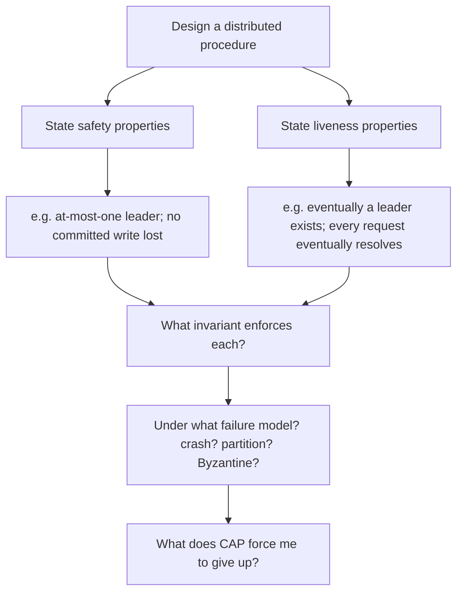

# Algorithmic Thinking — Professional

> **What?** At the staff/principal level, algorithmic thinking is *system-scale*: treating a distributed protocol, a consistency model, a scheduling policy, or a capacity plan as an algorithm whose correctness must hold under concurrency, partial failure, and adversarial load — and leading organisations to reason in invariants rather than incidents.
>
> **How?** You specify protocols by their safety and liveness properties, choose the *kind* of correctness the business actually needs (linearizable vs eventually-consistent vs probabilistically-bounded), reason about cost as a fleet-wide aggregate, and make the trade-offs durable by writing down invariants that survive personnel turnover and code rewrites.

---

The senior level brought algorithmic rigour to individual procedures, including concurrent ones. The principal level operates one altitude higher: **the algorithm is the distributed system's behaviour**, the inputs include failures and reorderings, and the cost is measured across a fleet and a budget. The thinking discipline is identical to junior level — contract, invariant, termination, cost — but the stakes and the input space are far larger.

## 1. A protocol is an algorithm; specify it as one

Replication, consensus, leader election, and saga coordination are algorithms whose "input" includes message loss, reordering, duplication, and node death. You cannot reason about them by reading code; you reason about them by **stating their properties** — the discipline of formal specification, even when done informally.

Distributed-systems correctness splits into two property classes (Lamport):

- **Safety** — "nothing bad ever happens." *No two nodes believe they are leader simultaneously.* A safety violation is a concrete, pin-pointable bad state.
- **Liveness** — "something good eventually happens." *A request is eventually committed.* A liveness violation is the system getting stuck forever.

This split is the principal's core lens. Most painful production incidents are one or the other: a *safety* break (double-spend, split-brain, lost write) or a *liveness* break (deadlock, livelock, a queue that never drains). Naming which one you're protecting changes the design.

The **FLP impossibility result** (Fischer–Lynch–Paterson) — no deterministic consensus protocol can guarantee *both* safety and liveness in an asynchronous network with even one crash — is not trivia. It tells the principal *where to spend the trade-off*: real protocols (Paxos, Raft) keep safety always and accept that liveness is only conditional (they make progress when the network is "good enough"). Knowing that you *must* trade something is what stops you from chasing an impossible design.

## 2. Choosing the kind of correctness the business needs

Exact, linearizable correctness is the most expensive product on the menu. A principal's highest-leverage decision is often choosing a *weaker, cheaper* correctness that still satisfies the actual requirement.

| Correctness model | Guarantee | Cost | When it's the right call |
| --- | --- | --- | --- |
| Linearizable / strong | reads see latest write, globally | high latency, coordination, availability hit under partition | money movement, unique-constraint enforcement |
| Causal / read-your-writes | respects cause→effect ordering | moderate | social feeds, collaborative editing |
| Eventual | converges *eventually*, may read stale | cheap, highly available | view counts, caches, presence |
| Probabilistic / bounded-error | provably within ε with prob ≥ 1−δ | very cheap at scale | analytics, cardinality, sampling |

The CAP theorem makes this concrete: under a network partition you choose **consistency or availability**, not both. A principal frames that as a *product* decision — "checkout must be consistent even if it means rejecting requests during a partition; the recommendations widget must stay available even if it serves stale data." Same company, opposite choices, each justified by what *that* feature's correctness actually requires. Mapping each subsystem to the *weakest* correctness model that still meets its requirement is algorithmic thinking applied to architecture.

## 3. Approximate and probabilistic algorithms as load-bearing infrastructure

At fleet scale, the "approximate" choice from the senior level becomes a primary architectural tool, and the principal owns its error budget explicitly.

- **Sketches** (HyperLogLog, Count-Min, t-digest) replace "store and count everything" with kilobytes and a *stated* error bound. The principal's job is ensuring the bound is contractual: "cardinality is within 2%, and every downstream consumer has agreed that's acceptable."
- **Probabilistic gating** (Bloom/Cuckoo filters) cuts expensive lookups by cheaply ruling out the negatives. Correctness reasoning: false positives cost a wasted lookup (tolerable); false negatives must be impossible (load-bearing) — a one-sided error you must prove your filter respects.
- **Sampling** (head-based, tail-based, reservoir) makes observability affordable. The trade is statistical: you accept that rare events may be missed in exchange for a tractable data volume, and you *quantify* that risk rather than hand-waving it.

The principal-level skill is treating the **error budget as a designed quantity**, the same way you'd design a latency budget — allocated across the system, monitored, and defended in review.

## 4. Cost as a fleet-wide, economic aggregate

Big-O still matters, but the principal also reasons about cost as money and as emergent fleet behaviour:

- **Aggregate dynamics over single-request cost.** An algorithm that's individually `O(1)` can melt the fleet if it triggers *correlated* behaviour: synchronised cache expiry (thundering herd), retry storms, or a hot shard. The fix is algorithmic — jitter, request coalescing, backpressure, consistent hashing — chosen by reasoning about the *distribution of behaviour across nodes*, not one node.
- **The constant factors finally matter.** At a billion requests, the constant hidden by big-O is a hardware budget line. A 2× constant-factor win in a hot path is real money. Principals know *when* to descend from asymptotics to constants (hot path, huge `n`) and when not to (everything else).
- **Backpressure and admission control are algorithms for survival.** Under overload, the correct algorithm is one that *sheds load gracefully* (queue bounds, load shedding, circuit breaking) rather than one that's optimal when healthy. Designing for the overloaded regime is a distinct algorithmic problem from designing for the happy path.

## 5. Verifying correctness you cannot test exhaustively

You cannot unit-test every interleaving of a distributed protocol — the state space is astronomical. Principals reach for stronger verification tools and, more importantly, *decide which parts of the system warrant them*:

- **Model checking / TLA+** to exhaustively explore the state space of a critical protocol and catch the rare interleaving that violates safety. Reserved for the genuinely load-bearing protocol, not everyday code.
- **Property-based and differential testing** — assert invariants ("the ledger always balances," "the fast path agrees with the brute-force oracle") over thousands of generated inputs and interleavings.
- **Deterministic simulation / fault injection** — replay the protocol under injected partitions, clock skew, and message reordering to surface liveness bugs.

The principal's judgment is *proportionality*: spend formal effort where a safety violation is catastrophic and irreversible (payments, data durability), and lean on tests and observability where it's recoverable. Over-verifying everything is its own form of waste.

## 6. Leading an organisation to think in invariants

The deepest principal contribution is cultural: making invariants the unit of design discourse.

- **Design docs state safety and liveness properties up front**, not just APIs. "After this change, *which invariant could break?*" becomes the standard review question.
- **Invariants outlive code.** A subsystem documented by "every accepted order is either fulfilled or refunded — never silently dropped; the outbox pattern guarantees it across crashes" can be rewritten in a new language by a new team without losing its correctness. Code rots; a well-stated invariant is the institutional memory.
- **Incidents become invariant-violations, not mysteries.** A mature postmortem names the invariant that broke and the assumption that was silently false — turning a one-off fire into a reusable lesson. This is Polya's "look back" step, institutionalised.

A staff/principal engineer's leverage is that one well-chosen invariant, written where the team will see it, prevents a class of bugs across many services and many years — far more than any single clever algorithm they could write themselves.

## 7. The discipline is unchanged — only the altitude

It is worth ending where the junior page began. The four questions never change:

1. **What is the contract?** (inputs, outputs, pre/postconditions — now including failure inputs)
2. **What invariant guarantees correctness?** (now: safety and liveness, across concurrency and partitions)
3. **Does it make progress / terminate?** (now: liveness under an explicit failure model)
4. **What does it cost?** (now: fleet aggregate, error budget, and dollars)

A principal is simply someone who asks those four questions about a *protocol* and a *fleet* with the same reflexive rigour a junior learns to apply to a `for` loop — and who teaches the whole organisation to ask them too.

---

## Where to go next

- Protocol-reasoning and approximate-vs-exact exercises are in [check your understanding](#check-your-understanding); design-interview framings in [check your understanding](#check-your-understanding).
- Concrete protocols, consensus, probabilistic data structures, and complexity theory: the **Data Structures & Algorithms** roadmap at [../../../../Data/datastructures-and-algorithms/](../../../../Data/datastructures-and-algorithms/).
- Related thinking pillars: [decomposition](../01-decomposition/), [abstraction and generalisation](../03-abstraction-and-generalization/), [modelling a problem in code](../05-modeling-a-problem-in-code/), and the broader [problem-solving](../../02-problem-solving/) method.

---
## Recall and apply

**Practice loop:** For one task, write the input, output, and steps before coding; test the smallest and edge cases.

Try to answer these questions from memory:

1. Your single-threaded algorithm is correct. What changes under concurrency?
2. How would you reason about the correctness of a distributed protocol?
3. Walk me through a time-vs-space trade-off you'd make consciously.
4. Your fast solution and your brute force disagree on one input. What now?
