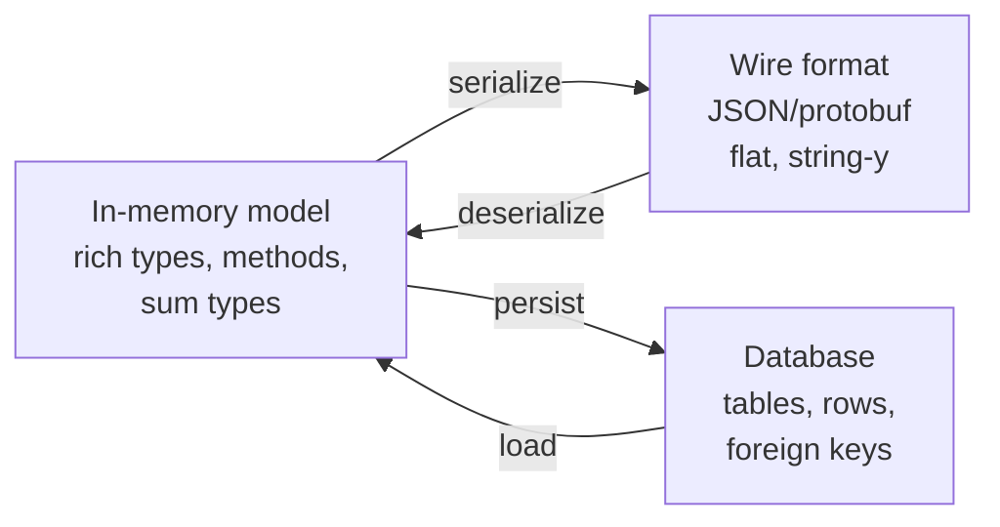

# Modeling a Problem in Code — Middle

> **What?** Modeling is choosing the *representation* that captures a problem faithfully — deciding whether the thing in front of you is fundamentally a graph, a state machine, a tree, a set of events, a matrix, or a plain record, and accepting that the choice makes some operations trivial and others nearly impossible.
> **How?** You learn to recognize the shape of a problem, name entities/values/relationships using the domain's own words, and encode invariants in the representation so that whole categories of bugs simply can't be expressed. You treat the model as something you'll refine as understanding grows.

---

## 1. Recognizing the shape of a problem

The biggest modeling decision is usually a *category* decision: what kind of structure is this, really? The same domain can be modeled several ways, and the category you pick decides which questions are cheap.

| If the problem is about… | It's probably a… | Makes easy | Makes hard |
|---|---|---|---|
| Things connected by relationships | **graph** | "who is reachable from X", shortest path | "give me everything in order" |
| A thing that moves between named states on events | **state machine** | "is this transition legal?", auditing | continuous/numeric values |
| Containment / hierarchy | **tree** | parent/child, sub-totals, scoping | many-to-many links |
| What *happened* over time | **event log** | history, replay, audit, time-travel | "current value right now" (must fold events) |
| Dense numeric relationships | **matrix / grid** | bulk math, neighbors-by-coordinate | sparse or irregular structure |
| Independent records keyed by id | **table / map** | lookup, CRUD | deep relationships, ordering |

A worked instinct: **a permission system "user X can do action Y on resource Z" is a graph** (or relations), not a pile of boolean flags. The moment you write `user.can_edit`, `user.can_delete`, `user.can_share`… you've chosen the wrong category, and "show me everyone who can edit this document" becomes a nightmare. Model it as edges — `(user, permission, resource)` — and that question is one lookup.

---

## 2. Worked example: modeling a chess board

Chess is a perfect lens because there are several reasonable representations and they trade off sharply.

### Model A — 8×8 grid

```python
board = [[None]*8 for _ in range(8)]
board[0][4] = ("white", "king")
```

- **Easy:** "what's on e1?" is `board[0][4]` — O(1). Rendering the board is a double loop.
- **Hard:** "where are all the white knights?" means scanning all 64 squares every time.

### Model B — map from piece to square

```python
pieces = {("white", "king", 0): (0, 4), ("white", "knight", 0): (0, 1)}
```

- **Easy:** iterating only the ~32 live pieces; "all white knights" is cheap.
- **Hard:** "what's on e1?" now requires scanning pieces (unless you keep a reverse index).

### The real-world answer: keep both

Engines keep *both* a square→piece array and piece→square sets, and update them together. This is a recurring theme: **when no single representation makes every operation cheap, maintain a primary model plus derived indexes**, and keep them in sync at the write boundary. The cost is the bookkeeping; the payoff is that every read is fast.

This same pattern — primary store plus secondary indexes kept in sync — is exactly what databases do for you. Recognizing when *you* need to do it by hand is a middle-level skill.

---

## 3. Make illegal states unrepresentable

The most powerful modeling move you can learn now: **shape the types so that a bad state won't even compile (or construct).** Instead of allowing nonsense and then writing checks to catch it, you arrange the representation so nonsense can't be written down.

The phrase comes from Yaron Minsky's "Effective ML" and is the spine of Scott Wlaschin's *Domain Modeling Made Functional*: *make illegal states unrepresentable.*

### Example: a contact must have *some* way to reach them

Requirement: "A contact has an email, or a phone, or both — but never neither."

```python
# Weak: both fields optional → "neither" is representable (illegal!)
class Contact:
    email: str | None
    phone: str | None
    # Contact(None, None) is a valid object but an invalid contact
```

You'd then sprinkle `if email is None and phone is None: raise ...` everywhere. Instead, encode the rule in the type:

```python
from dataclasses import dataclass

@dataclass(frozen=True)
class EmailOnly:   email: str
@dataclass(frozen=True)
class PhoneOnly:   phone: str
@dataclass(frozen=True)
class EmailAndPhone: email: str; phone: str

Contact = EmailOnly | PhoneOnly | EmailAndPhone
# There is literally no way to build a contact with neither.
```

Now the "neither" case doesn't exist in the type space. Every function that takes a `Contact` is relieved of one whole class of defensive check, and the rule is documented *by the types themselves*.

### State machines: don't carry fields that don't apply

A common smell is an object with optional fields that are only meaningful in some states:

```python
# Weak: a single struct with status + every field that any status might need
class Order:
    status: str               # "cart" | "paid" | "shipped"
    paid_at: datetime | None  # only when paid/shipped
    tracking: str | None      # only when shipped
```

Now "shipped order with no tracking" is representable — a bug waiting to happen. Model each state as its own type so each carries *exactly* the data that state has:

```python
@dataclass
class Cart:    items: list
@dataclass
class Paid:    items: list; paid_at: datetime
@dataclass
class Shipped: items: list; paid_at: datetime; tracking: str

Order = Cart | Paid | Shipped
```

A `Shipped` *always* has tracking; a `Cart` *can't* have a `paid_at`. The state machine is now enforced by construction, not by hope. This pairs naturally with [algorithmic thinking](../04-algorithmic-thinking/): transitions become functions `Cart -> Paid -> Shipped`.

---

## 4. Speak the domain's language

When you name entities and fields, use the words the domain experts use — what Eric Evans calls the **ubiquitous language** in *Domain-Driven Design*. If the business says "policy," "premium," and "claim," your types should say `Policy`, `Premium`, `Claim` — not `Record`, `Amount`, `Request`. A model whose names match the conversation is a model people can reason about together.

A light DDD vocabulary worth carrying:

| Term | Meaning | Test |
|---|---|---|
| **Entity** | Has identity that persists through change | "Is it still the same one if its fields change?" → a `User` |
| **Value object** | Defined entirely by its values, immutable | "Are two of these interchangeable if equal?" → `Money(10, "USD")`, a `DateRange` |
| **Aggregate** | A cluster you treat as one unit for consistency | "What must change together atomically?" → an `Order` and its line items |

The key distinction for a middle engineer: **entities have identity; values don't.** Two `$10` are the same $10. Two users named "Alex" are different people. Getting this wrong — giving identity to a value, or treating an entity as interchangeable — is a frequent source of subtle bugs (e.g. deduping users by name). See [domain modeling from requirements](../../08-object-thinking/06-domain-modeling-from-requirements/) for the full treatment.

---

## 5. Impedance mismatch: the model lives in three places

Your model isn't only in your code. The same concept also exists in the **database** and on the **wire** (JSON, protobuf), and these three shapes rarely match perfectly. The friction between them is the *impedance mismatch*.



Examples of the mismatch:
- Your code has a sum type `Cart | Paid | Shipped`, but a SQL table is one flat row with nullable columns — the very anti-pattern you just avoided in memory.
- Your in-memory object graph has cycles; JSON can't express a cycle.
- An enum in code becomes a bare string on the wire that some other service can typo.

You don't eliminate the mismatch; you *manage* it. Decide deliberately where translation happens (a mapping layer), keep the rich model in the core, and treat the DB/wire shapes as separate representations you map to and from. Don't let the database's flat shape leak back and flatten your in-memory model.

---

## 6. The model will be wrong; plan to evolve it

Box's "all models are wrong, some are useful" has a corollary for working engineers: **your model encodes your current understanding, and your understanding will improve.** The goal isn't a perfect first model; it's a model that's *cheap to refine.*

Signs your understanding has outgrown the model:
- A new requirement forces an awkward optional field on an entity it doesn't belong to.
- You keep adding `type` or `kind` discriminator strings and branching on them — a hint that a single entity is really several.
- A value object starts needing an id — maybe it's actually an entity now.

When this happens, change the model deliberately: introduce the new type, migrate the old data, and delete the workaround. Refactoring the model early (when little depends on it) is routine; doing it late is a project. Recognizing the smell *now* is the skill.

---

## 7. Checklist for a middle-level model

1. **Name the category first** — graph? state machine? tree? events? table? The category decides everything downstream.
2. **Match the structure to the dominant operation**; add derived indexes when one structure can't serve all reads.
3. **Make illegal states unrepresentable** — push invariants into types, not into scattered `if`s.
4. **Use the ubiquitous language;** distinguish entities (identity) from values (equality).
5. **Manage the impedance mismatch** at an explicit boundary; keep the rich model in the core.
6. **Expect to evolve it** — treat awkward optional fields and proliferating discriminators as signals to remodel.

---

**See also:** [Decomposition](../01-decomposition/) · [Pattern recognition](../02-pattern-recognition/) · [Algorithmic thinking](../04-algorithmic-thinking/) · [Domain modeling from requirements](../../08-object-thinking/06-domain-modeling-from-requirements/) · [Roadmap home](../../README.md)

---
## Check your understanding

Try to answer these questions from memory:

1. Model an order that's a cart, then paid, then shipped. What's the wrong way?
2. Entity vs. value object — what's the test, and why does it matter?
3. What is the impedance mismatch and how do you manage it?
4. "All models are wrong, some are useful." What does that mean for an engineer?
