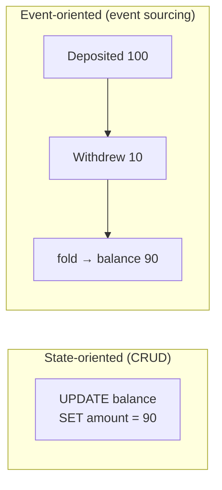
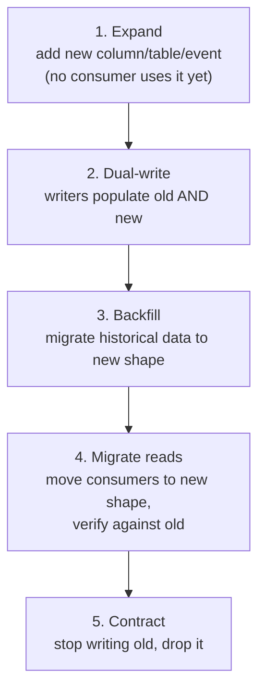

# Modeling a Problem in Code — Professional

> **What?** At staff/principal level, the data model is the longest-lived and hardest-to-change asset in a system — the decision that constrains architecture, team boundaries, and product velocity for a decade. Modeling becomes governance: choosing representations that survive scale and reorganization, and migrating wrong ones across live systems without stopping the business.
> **How?** You design models for change rather than for today's feature; you govern shared schemas and event contracts as public APIs; you choose between state-oriented and event-oriented representations with eyes open; and you run model migrations at scale using expand/contract and parallel-run techniques because you can never "just change the schema."

---

## 1. The data model outlives everything else

Code is rewritten freely; teams reorganize; frameworks are replaced. The *data model* — the schema in the database, the shape of events on the bus, the contract other teams consume — outlives all of it, because data accumulates and dependencies harden around it.

This is the principal-level inversion of Pike and Brooks: not just "data dominates the code," but **the data model dominates the *organization*.** A central entity that means slightly the wrong thing becomes a constraint that every downstream team, report, and integration encodes assumptions against. Within a year you cannot change it without coordinating N teams. The model has become, in Conway's-law terms, part of the org's structure.

Consequences you must internalize:
- **A schema is a liability proportional to its reach.** Every consumer is a dependency you can't break unilaterally.
- **The cost of a modeling mistake scales with data volume and consumer count**, both of which only grow. The cheapest time to fix the model is always *now*.
- **You are designing the thing future engineers will most wish they could change and least be able to.** Design accordingly.

---

## 2. Design for change, not for today

A junior models the current feature; a principal models so that *unknown* future features fit. You cannot predict requirements, but you can predict the *axes of change* and keep them flexible.

### Heuristics for change-tolerant models

| Heuristic | Why it survives | Anti-pattern it prevents |
|---|---|---|
| **Model facts, not current state, where history matters** | facts are append-only; you can re-derive any view later | overwriting `status`, then needing the history you destroyed |
| **Reference by stable id, never by mutable natural key** | emails, usernames, SKUs change; ids don't | the "we keyed on email and then email changed" migration |
| **Represent open sets as data rows, not enum/columns** | new kinds arrive without a schema change | a new `payment_method` requiring a migration + deploy |
| **Keep a translation seam between core model and external contracts** | you can refactor the core without breaking consumers | the DB schema leaking into the public API forever |
| **Separate the *rule* from its *materialization*** | the rule is small and editable; the expansion is regenerable | millions of denormalized rows you must migrate to change a policy |

### Open/closed for data

The decisive question for any classification: **is this set closed or open?** Days of the week are closed (model as an enum/type — adding one is a real event you *want* to be loud). Payment methods, notification channels, integration partners are open — model them as rows in a table, because new ones must be addable without a schema migration and a coordinated deploy. Misjudging this — making an open set closed — is one of the most expensive modeling errors at scale, because every new member becomes a cross-team release.

---

## 3. State-oriented vs. event-oriented: a decade-long fork

The single largest representational decision in a large system is whether the source of truth is **current state** (a row you update in place) or the **sequence of events** that produced it (an append-only log you fold into state).

| Dimension | State-oriented | Event-oriented |
|---|---|---|
| "What is it now?" | trivial (read the row) | derived (fold the log) |
| "How did it get here?" | lost (history overwritten) | native (the log *is* the history) |
| Audit / regulation | needs bolt-on audit tables | inherent |
| New read model / projection | re-derive from scratch, lossy | replay the log into a new projection |
| Operational complexity | low | high (versioning, snapshots, replay) |
| Wrong-decision cost | manageable | severe — events are immutable, so a bad event schema is forever |

The principal judgment: **event-orientation buys you history, auditability, and the ability to spawn new read models cheaply, at the cost of permanent commitment to your event schema and real operational complexity.** Use it where the *history is the product* (ledgers, audit-heavy domains, collaborative editing) and resist it where current-state CRUD genuinely suffices. The failure mode is adopting event sourcing as a fashion and discovering your event schema is now an un-versionable liability across the whole system. Weigh the event-driven trade-offs alongside [systems thinking](../../03-systems-thinking/) for the operational side.

---

## 4. Schema and event-model governance

When a model is consumed by other teams, it is a **public API** and must be governed like one. "Just add a column" is a breaking change to someone.

### Treat contracts as versioned, evolvable artifacts

- **Schema evolution rules.** Adopt a compatibility policy (backward/forward/full) and enforce it in CI — e.g. a schema registry that rejects an incompatible Avro/protobuf change before it ships. New *optional* fields are safe; removing a field, narrowing a type, or repurposing a meaning is not.
- **Never reuse a field for a new meaning.** Repurposing `status` from "order status" to "fulfillment status" is silent corruption for every existing consumer. Add a new field; deprecate the old one explicitly.
- **Tolerant readers.** Consumers should ignore unknown fields, not crash — this is what lets producers evolve. Bake it into the deserialization layer.
- **Ownership and review.** Shared schemas and event contracts need a named owner and a review gate, the same as a public API. Drift between the documented model and the on-the-wire reality is where multi-team systems rot.

### The model as a boundary object

A well-named, well-bounded model is also the *interface between teams*. DDD's **bounded context** is the governance unit: the same word ("customer") legitimately means different things in billing vs. support, and forcing one shared model across both creates a brittle god-schema. The principal decision is often **where to draw the context boundary and where to translate** (an anti-corruption layer) — so each team owns a model that fits its language, and translation is explicit at the seam rather than a shared schema everyone fights.

---

## 5. Migrating a wrong model at scale

You will inherit wrong models, and you can never stop the system to fix them. The technique is **expand/contract (parallel change)**: never mutate in place; add the new shape, move readers and writers across, then retire the old shape.

Principal-level concerns layered on top:

- **Parallel run / shadow comparison.** During step 4, compute both representations and diff them in production; discrepancies reveal modeling assumptions the old code had that you didn't know about. Don't cut over until the diff is clean.
- **Backfill is the hard part at scale.** A billion-row backfill must be chunked, throttled, idempotent, resumable, and respectful of replication lag and lock contention. The *modeling* decision (how the new shape relates to the old) determines whether the backfill is a `SELECT`-and-transform or an archaeology project.
- **Irreversible models multiply the cost.** If the wrong model is an immutable event stream, you can't rewrite history — you version the event type and fold both old and new versions in the projection logic, possibly forever. This is the bill for an event-schema mistake, and why event schemas deserve the most modeling scrutiny up front.
- **Strangler boundaries.** For a deeply wrong core model, you often introduce the correct model in a new bounded context and strangle the old one incrementally behind a translation layer, rather than mutating the legacy schema directly.

The strategic point: **migration cost is dominated by *consumer count* and *data volume*, both monotonically increasing.** This is the quantitative argument for getting modeling scrutiny right early and for remodeling the moment you're confident, not after another year of accretion.

---

## 6. Governing fidelity across a portfolio

At portfolio scale, "all models are wrong, some useful" becomes a resource-allocation policy. You cannot model everything richly; you decide *where the organization spends its modeling fidelity*:

- **Core domain** (your competitive differentiator): model richly, in-house, with the most senior attention. The fidelity here *is* the product.
- **Supporting domains:** model simply, accept good-enough, don't over-invest.
- **Generic domains** (auth, billing rails, email): don't model — buy or adopt a standard, and translate at the boundary. Building a faithful in-house model of a solved problem is misallocated fidelity.

The recurring principal failure is inverted spend: an elaborate, lovingly-modeled internal solution to a generic problem, and a thin, leaky model of the one domain that actually differentiates the business.

---

## 7. The principal's modeling stance

1. **Treat the model as the longest-lived asset** — design it for the decade, not the sprint.
2. **Classify every set as open or closed**, model facts where history matters, key on stable ids.
3. **Choose state vs. event orientation deliberately**, knowing event schemas are a permanent commitment.
4. **Govern shared schemas/events as public APIs** — compatibility rules in CI, named owners, tolerant readers, no field-repurposing.
5. **Draw bounded-context boundaries and translate at seams** rather than forcing one shared model.
6. **Migrate via expand/contract with parallel-run verification**; respect that cost scales with consumers and volume.
7. **Spend fidelity on the core domain;** buy and translate the generic.

Brooks's tables, governed at scale: get them right and the architecture follows; get them wrong and every team downstream pays interest on the mistake for years.

---

**See also:** [Decomposition](../01-decomposition/) · [Abstraction and generalization](../03-abstraction-and-generalization/) · [Algorithmic thinking](../04-algorithmic-thinking/) · [Systems thinking](../../03-systems-thinking/) · [Domain modeling from requirements](../../../craftsmanship/object-oriented-design/08-object-thinking/06-domain-modeling-from-requirements/) · [First-principles thinking](../../05-first-principles-thinking/) · [Roadmap home](../../README.md)

---
## Check your understanding

Try to answer these questions from memory:

1. You're consuming a shared schema/event used by five teams. A field needs a new meaning. What do you do?
2. How do you migrate a wrong model in production without downtime?
3. Where does modeling sit relative to the other computational-thinking skills?
4. A junior shows you a model where `status` is a string and there's also an `is_done` boolean. What's wrong, and what's the principle?
