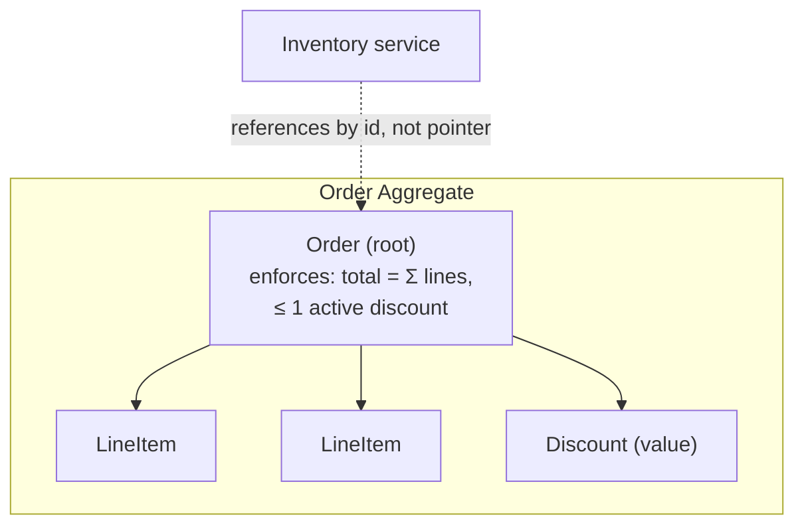

# Modeling a Problem in Code — Senior

> **What?** At senior level, modeling is the act of choosing the representation that will *define the problem's solvability* — the load-bearing decision that determines which features are one-liners, which require heroics, and which are impossible without a rewrite. You treat the data model as the design, and the code as a consequence of it.
> **How?** You evaluate competing representations against the *whole* operation set (not just today's feature), encode invariants structurally, locate translation boundaries on purpose, recognize a wrong model early enough to change it cheaply, and balance fidelity against simplicity with a clear sense of what each costs.

---

## 1. Data dominates — and why that's literally true

Fred Brooks, in *The Mythical Man-Month*, wrote the line that anchors this whole topic:

> "Show me your flowcharts and conceal your tables, and I shall continue to be mystified. Show me your tables, and I won't usually need your flowcharts; they'll be obvious."

Rob Pike's *Notes on Programming in C* says the same from the other side: *"Data dominates. ... Data structures, not algorithms, are central to programming."*

This isn't a slogan; it's a statement about where the *information* in a system lives. The code is mechanical — it follows from the data's shape. The representation is where the actual design decisions are encoded, because the representation determines:

- **The operation cost class.** Whether "find all X related to Y" is O(1), O(n), or "we can't, the data doesn't link that way."
- **Which invariants are free.** A well-chosen type makes illegal states *unconstructable*; a poorly-chosen one makes them merely *discouraged* (by checks that will be forgotten).
- **The blast radius of change.** A model that matches the domain absorbs new requirements as new fields/types; a model that fights the domain absorbs them as special cases, and special cases compound.

So senior modeling is not "pick a struct." It's choosing the representation under which the *expected future stream of operations* is cheap and correct.

---

## 2. Choose against the whole operation set, not the first feature

The classic junior mistake is to model for the feature in front of you. The senior move is to enumerate the *operation set* the model must serve over its life, then pick the representation that keeps the important operations cheap and doesn't make any required operation impossible.

### Worked example: an availability calendar

Requirement today: "Show whether a room is free at a given time." Tempting model — a list of busy intervals:

```python
busy = [Interval(start, end), ...]   # is_free(t): scan for overlap
```

Fine for today. Now the operation set grows, as it always does:

| Future operation | Intervals model | Better representation |
|---|---|---|
| Is `t` free? | O(n) scan | **interval tree** → O(log n) |
| Find the next free 30-min slot | re-derive gaps each call | gaps materialized / segment structure |
| Recurring events ("every Tuesday") | explodes into thousands of intervals | **rule + exceptions** (RRULE-style), expanded lazily |
| "Who booked over this slot?" | intervals don't carry owner | intervals must reference a `Booking` entity |

The interval list isn't *wrong* — it's wrong *for this operation set*. The senior version recognizes that a calendar is fundamentally **rules generating events over a time axis**, not a static list, and models the rule (recurrence) separately from its materialization. Choosing that up front is the difference between a feature and a rewrite.

The discipline: **list the operations, mark which are required vs. likely, and reject any representation that makes a required operation impossible** — cost you can optimize, impossibility you can't.

---

## 3. Make illegal states unrepresentable — at scale

Minsky's principle ("make illegal states unrepresentable") and Wlaschin's *Domain Modeling Made Functional* push invariants into the type structure so the compiler/constructor enforces them. At senior level you apply this as a *systemic* technique, and you know its limits.

### The technique

Replace "valid struct + runtime validation" with "a type that can only hold valid values."

```python
# Before: primitive obsession — every function must re-validate
def transfer(from_account: str, to_account: str, cents: int): ...
#   cents could be negative; account ids are bare strings

# After: parse, don't validate — validity is a property of the type
@dataclass(frozen=True)
class AccountId:
    value: str
    def __post_init__(self):
        if not _valid(self.value): raise ValueError(self.value)

@dataclass(frozen=True)
class Money:                       # value object; non-negative by construction
    cents: int
    def __post_init__(self):
        if self.cents < 0: raise ValueError("negative money")

def transfer(src: AccountId, dst: AccountId, amount: Money): ...
```

Alexis King's "Parse, Don't Validate" is the operational form: **validate once at the boundary, return a *type* that proves the validation happened**, and then the interior never re-checks. The proof travels with the data.

### Where to stop

Type-encoding has diminishing returns. Invariants spanning *multiple aggregates* ("total of all transactions equals the balance"), or that depend on *external state* ("this username is unique"), can't live in a single type — they belong to an aggregate boundary, a transaction, or a database constraint. The senior judgment is knowing which invariants are *structural* (encode them) and which are *contextual* (enforce them at the consistency boundary). Over-encoding produces a type-tetris codebase that's as hard to change as the bugs it prevented.

---

## 4. The aggregate as a consistency boundary

Once a model has invariants that span several objects, you need a boundary that says "these change together, atomically." That's Evans's **aggregate**: a cluster of entities and values with one root, where outside code may only hold a reference to the root, and all invariants inside hold at every transaction boundary.



Modeling decisions that follow from picking aggregate boundaries:
- **Transaction scope:** one aggregate = one transaction is the default; spanning two means you've taken on distributed-consistency cost.
- **Reference style:** *inside* the boundary, hold object references; *across* boundaries, hold ids. This is what keeps aggregates independently loadable and independently consistent.
- **Concurrency unit:** the aggregate is your natural optimistic-locking / version unit.

Drawing the boundary in the wrong place is a senior-grade modeling error: too large and you serialize unrelated work behind one lock; too small and an invariant has nowhere to live. This is where modeling stops being about data shape and starts constraining your concurrency and transactional design.

---

## 5. The cost of a wrong model, and detecting it early

A wrong model is not a bug you fix; it's a tax you pay on every feature. The symptom is uniform: **each new requirement arrives as a workaround rather than an extension.** You can read the wrongness off the diff history.

Early signals, roughly in order of severity:

1. **Discriminator sprawl.** Growing `if type == ...` chains and nullable fields that are "only set when type is X" — the entity is really several types wearing one struct.
2. **Derived data stored and drifting.** You cache a computed value, then add reconciliation jobs because it diverges — the model put a *fact* where a *function* belonged (or vice versa).
3. **Cross-cutting queries that the model can't answer** without a full scan or a new denormalized copy — the relationships you need aren't represented as relationships.
4. **The same fact in two places, kept in sync by code** — a normalization failure that will eventually disagree.
5. **Features that "almost" fit** require touching a surprising number of files — high coupling traceable to a central type that means too many things.

The senior move is to **treat these as model defects, not local bugs**, and to quantify the trajectory: if the workaround count is rising linearly with features, the model is the bottleneck and remodeling now is cheaper than every future workaround. Tie this to [first-principles thinking](../../05-first-principles-thinking/): re-derive what the domain actually *is*, rather than patching what you wrote.

---

## 6. Fidelity vs. simplicity

"All models are wrong, some are useful" is a directive about *fidelity*: capture enough of reality to be correct and useful, no more. More fidelity buys correctness in edge cases and costs complexity, performance, and changeability everywhere.

| Push toward more fidelity when… | Push toward more simplicity when… |
|---|---|
| The discarded detail causes real, costly errors (money, safety, legal) | The detail is unused by any operation |
| The domain's edge cases *are* the business (tax, scheduling, billing) | A simpler model covers 99% and the 1% is cheaply handled out-of-band |
| Auditability/regulation requires faithful history | Speed of change matters more than completeness |
| You're modeling a core domain you'll live in for years | You're modeling a supporting concern or a throwaway |

The trap at both ends: a too-simple model is correct until the day it isn't, and then it's a rewrite; a too-faithful model is correct and unbuildable. The senior calibration is to model the **core domain** richly and the **supporting domains** simply, spending fidelity where the business actually lives. (This mirrors DDD's core/supporting/generic subdomain split.)

---

## 7. Synthesis: modeling is where the other pillars cash out

Modeling is the integration point of computational thinking:

- **[Decomposition](../01-decomposition/)** gives you the entities and the boundaries between them.
- **[Pattern recognition](../02-pattern-recognition/)** tells you the category — "this is a state machine," "this is a graph."
- **[Abstraction](../03-abstraction-and-generalization/)** decides what to keep and what to discard (fidelity).
- **[Algorithmic thinking](../04-algorithmic-thinking/)** is what the chosen representation then makes cheap or impossible.

Get the representation right and, as Brooks promised, the flowcharts become obvious. Get it wrong and no amount of clever algorithm work will save you — you'll be fighting the data forever.

---

**See also:** [Decomposition](../01-decomposition/) · [Pattern recognition](../02-pattern-recognition/) · [Abstraction and generalization](../03-abstraction-and-generalization/) · [Algorithmic thinking](../04-algorithmic-thinking/) · [Domain modeling from requirements](../../../craftsmanship/object-oriented-design/08-object-thinking/06-domain-modeling-from-requirements/) · [First-principles thinking](../../05-first-principles-thinking/) · [Roadmap home](../../README.md)

---
## Check your understanding

Try to answer these questions from memory:

1. How do you know early that you've chosen the wrong model?
2. Model a chess board. Which representation, and why?
3. How do you model a calendar with recurring events?
4. When would you choose an event-sourced model over a state (CRUD) model?
