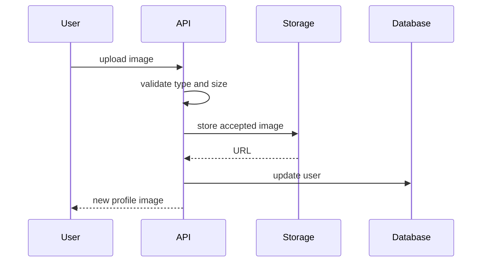

# Computational Thinking — Junior

Focus on one question: **how do I turn a large request into small results I can verify?**

Suppose the request is “let users upload a profile picture.” The sentence hides file selection, validation, resizing, storage, database update, authorization, and display. Coding from the sentence mixes concerns and makes failures hard to locate.

## Decompose by outcomes

Write observable outcomes, not vague activities:

- reject an unsupported or oversized file;
- store one accepted image;
- associate its URL with the correct user;
- return a useful response;
- display the new image.

## Recognize patterns carefully

Look for repeated behavior: validation, authorization, persistence, or error translation. Repetition is a clue, not an automatic reason to create a generic helper. First name what is actually the same and what varies.

## Choose the smallest useful abstraction

An abstraction hides irrelevant detail while preserving what callers need. `ImageStore.save(data) -> URL` is useful if callers should not know whether storage is local or remote. `Utils.process(data)` hides too much and communicates nothing.

## Write the procedure before code

List inputs, outputs, decisions, and failure paths. Walk through a normal case and one edge case. Then implement one vertical slice and test it.

## Apply it today

Take one ticket and write: desired result, five smaller outcomes, one dependency per outcome, and the first testable slice. Stop if a step cannot be verified; split it again.

## Test yourself

1. Why is “build the backend” a poor decomposition?
2. Which details should an `ImageStore` hide?
3. What repeated behavior is not yet a justified abstraction?
4. How would you verify the first slice without completing the feature?

Continue to [`middle.md`](middle.md).
