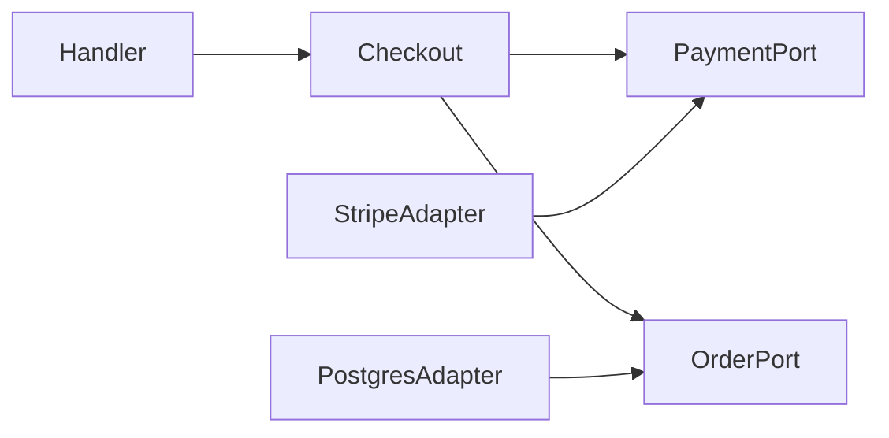

# Computational Thinking — Middle

At middle level, decomposition becomes boundary design. A good boundary has high cohesion inside and limited, explicit coupling outside.

## Model capabilities, not technical layers

Group behavior that changes for the same reason. A `billing` capability may contain rules, use cases, and persistence ports. Splitting every system into `controllers`, `services`, and `repositories` can scatter one change across the repository.

## Find seams

A seam is a place where behavior can vary or be replaced without changing the surrounding code. Interfaces, functions, queues, database views, and API contracts can be seams. Coupling measures dependency; cohesion measures relatedness; a seam is the controllable boundary where you manage both.

Define interfaces where behavior is consumed. Keep them small enough that a fake or alternative implementation is natural.

## Generalize from evidence

Use the rule of three as a prompt, not a law. Compare multiple examples, identify the stable operation and true variation, then generalize. If two code paths merely look similar but obey different business rules, duplication may be safer than false reuse.

## Reason about algorithms

State input size and dominant operation. A linear scan may be correct for 100 records and wrong for 100 million. Consider time, memory, I/O, concurrency, and failure—not Big-O alone.

## Worked method

For a checkout change:

1. write domain invariants such as “charge only after inventory reservation”;
2. draw the component sequence;
3. mark failure and retry boundaries;
4. define the smallest stable ports;
5. implement one end-to-end path;
6. measure and revise the model.

## Test yourself

1. How does a seam differ from low coupling?
2. When is duplicated code preferable to a shared abstraction?
3. Which invariant should decide the checkout sequence?
4. What workload information is missing from Big-O notation?

Continue to [`senior.md`](senior.md).
