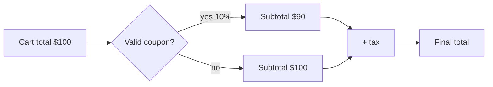

# Understanding the Problem — Junior

> **What?** The first and most-skipped stage of problem-solving: before you write any code, you make sure you actually understand what you are being asked to do — what the result should be, what you are given, and what rules must hold.
> **How?** You restate the problem in your own words, name the unknown, list the data and the conditions, and work one concrete example by hand. Only then do you start solving.

---

This stage comes from George Pólya's *How to Solve It* (1945), a small book about how mathematicians actually solve problems. Pólya found that good problem-solvers spend real time **understanding the problem** first, while weak ones jump straight to "doing something." Engineering is the same. The single most common reason junior developers get stuck — or build the wrong thing — is that they started coding before they understood the problem.

## 1. The discipline: don't code until you can restate it

The rule is simple and it feels unnatural at first:

> If you cannot explain the problem in your own words, you do not understand it yet, and you are not ready to code.

When a ticket says *"Add a discount to the checkout page,"* that is not yet a problem you can solve. Restating it forces the gaps into the open:

- "We need to apply a percentage discount to the cart total when the user enters a valid coupon code, before tax is calculated, and show the discounted total on the checkout page."

Now you can *see* the questions you didn't know you had: percentage or fixed amount? Before or after tax? What is a *valid* code? What happens to an invalid one? The restatement did half the work — this is the idea behind the engineer Charles Kettering's line, **"a problem well stated is a problem half solved."**

Try this rule literally for a week: before opening your editor, type the problem in your own words in a comment or a notebook. If you can't, go ask.

## 2. Pólya's three questions

Pólya gives three questions to ask of any problem. They map cleanly onto programming.

| Pólya's question | In code, this is… | Example: "reverse a linked list" |
| --- | --- | --- |
| **What is the unknown?** | What you must produce — the return value, the output, the end state | A list with nodes in reverse order |
| **What are the data?** | What you are given — inputs, arguments, the current state | The head pointer of a singly linked list |
| **What is the condition?** | The rules that connect data to unknown — constraints, invariants | Do it in O(1) extra space; the list may be empty |

If you can fill in all three rows, you understand the problem well enough to start. If you can't fill in a row, that's exactly the question to ask before you write anything.

```text
Unknown:   the head of the reversed list
Data:      head of the original list (may be null)
Condition: in-place (no new nodes), preserve all values
```

Writing these three lines at the top of a function — even temporarily — keeps you honest.

## 3. The problem as reported is not the real problem

The bug report you receive is a *symptom*, written by someone who saw something go wrong. It is not the defect. A junior developer reads *"the page is broken"* and changes the page. A better developer asks: **broken how, for whom, when, in what browser, doing what?**

Real bug report:

> "The export button doesn't work."

That sentence contains almost no information. Compare what you need to actually find the problem:

- *Doesn't work* — does nothing happen, or does it error, or does it download the wrong thing?
- Which export — there are three buttons labeled Export.
- For all users, or one? Logged in? With a big dataset?
- Reproducible, or once?

The gap between "the export button doesn't work" and "clicking Export CSV on a report with more than 10,000 rows produces an empty file in Safari" is the gap between guessing and solving.

## 4. The XY problem

A very common trap: someone asks you about their *attempted solution* (Y) instead of their *actual problem* (X). This is the **XY problem**.

> **Them:** "How do I get the last 3 characters of a filename in Bash?"
> **You (if you only answer Y):** `"${file: -3}"`
> **The real problem (X):** they wanted the file *extension* — and extensions aren't always 3 characters (`.md`, `.jpeg`, `.tar.gz`). The right answer is a completely different tool.

The tell: someone is asking a strangely specific, low-level question. Always ask **"what are you ultimately trying to do?"** You'll often find the question dissolves because the real goal has a simpler path. When *you* are the one asking for help, give the X, not just the Y — describe the goal, not only your half-built attempt.

## 5. Work a concrete example by hand

Abstractions hide misunderstandings; concrete examples expose them. Before coding, take one real input and produce the output yourself, on paper.

Problem: "Given a list of prices, return the running total."

```text
Input:  [10, 5, 20]
By hand:
  after 10  -> 10
  after 5   -> 15
  after 20  -> 35
Output: [10, 15, 35]
```

Doing this surfaces the questions that the description didn't answer: Does the output include the running total *after each element* (3 numbers) or just the final total (1 number)? What about an empty list — `[]` or `0`? You found two missing requirements just by working one example. Then deliberately pick **edge cases**: empty input, one element, negative numbers, duplicates. Each is a chance to find a hole before code does.

## 6. Write it down and draw a figure

Pólya advises: *draw a figure, introduce suitable notation.* Even crude diagrams beat holding the problem in your head.



The act of drawing forces a decision: *is the discount applied before or after tax?* You cannot draw an ambiguous arrow. Sketching the inputs, the transformation, and the output makes the unknown and the conditions visible.

## 7. The definition of done

You don't fully understand a task until you know how you'll prove it's finished. Ask: **how will I know this is correct?** That answer is your *acceptance criteria*.

```text
Done when:
- A valid coupon reduces the displayed total by the right amount
- An invalid coupon shows an error and changes nothing
- An empty cart cannot have a coupon applied
- Tax is computed on the discounted subtotal
```

If you can't write these before coding, you don't understand the problem yet. This is the engineering version of the carpenter's rule **"measure twice, cut once"** — the few minutes spent understanding save hours of building the wrong thing.

## 8. A short checklist

Before you write code, you should be able to answer:

1. Can I restate the problem in my own words?
2. What is the **unknown** (the output / end state)?
3. What are the **data** (inputs / current state)?
4. What are the **conditions** (constraints, rules, edge cases)?
5. What is the *real* problem, not just what was reported?
6. Can I work one concrete example by hand?
7. How will I know I'm done?

If any answer is "I'm not sure," you've found your next clarifying question — ask it before you code.

---

**Where this leads:** Once you truly understand the problem, you can [devise a plan](../02-devising-a-plan/) to solve it. When the "problem" is a bug, understanding it means reproducing it first — see [debugging as problem-solving](../05-debugging-as-problem-solving/). And many misunderstandings come from unexamined beliefs, covered in [questioning assumptions](../../05-first-principles-thinking/02-questioning-assumptions/). Back to the [problem-solving section](../) and the [roadmap root](../../README.md).

---
## Check your understanding

Try to answer these questions from memory:

1. What does Pólya mean by "understanding the problem," and why is it the most-skipped stage?
2. What are Pólya's three questions, and how do they map to a programming task?
3. You're given a coding problem in this interview. What's the first thing you do?
