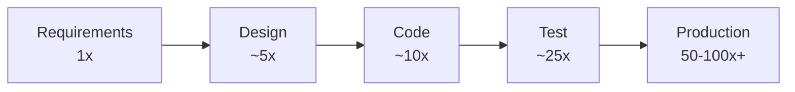
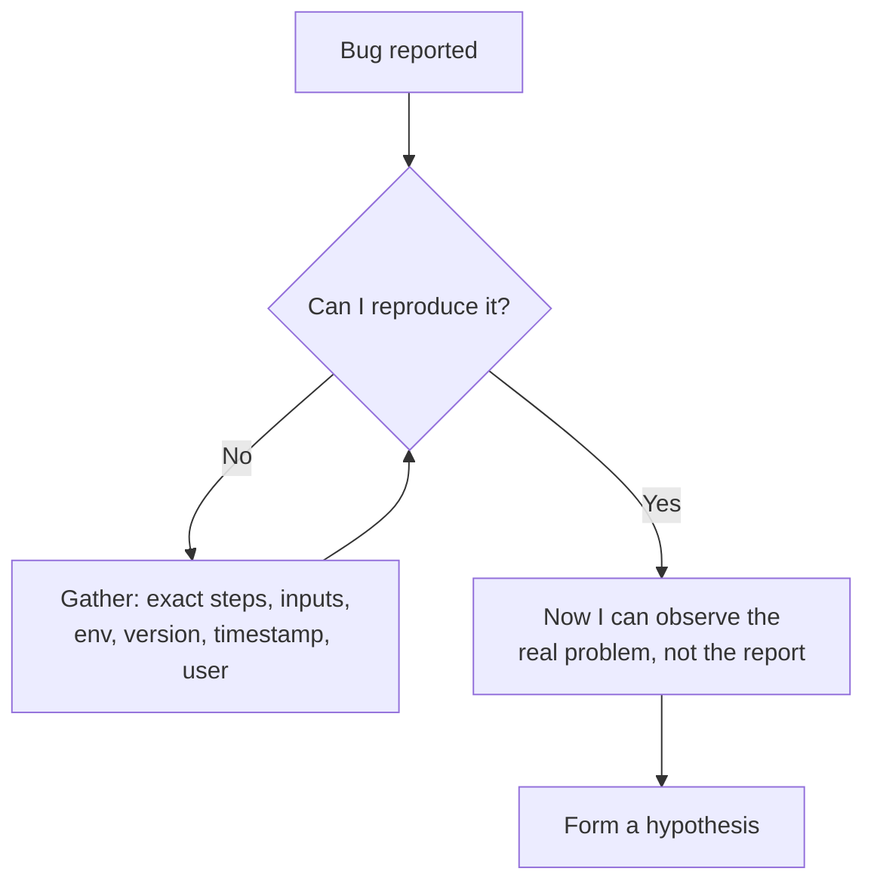

# Understanding the Problem — Middle

> **What?** Pólya's first stage applied to real engineering work: separating the problem as *reported* from the problem as it *actually is*, and converting a vague ticket into a precise, testable statement before any plan exists.
> **How?** You interrogate the unknown/data/conditions, hunt for the XY problem behind the request, surface implicit assumptions and missing constraints, reproduce the problem before theorizing, and lock down acceptance criteria so "done" is unambiguous.

---

At the junior level, understanding the problem is mostly about *yourself* — making sure you, personally, know what you're building. At the middle level it becomes about the **gap between what people say and what they mean**. Tickets are written by humans who saw a symptom or imagined a solution. Your job is to recover the real problem hiding underneath, and to do it cheaply — before you've written code that's wrong.

## 1. Requirements are the most expensive place to be wrong

Barry Boehm's research on the **cost of change** is the economic argument for this entire stage. A defect introduced in requirements but not caught until later costs dramatically more to fix the further downstream it travels — by the time it's in production, the multiplier is often quoted at 10–100×. The numbers vary by study and methodology, but the *shape* is uncontroversial and matches every engineer's experience.



The leverage is brutal: a misunderstanding fixed during *understanding the problem* costs minutes. The same misunderstanding fixed after launch costs a hotfix, a migration, an incident review, and trust. This is *why* the discipline of not coding yet pays — it's the cheapest possible point to be wrong, so it's the right place to spend effort.

## 2. Restating with Pólya's three questions — under ambiguity

Pólya's questions — *what is the unknown? what are the data? what is the condition?* — are easy on a textbook problem. Real tickets are ambiguous, so the value is in noticing **which question you can't answer.**

Take a real-flavored ticket:

> "Users are complaining that search is slow. Make it faster."

| Pólya's question | What the ticket tells you | What's actually missing |
| --- | --- | --- |
| **Unknown** | "faster" search | Faster by how much? p50 or p99? Perceived speed or measured latency? |
| **Data** | search is slow | Which query? Which users? Dataset size? Cold or warm cache? |
| **Condition** | (none stated) | Can results change? Is stale-but-fast acceptable? Budget? Deadline? |

Every empty cell on the right is a clarifying question. "Make search faster" is not a problem you can solve; "reduce p99 latency for autocomplete queries on the products index from 800 ms to under 200 ms, results may be eventually consistent" *is*.

## 3. The XY problem in code review and tickets

The **XY problem** — asking about an attempted solution (Y) instead of the real goal (X) — is everywhere in engineering, not just on Stack Overflow.

| What you're told (Y) | The real problem (X) | Better solution |
| --- | --- | --- |
| "Add a config flag to disable foreign keys during import" | Imports are slow and time out | Batch inserts / defer constraint checks in one transaction, not disable integrity |
| "How do I parse this giant log file with regex?" | Need to alert on a specific error rate | Emit a metric at the source; don't parse logs at all |
| "Give me write access to the prod database" | A report is missing a column | Add the column to the read replica's view |

The pattern to train into your reflexes: when a request is oddly specific or low-level, ask **"what are you ultimately trying to accomplish?"** before you build Y. Half the time, Y is the wrong tool for X, and you'll have saved everyone from shipping a workaround that becomes permanent. In code review, the XY problem shows up as a clever change with no clear motivation — the right comment is "what problem does this solve?", not "nit: rename this variable."

## 4. Reproduce before you theorize

For any problem framed as "it's broken," understanding it means **observing it**, not imagining it. You cannot solve a bug you can't see.



Theorizing before you can reproduce is how you "fix" things that were never broken and ship changes that don't address the actual fault. The minimum reproduction — the smallest input that still triggers the problem — is itself a comprehension tool: stripping away everything irrelevant tells you what the problem actually depends on. (This connects directly to [debugging as problem-solving](../05-debugging-as-problem-solving/), where reproduction is the foundation.)

## 5. Surfacing implicit assumptions and missing constraints

Every requirement carries unstated assumptions. Understanding the problem means dragging them into daylight before they become bugs. A useful drill is to read each sentence of a ticket and ask **"what is this quietly assuming?"**

> "When a user deletes their account, remove their data."

Hidden questions, every one a future incident if left unasked:

- **Hard or soft delete?** Can the user undo it within 30 days?
- **What about data others depend on** — comments others replied to, shared documents?
- **Legal holds / compliance** — are you *allowed* to delete invoices and audit logs?
- **"Their data"** — does that include backups? Derived analytics? Logs?
- **Concurrency** — what if a request is in flight during deletion?

Notice these aren't edge cases you discover in QA; they're requirements you discover by *questioning the assumptions in the sentence*. The systematic version of this skill lives in [questioning assumptions](../../05-first-principles-thinking/02-questioning-assumptions/).

## 6. Clarifying questions: the right ones, not the most

Good clarifying questions are cheap and high-yield; bad ones are noise. Aim them at the parts of the problem you genuinely can't resolve, and prefer questions whose answer *changes what you build*.

| Weak question | Strong question | Why it's better |
| --- | --- | --- |
| "Any other requirements?" | "If two users redeem the last coupon at the same time, who wins?" | Forces a decision that affects the design |
| "Should it be fast?" | "What's the acceptable p99 latency, and what's it now?" | Turns a vibe into a number you can test against |
| "Should I handle errors?" | "When the payment provider times out, do we retry, fail, or queue?" | Names a real branch the code must have |

The **five Ws** (who, what, when, where, why) are a reliable scaffold — especially *why*, which usually exposes the X behind the Y. A senior signal in interviews and on teams alike is *asking the question that reframes the problem*, not the question that just confirms what's already written.

## 7. The definition of done as a contract

Acceptance criteria are how you encode your understanding so it can be checked. Write them as concrete, testable statements — ideally before estimating the work.

```gherkin
Feature: Apply discount coupon at checkout

  Scenario: Valid percentage coupon
    Given a cart subtotal of $100
    And a valid coupon "SAVE10" for 10% off
    When the coupon is applied
    Then the displayed subtotal is $90
    And tax is calculated on $90

  Scenario: Expired coupon
    Given a cart subtotal of $100
    And an expired coupon "OLD20"
    When the coupon is applied
    Then an error "This coupon has expired" is shown
    And the subtotal remains $100
```

If you and the requester can both look at this and say "yes, that's what we mean," you've understood the problem. If writing the criteria surfaces a question you can't answer — *what if two coupons are applied?* — you've found a requirement gap *before* writing code, which is exactly the point.

## 8. A working routine

A repeatable sequence for turning a ticket into a problem you can actually solve:

1. **Restate** the ticket in your own words; if you can't, you're not ready.
2. **Fill Pólya's grid:** unknown, data, condition. Note every empty cell.
3. **Check for XY:** is this a solution dressed up as a problem? Ask for the goal.
4. **List the implicit assumptions** in each sentence of the requirement.
5. **Reproduce** (for bugs) / **work an example** (for features) by hand.
6. **Ask the few clarifying questions** that change the design.
7. **Write acceptance criteria.** That's your definition of done.

Only after step 7 do you move on to [devising a plan](../02-devising-a-plan/).

---

**Connected ideas:** Breaking a now-understood problem into parts is [decomposition](../../01-computational-thinking/01-decomposition/). When the problem is a defect, understanding *is* reproduction — see [debugging as problem-solving](../05-debugging-as-problem-solving/). After solving, you check whether you understood it correctly all along in [looking back and reflecting](../04-looking-back-and-reflecting/). Back to the [problem-solving section](../) and the [roadmap root](../../README.md).

---
## Recall and apply

**Practice loop:** Restate one live problem, list its constraints and unknowns, then confirm them with the right person or evidence.

Try to answer these questions from memory:

1. What is the XY problem? Give an engineering example.
2. A ticket says "the export button doesn't work." What do you do before touching code?
3. Why are requirements the most expensive place to be wrong?
4. How do you tell the difference between the problem as reported and the real problem?
