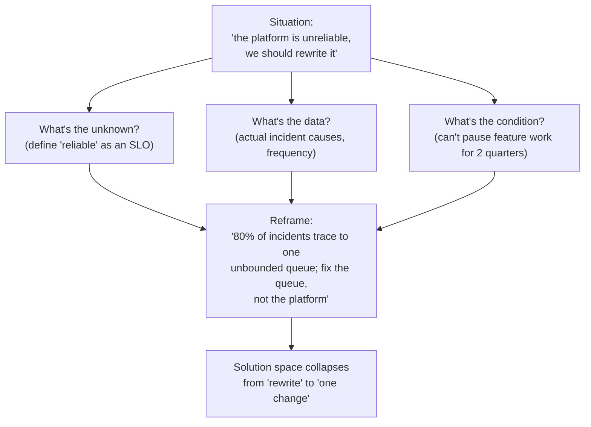

# Understanding the Problem — Professional

> **What?** Pólya's first stage operating at staff/principal scale: framing ambiguous, contested, organization-level problems where the unknown is itself disputed, the data is political, and the conditions are emergent — and where *problem framing* is the single highest-leverage thing a senior technical leader does.
> **How?** You diagnose stated-vs-real *business* needs across stakeholders, reframe problems to change what an entire team can see, separate the problem from premature solutions in roadmaps and architecture decisions, distribute a shared problem understanding so dozens of people execute against the same target, and build the organizational reflexes that catch misframed problems before they consume quarters.

---

At the staff and principal level, you rarely receive a clean problem. You receive a *situation*: an executive worry, a customer escalation, a metric trending wrong, three teams blocking each other, an architecture that "needs to be rewritten." None of these is a problem yet. Your highest-value contribution — more than any design or code — is converting situations into well-framed problems, because once a problem is framed correctly, competent engineers can solve it, and once it's framed *wrong*, no amount of talent will save the quarter. Pólya's first stage, scaled to an organization, is the work.

## 1. Problem framing as the highest-leverage skill

A useful way to see the leverage: the cost of a misframed problem scales with the number of people and the duration spent solving it. One engineer misunderstanding a ticket wastes a day. A 30-person org spending two quarters building the wrong platform wastes a fortune — and the loss is invisible until the end, because everything *looked* like progress. Velocity on the wrong problem is the most dangerous metric in engineering; teams that "move fast" on a misframed problem move fast in the wrong direction.

This reframes Boehm's cost-of-change curve at organizational scale. The cheapest possible intervention point is *before the problem is accepted as stated* — when reframing it costs a conversation, not a re-org. Principal engineers earn their title largely by intervening at that point: noticing that the problem on the table is the wrong problem, and saying so before forty people commit.

## 2. Stated business need vs. real business need

The XY problem, at the executive level, has the highest stakes and the thickest disguise. A request arrives as a solution, wrapped in authority, and questioning it reads as insubordination unless you do it skillfully.

| What's requested (Y) | The stated need | The real business need (X) | What changes if you find X |
| --- | --- | --- | --- |
| "Migrate everything to microservices" | "We need to scale" | Two teams can't deploy without coordinating; releases are slow and risky | The problem is *deployment coupling*, solvable without a full rewrite — maybe a few seams and a CI change |
| "Build an internal data platform" | "Teams keep building their own pipelines" | No one trusts the others' numbers; definitions drift | The problem is *semantic governance*, not infrastructure — a metrics catalog may beat a platform |
| "We need an AI feature" | "Competitors have one" | Sales is losing deals on a specific capability gap | The problem might be a single workflow, not a model |

The discipline: walk every executive request up to the **business outcome** it serves, and confirm that outcome with the people who own it. The senior-leader version of Pólya's "what is the unknown?" is **"what outcome would make this a success, measured how, and who decides?"** If three executives give three different answers, you haven't found a problem — you've found a disagreement to surface, and surfacing it *is* the work.

## 3. Reframing to change what an organization can see

The framing of a problem silently fixes its solution space; at scale, reframing is the most powerful tool a technical leader has, because it changes what an entire org can even consider.

- **"Our system is too slow"** → reframed as **"our p99 is dominated by one synchronous call in a flow used by 3% of traffic"** turns a vague rewrite into a scoped, one-sprint fix. Most "the system is slow / the codebase is bad / we need to rewrite" problems are *too coarse to act on*, and the leverage is in sharpening them.
- **"We need to reduce incidents"** → reframed as **"we have no way to safely roll back, so every incident lasts 40 minutes instead of 4"** moves the problem from prevention (hard, slow) to recovery (tractable, high-impact).
- **"Engineers are unhappy with the build"** → reframed as **"the median PR waits 2 hours for CI, so people batch changes, so PRs are large, so review is slow"** turns a morale complaint into a measurable bottleneck with a clear lever.

Each reframe is an exercise in Pólya's questions applied organizationally: *what is the actual unknown, what is the real data, what is the binding condition?* Done in a room, a good reframe visibly changes what people propose next — that's how you know it landed.

## 4. Separating the problem from premature solutions in decisions

Organizations encode solved-too-early problems into roadmaps, architecture decisions, and OKRs, where they're expensive to undo. A principal engineer's job is to catch the smuggling of solutions into problem statements *before* they harden.

- **In roadmaps:** an OKR that says "ship the new search service" is a *solution* masquerading as a goal. The goal is the outcome the service is meant to produce. If you can't restate the OKR as an outcome, the org has skipped understanding the problem — and will measure success by shipping the thing, not by solving anything.
- **In architecture review:** the most valuable question in an ADR review is often not "is this design good?" but **"what problem does this solve, and is that the right problem?"** Many designs are excellent answers to the wrong question. Reviewing the *problem statement* of an RFC is higher-leverage than reviewing its solution.
- **In incident review:** a postmortem that jumps to "add more monitoring" has skipped understanding the problem. The real unknown is *why the signal that existed wasn't acted on* — often an org problem, not a tooling one.

A practical guardrail: require every significant proposal to open with a problem statement that a stakeholder could *reject* — specific enough to be wrong. Solution-shaped goals can't be rejected, which is exactly why they're dangerous.

## 5. Distributing a shared understanding across a team

At individual scale, understanding lives in your head. At org scale, the understanding must be *replicated* — every engineer must be solving the same problem, or the system fractures along the seams of their differing interpretations. This is a distinct, harder skill: not understanding the problem yourself, but making forty people understand the *same* problem.

Mechanisms that actually work:

- **A canonical problem statement** owned by one person, referenced everywhere (the PRD, the RFC, the kickoff). One source of truth for "what we are solving" prevents each team from quietly solving a slightly different problem.
- **Explicit non-goals**, broadcast loudly. At scale, the failure mode isn't usually building the wrong feature — it's twelve people each assuming a different scope. Non-goals are the cheapest alignment tool that exists.
- **A worked example everyone has seen** — one concrete end-to-end scenario, traced through the whole system, that the whole team agrees is the thing they're building for. Concrete instances align teams the way abstractions never do.
- **Acceptance criteria as the contract** between teams. When team A's "done" and team B's "depends on A" are written as the same testable statements, the integration seam is defined before it's built.
- **A figure on the wall.** A shared system diagram with the problem boundary drawn on it lets you point at exactly where each team's responsibility starts and ends.

The test of distributed understanding: pull any engineer aside and ask "what problem are we solving and how will we know we succeeded?" If you get the same answer from people on different teams, the understanding is replicated. If you get divergent answers, you have a framing leak that will surface as an integration failure or a missed quarter.

## 6. Building organizational reflexes that catch misframing early

The principal-level endgame is not framing every problem yourself — it doesn't scale and it creates a bottleneck. It's installing the *reflexes* that make the org frame problems well by default:

- **"What's the X?" as culture.** Normalize asking, of any request, "what are we ultimately trying to achieve?" — including of executives — so that the XY problem gets caught by everyone, not just you.
- **Problem statements as gate.** Make a rejectable problem statement a required entry condition for any RFC, OKR, or large ticket. The forcing function does the work even when you're not in the room.
- **Reproduction/observation as a norm** for anything framed as broken — no theorizing about causes the team can't see. (See [debugging as problem-solving](../05-debugging-as-problem-solving/).)
- **Cheap reframing rituals:** pre-mortems ("assume this failed — why?"), inversion ("what would guarantee we *don't* solve this?"), and the five Ws applied to the business goal. These bake [questioning assumptions](../../05-first-principles-thinking/02-questioning-assumptions/) into how the org operates.

When these reflexes are in place, the organization stops confidently building the wrong thing — not because everyone became smarter, but because the system catches misframed problems while they're still cheap, which is the whole point of Pólya's first stage.

## 7. The leadership posture

A final, load-bearing point. At this level, *protecting the time to understand the problem* is itself a leadership act, performed against pressure. Executives want commitments; teams want to start; everyone is uncomfortable with a problem that isn't yet a plan. The discipline of saying **"we don't understand this well enough to commit yet — give me two days to frame it"** is unpopular in the moment and obviously correct in retrospect. Spending that credibility is what the role is for. The measure-twice-cut-once instinct, applied to a quarter of an org's effort, is worth more than any single technical decision you'll make.

---

**Connected ideas:** A framed org-level problem feeds [devising a plan](../02-devising-a-plan/) and is validated after the fact in [looking back and reflecting](../04-looking-back-and-reflecting/). When a team is stuck, reframing is often the unlock — see [techniques for when you're stuck](../06-techniques-when-you-are-stuck/). Catching solution-shaped goals draws on [questioning assumptions](../../05-first-principles-thinking/02-questioning-assumptions/); splitting a framed problem across teams is [decomposition](../../01-computational-thinking/01-decomposition/). Back to the [problem-solving section](../) and the [roadmap root](../../README.md).

---
## Check your understanding

Try to answer these questions from memory:

1. How do you surface implicit assumptions in a requirement?
2. What is "a problem well stated is a problem half solved," and do you believe it?
3. As a senior engineer, how is understanding the problem different from when you were junior?
4. Give a question you'd ask in this interview that would signal seniority.
