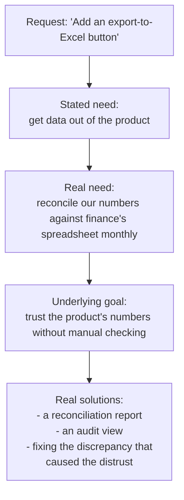
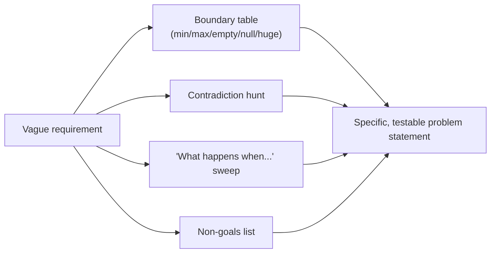

# Understanding the Problem — Senior

> **What?** Pólya's first stage treated as the highest-leverage engineering skill: precisely framing problems that arrive underspecified, contradictory, or disguised as solutions — and resisting the strong pull to start building before the problem is actually nailed down.
> **How?** You reconstruct the unknown/data/conditions from incomplete information, separate stated from real needs across stakeholders, force ambiguity and hidden constraints into the open, choose the *right* problem to solve, and encode the shared understanding as testable acceptance criteria that survive contact with reality.

---

By the senior level, the failure mode is no longer "I didn't understand the task." It's "the whole team confidently built the wrong thing because everyone *thought* they understood it and no one wrote it down precisely." Understanding the problem stops being a personal habit and becomes a **risk-management discipline you apply on behalf of others**. The most expensive engineering mistakes are not bad code — they are well-executed solutions to misunderstood problems.

## 1. Why this stage has the highest leverage of all four

Pólya's four stages — understand, plan, execute, look back — are not equally forgiving. An error in *carrying out the plan* is a bug: localized, visible, cheap to fix. An error in *understanding the problem* is silent and compounding — it propagates into the plan, the architecture, the tests, and the acceptance criteria, all of which now faithfully encode the wrong target.

This is Boehm's cost-of-change curve, but the deeper point is about **error visibility**. A coding error fails loudly: a test breaks, a stack trace appears. A *comprehension* error fails quietly — the system works exactly as built, just on the wrong problem — and is often only discovered when a user, an auditor, or an outage reveals the mismatch months later. There is no compiler for "you solved the wrong problem." The only defense is spending disproportionate care here, where it's cheapest, which is precisely Kettering's **"a problem well stated is a problem half solved."**

## 2. Reconstructing Pólya's questions from incomplete reality

Pólya assumed a well-posed problem. Senior work begins with an *ill-posed* one, and the skill is reconstructing the three elements when they're missing or wrong.

| Pólya's element | The senior difficulty | Technique |
| --- | --- | --- |
| **The unknown** | The desired end state is described as a feeling ("make onboarding smoother") or a vanity metric | Convert to an observable, measurable outcome: "increase activation (first key action within 24h) from 30% to 45%" |
| **The data** | The "givens" are wrong — stale assumptions, mis-stated current behavior, a system that doesn't behave as documented | Verify the data empirically; read the code and the logs, don't trust the description |
| **The condition** | The real constraints (latency budget, compliance, on-call cost, migration risk) are unstated and discovered late | Enumerate constraints explicitly and have stakeholders confirm them in writing |

A senior engineer treats the ticket as a *hypothesis about the problem*, not the problem itself, and validates each of the three elements against reality before accepting it.

## 3. Stated need vs. real need across stakeholders

Underneath every feature request is a need; underneath every need is a goal. The XY problem scales up: the "X" might be a business outcome two layers removed from the request, and different stakeholders may be describing different problems while using the same words.

The export button (Y) might never touch the real problem (numbers they don't trust). The senior move is to walk *up* the chain — "what will you do with the export once you have it?" — until you reach a goal that's stable across stakeholders. Often the request evaporates, replaced by something cheaper and more durable. This is the difference between an order-taker and an engineer: order-takers ship X-shaped solutions to Y-shaped requests; engineers find the real X.

A common organizational hazard: each stakeholder optimizes a *local* X. Support wants fewer tickets, sales wants a demo feature, the PM wants a roadmap item. Naming whose problem you're actually solving — and which problems you're explicitly *not* solving — is part of understanding it.

## 4. Choosing the right problem to solve

Underrated and senior: not every well-understood problem is worth solving, and the framing determines the solution space.

- **Reframe to shrink the problem.** "We need a faster batch job" might dissolve into "we don't need this job to run synchronously at all." The cheapest solution to a problem is often discovered by questioning whether the problem, as posed, needs to exist.
- **Reframe to widen the solution space.** "How do we cache this expensive query?" presupposes the query is necessary. "How do we avoid needing this query on the hot path?" admits denormalization, precomputation, or a different access pattern. The *level* at which you state the problem decides which solutions are even thinkable.
- **Check the problem is real and large.** Reproduce it, measure it. "Users complain it's slow" — for how many users, how often, costing what? A problem that's real but tiny doesn't deserve a large solution.

## 5. Forcing ambiguity into the open

Ambiguity is comfortable because it lets everyone agree without agreeing. The senior job is to make the disagreement visible *now*, on a doc, instead of *later*, in production.

Practical instruments:

- **The contradiction hunt.** Read the requirements looking for two statements that can't both be true. "Must be real-time" + "must be eventually consistent across regions" is a contradiction someone has to resolve before you architect anything.
- **The boundary table.** For every input, list min, max, empty, null, malformed, and "huge." Each row that has no defined behavior is an undiscovered requirement.
- **The "what happens when…" sweep.** Concurrency, partial failure, retries, time zones, duplicates, ordering. "Send a confirmation email" hides *exactly-once or at-least-once? what if the send fails after the order commits?*
- **Negative scope.** Explicitly write what the solution will *not* do. Stating non-goals is one of the fastest ways to expose a stakeholder who assumed it was in scope.

## 6. Worked example: from a real-flavored ticket to a problem

> **Ticket:** "Payments are sometimes double-charged. Add idempotency."

A junior adds an idempotency key and closes the ticket. A senior treats the ticket as a hypothesis and tests it.

1. **Reproduce / observe.** Pull the double-charge events. *Are* they double charges, or two legitimate charges? When do they cluster — on client retries, on a specific gateway timeout, on a deploy?
2. **Pólya's grid.**
   - *Unknown:* a payment flow where retrying a failed-but-maybe-succeeded request never charges twice.
   - *Data:* the current flow, the gateway's own idempotency support, the retry behavior of the client and the queue.
   - *Condition:* must not *drop* legitimate charges (false-negative is as bad as the bug); must survive process crashes between charge and record.
3. **XY check.** "Add idempotency" is Y. X is "the customer is charged exactly the right amount." Idempotency on *our* side is useless if the gateway already charged and we never recorded it — the real problem may be a missing transactional outbox, not a missing key.
4. **Ambiguity sweep.** What's the idempotency window? What if the same cart is *deliberately* paid twice? Is the key the order ID or the attempt ID? Each answer changes the design.
5. **Acceptance criteria.** "Retrying any payment request with the same idempotency key within 24h returns the original result and never initiates a second gateway charge, verified by a forced-timeout-then-retry integration test."

Notice the ticket's proposed solution ("add idempotency") survived, but its *meaning* changed completely — and a more dangerous bug (lost charges) was uncovered in the *understanding*, before a line of code.

## 7. Encoding shared understanding so it survives

Understanding that lives only in your head isn't yet an engineering asset. Encode it where it can be checked and contested:

- **A one-paragraph problem statement** at the top of the design doc: the unknown, the data, the conditions, and the non-goals — in plain language a stakeholder can veto.
- **Executable acceptance criteria** (Gherkin scenarios, a test list) that make "done" unambiguous and double as the spec.
- **A figure** — a sequence diagram, a state machine, a before/after data flow — because diagrams can't hide the ambiguity that prose tolerates.
- **An explicit assumptions list**, each marked *verified* or *unverified*. Unverified assumptions are risks; naming them lets the team decide whether to spend time confirming them now or accept the risk.

The test of whether you've understood a problem isn't whether *you* feel clear. It's whether someone who disagrees can read your statement and point to *exactly* the sentence they disagree with. Vague statements can't be disagreed with — which is why they're dangerous.

---

**Connected ideas:** A well-framed problem flows into [devising a plan](../02-devising-a-plan/); after shipping, you verify your framing held in [looking back and reflecting](../04-looking-back-and-reflecting/). For defects, framing *is* reproduction — see [debugging as problem-solving](../05-debugging-as-problem-solving/); when framing fails entirely, consult [techniques for when you're stuck](../06-techniques-when-you-are-stuck/). The assumption-hunting muscle is [questioning assumptions](../../05-first-principles-thinking/02-questioning-assumptions/); breaking the framed problem apart is [decomposition](../../01-computational-thinking/01-decomposition/). Back to the [problem-solving section](../) and the [roadmap root](../../README.md).

---
## Check your understanding

Try to answer these questions from memory:

1. What makes a good clarifying question versus a bad one?
2. How do concrete examples and edge cases help you *understand* a problem (not just test it)?
3. Walk me through understanding "reverse the words in a sentence."
4. What does "definition of done" have to do with understanding a problem?
