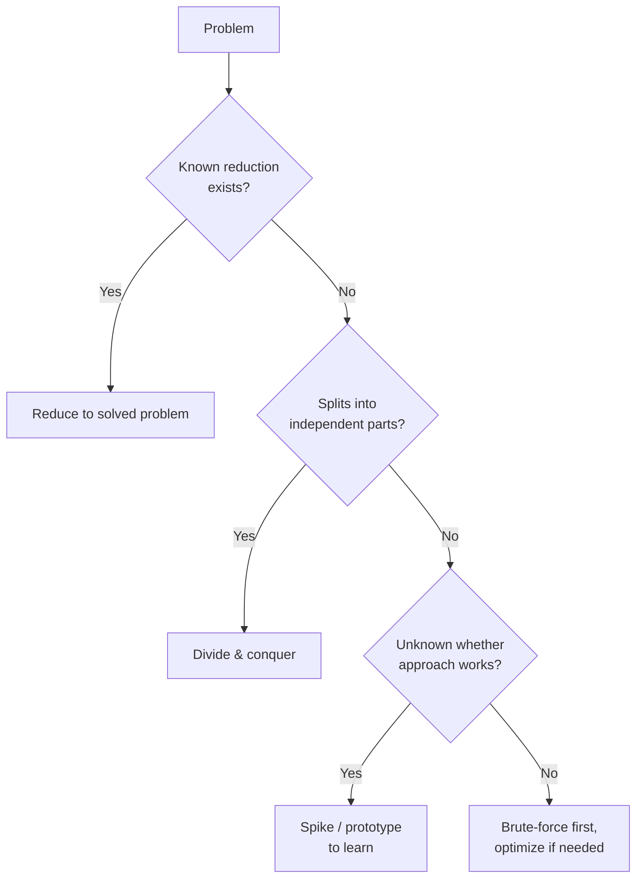

# Devising a Plan — Middle

> **What?** Devising a plan is the deliberate act of choosing a *strategy* — a class of approach — and sequencing its steps, before committing to tactics (specific code, libraries, data structures). It is the bridge between understanding and execution in [Pólya's *How to Solve It*](../).
> **How?** You generate two or three candidate approaches, map each to a known problem class, judge them by risk and reversibility, then sequence the chosen one *riskiest-part-first* so the unknown gets tested early. The plan is written as a checkable hypothesis, not as code.

---

At the junior level a plan is "a few steps in plain English." At the middle level the job grows in three directions: you **generate more than one** plan and choose between them, you **name the strategy** you're using (divide & conquer, reduce-to-known, brute-force-then-optimize), and you **sequence by risk** so that if the plan is going to fail, it fails fast and cheap.

## 1. Auxiliary problems: the related-problem heuristic, used well

Pólya's central trick for finding a plan is the **auxiliary problem** — a different, usually easier problem whose solution helps you solve the real one. His questions:

- *Have you seen the same problem in a slightly different form?*
- *Do you know a related problem? A problem with the same unknown?*
- *Here is a problem related to yours and solved before. Could you use it?*

In engineering this is the **reduce-to-a-solved-problem** move, and it's the highest-leverage thing you can do. Examples:

| Your task | Reduces to (the known problem) | The plan becomes |
|---|---|---|
| "Detect cycles in our task-dependency graph" | Cycle detection in a directed graph | Topological sort; if it fails, there's a cycle |
| "Rate-limit this endpoint" | Token bucket / leaky bucket | Apply the known algorithm; don't invent one |
| "Schedule jobs so the latest one finishes earliest" | Interval / greedy scheduling | Sort by finish time, greedy pick |
| "Find the closest matching string" | Edit distance | DP table, O(mn) |

The skill is *recognizing* the reduction. That recognition is [pattern recognition](../../01-computational-thinking/02-pattern-recognition/) applied to whole problem classes. When you can name the class, you inherit a known-good algorithm, its complexity, and its pitfalls — for free. **Always ask "what is this *really*?" before designing anything bespoke.** Bespoke is for when no reduction exists.

## 2. The strategy patterns

When no off-the-shelf reduction fits, you reach for a general *strategy*. The four you'll use most:

### Divide & conquer
Split the problem into independent sub-problems, solve each, combine. The plan is the *split* and the *combine*; the sub-problems often reduce to known problems.

> "Migrate 40M rows to a new schema without downtime." Divide: do it in batches of 10k by primary-key range. Each batch is the same small, safe operation. Combine: when all ranges are done, flip the read path.

### Reduce to a solved problem
Section 1. Transform your problem into one you already know how to solve.

### Brute-force-then-optimize
Write the obviously-correct, possibly-slow version first; measure; optimize only the part that's actually slow.

> Plan: (1) correct O(n²) version, (2) benchmark on real data, (3) *if* too slow, add an index / hash map / cache. Steps 2 and 3 are conditional — you may never need them.

This is a *risk-reducing* sequence: correctness first, performance second, and you only pay for performance work if measurement says you must.

### Spike / prototype
When the unknown is "will this even work?", the plan is to *learn*, not to ship. You build a throwaway prototype to answer one question, then throw it away and plan for real. This deserves its own treatment — see [Spikes and Prototypes](../../09-scientific-and-hypothesis-driven/04-spikes-and-prototypes/). The key discipline: **a spike answers a question; it is not the foundation you build on.**



## 3. Generate before you choose

A middle-level mistake is grabbing the *first* plan that appears and running with it. The senior habit is to generate **two or three** candidate approaches before committing — the [divergent-then-convergent](../../07-creative-and-lateral-thinking/01-divergent-vs-convergent/) move: spread options out, *then* narrow.

> Task: "Make the dashboard load in under 1 second; it currently takes 6."
> - **Plan A:** add a Redis cache in front of the slow query.
> - **Plan B:** denormalize the data into a precomputed table, refreshed hourly.
> - **Plan C:** paginate / lazy-load so the first paint is fast and the rest streams in.

Three real approaches, with different costs and risks. If you'd grabbed Plan A immediately, you'd never have considered that Plan C ships in an afternoon and needs no new infrastructure. **Cheap to list, expensive to skip.**

## 4. Choose by risk and reversibility

Now choose. The two axes that matter most are **risk** (how likely is this to fail or surprise me?) and **reversibility** (how hard is it to undo if it does?).

| | Reversible (easy to undo) | Irreversible (hard to undo) |
|---|---|---|
| **Low risk** | Just do it | Do it, but double-check |
| **High risk** | Try it, watch closely, be ready to revert | **Danger zone** — spike first, get a second opinion |

The danger zone — high-risk *and* hard-to-undo — is where you slow down: prototype it, write a design doc, ask a senior. A schema migration that drops a column is here. A CSS tweak behind a feature flag is the opposite corner — just try it.

This maps onto the junior rule "don't over-plan reversible changes," but now it's a 2×2 you can actually point at in a review.

## 5. Sequence riskiest-part-first

Once you've chosen an approach, *order the steps*. The default instinct is to do the easy, satisfying parts first. **Resist it.** Do the **riskiest, most uncertain part first** — the part most likely to invalidate the whole plan.

> Plan: integrate a third-party payments API.
> Tempting order: build the UI, build the order model, wire up the database, *then* call the payment API.
> Risk-first order: **call the payment API in a throwaway script on day one.** If their sandbox is broken, their docs are wrong, or they don't support your currency — you find out before you've built a UI around an assumption that doesn't hold.

The principle: **de-risk the unknown early.** The cost of discovering a fatal flaw scales with how much you've built on top of it. Front-load the discovery.

```
WEAK ordering (easy → hard):   [easy] [easy] [easy] [💥 fatal unknown]  ← discovered last, most code wasted
STRONG ordering (risk → easy): [💥 fatal unknown] [easy] [easy] [easy]  ← discovered first, nothing wasted
```

## 6. Concrete enough to check, not so detailed it's coding

The plan must be checkable. A teammate should be able to read it and spot a flaw *without* reading code. So write the *decisions* and the *sequence*, not the syntax:

```
PLAN: sub-1s dashboard (chose Plan C — lazy-load)
RISKIEST FIRST:
1. Spike: can the summary endpoint return in <200ms with just top-line numbers?
   (If no, this whole plan is dead — try Plan B.)
2. Split the page: top-line summary (sync) + detail panels (lazy).
3. Detail panels fetch on scroll / on demand.
4. Add a skeleton loader so perceived load is fast.
CHECK: does step 1 actually de-risk the assumption? Yes — if the summary
is slow, lazy-loading won't help and we pivot before building UI.
```

Notice step 1 explicitly states what would *kill* the plan. That's the mark of a checkable plan: it names its own failure condition. If you can't say what would falsify your plan, you haven't planned — you've hoped.

## 7. The plan is a hypothesis

Everything above produces a *hypothesis*: "I believe this sequence of steps will close the gap." Stage 3, [Carrying Out the Plan](../03-carrying-out-the-plan/), is the experiment that tests it. When a step fails, you don't grind — you return to *this* stage and re-plan, now knowing more. The faster you can cycle plan → test → re-plan, the better you are. This is the engine of [hypothesis-driven development](../../09-scientific-and-hypothesis-driven/04-spikes-and-prototypes/).

## Where this fits

- After **[Understanding the Problem](../01-understanding-the-problem/)**; before **[Carrying Out the Plan](../03-carrying-out-the-plan/)**.
- Strategy patterns lean on **[pattern recognition](../../01-computational-thinking/02-pattern-recognition/)** and **[divergent thinking](../../07-creative-and-lateral-thinking/01-divergent-vs-convergent/)**.
- Spikes get full treatment in **[Spikes and Prototypes](../../09-scientific-and-hypothesis-driven/04-spikes-and-prototypes/)**.
- When no plan appears: **[Techniques When You Are Stuck](../06-techniques-when-you-are-stuck/)**.
- Back to the **[roadmap root](../../README.md)**.

---
## Recall and apply

**Practice loop:** Compare a direct plan with one alternative. Record the next step, success signal, risk, and fallback.

Try to answer these questions from memory:

1. What's the difference between working forward and working backward?
2. What does "reduce to a solved problem" mean, and why is it powerful?
3. You think of one approach immediately. Should you start building it?
4. How do you choose between two candidate plans?
