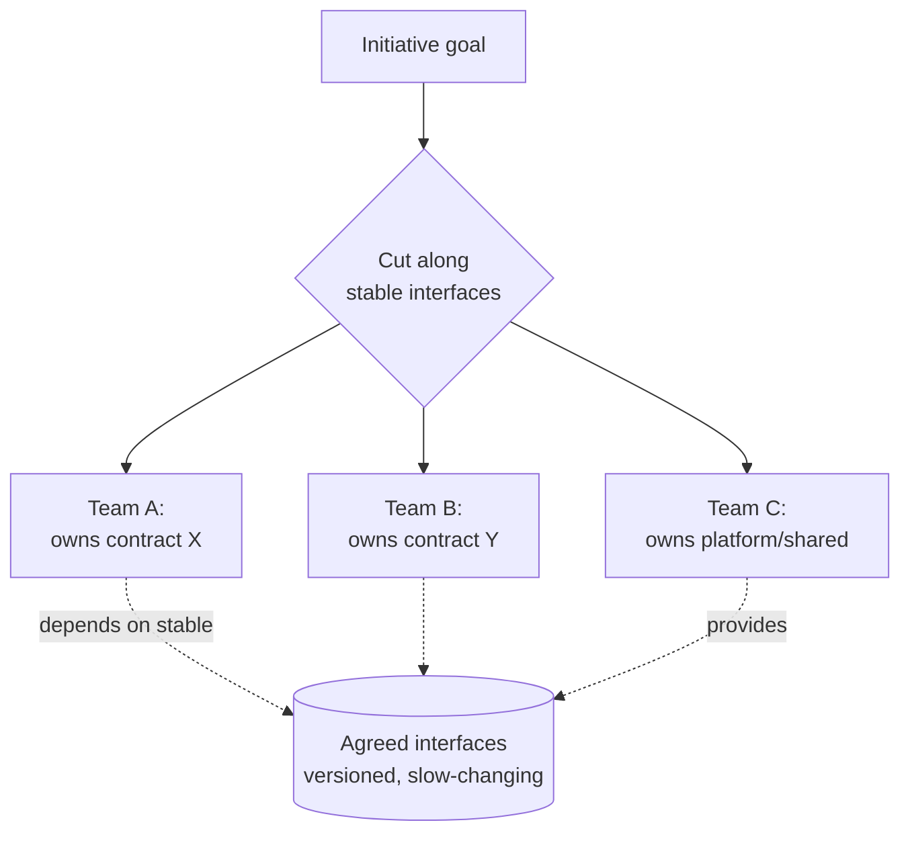

# Devising a Plan — Professional

> **What?** At staff/principal level, devising a plan is *technical strategy across teams and quarters*: choosing among architectural directions whose costs play out over years, sequencing a multi-team initiative to retire institutional risk first, and producing a plan that aligns autonomous teams without micromanaging them — [Pólya's](../) second stage applied to organizations.
> **How?** You frame the problem space so the *right* approaches are even considered, decompose the initiative so teams can work in parallel against stable interfaces, sequence to retire the unknowns that would force a re-org of the plan, and write the plan as a strategy with explicit assumptions, kill-criteria, and decision rights — durable enough to survive leadership changes, attrition, and shifting priorities.

---

The [senior page](./senior.md) plans a system. This page plans a *program of work* spanning several teams and one or more years, where the dominant risks are no longer technical-only — they're coordination risk, sequencing risk, and the risk that the problem itself was framed wrong. Pólya still applies, but the "unknown" is now "what is the right technical direction for this organization, given where it's going?"

## 1. Plan the frame before you plan the solution

The highest-leverage staff move happens *before* any approach is on the table: **getting the problem framed correctly**, which is the handoff from [Understanding the Problem](../01-understanding-the-problem/). At this scale the most expensive failures are perfectly-executed solutions to the wrong problem.

> Brief: "Plan the migration off the monolith to microservices."
> A staff engineer does not start sketching service boundaries. They reframe: *Why? What outcome does the business need — independent deploy cadence? team autonomy? scaling a specific hot path?* Each answer implies a **different** plan. If the real need is "the checkout team is blocked by the monolith's release train," the plan might be *extract checkout only* — not a years-long full decomposition that solves a problem no one has.

Pólya's "restate the problem" and "what is the unknown, really?" become, at this altitude, *strategy questions with org-wide blast radius*. The plan you devise is only as good as the problem you chose to solve. **Spend disproportionate effort here**; it's the cheapest place to be right.

## 2. Decompose so teams compose

A single-system plan sequences *steps*. A multi-team plan must decompose into **work that teams can own independently** — which means the decomposition is really an *interface design* problem (a [reduce-to-known](./middle.md) move: program planning reduces to defining stable contracts and minimizing the dependencies across them).

The planning question is no longer "what's the next step?" but **"what are the seams along which teams can work without blocking each other?"**



The seams *are* the plan. Get them wrong and every team blocks every other team; you've created a coordination tax that no amount of standups will pay down. Get them right and the program parallelizes. This is why staff plans often spend their first phase **defining and stabilizing interfaces** — the cross-team contracts — before feature work begins. It's the riskiest-part-first principle applied to *coordination* risk: the contract everyone depends on is the one-way door; nail it before teams build on it.

## 3. Sequence to retire institutional risk first

The senior page sequences technical spikes first. The staff page extends "riskiest-part-first" to risks that aren't in the code:

| Risk class | Example | How the plan retires it early |
|---|---|---|
| **Technical** | "Can the new store hit our latency SLO?" | Spike / load test in phase 0 |
| **Integration** | "Will three teams' contracts actually compose?" | Build a thin end-to-end *walking skeleton* first — one trivial path through all teams' surfaces |
| **Organizational** | "Does the team that owns the dependency have the capacity?" | Confirm staffing & priority *before* sequencing dependent work |
| **Validation** | "Will customers / the business even want this outcome?" | Ship a narrow slice to real users early; don't build the whole thing on an unvalidated assumption |

The **walking skeleton** deserves emphasis: instead of each team building its piece fully and integrating at the end (where all the integration risk lands, late, expensively), the plan threads one *thin* path through every team's surface first. It proves the seams compose while they're still cheap to move. This is divide-and-conquer's *combine* step, de-risked early — the single most effective antidote to "it all worked in isolation and exploded at integration."

```
WEAK program plan:  [Team A builds all of X] [Team B builds all of Y] ... [💥 integrate at the end]
STRONG program plan: [thin path through A+B+C — prove seams] → [teams fill in depth in parallel] → [integration already de-risked]
```

## 4. Choose architectural direction by total cost over time

At this level, "choose by risk and reversibility" matures into **choosing by lifecycle cost** — because the decisions are one-way doors whose cost compounds for years.

> Direction A: adopt an off-the-shelf event platform. Lower build cost, ongoing license + lock-in, faster to value.
> Direction B: build on open-source primitives. Higher build + operational cost, full control, no vendor risk.
> Direction C: extend the existing system. Lowest near-term cost, accrues technical debt that may force a rewrite in two years.

The staff plan evaluates these on **build cost, run cost, switching cost, and optionality** (does this choice keep future doors open or close them?). A common, expensive failure is optimizing for build cost — what ships this quarter — while ignoring run cost and switching cost, which dominate the multi-year total. The plan must state which axis it's optimizing and *why that's the right axis for where the business is going*. Make the assumption explicit so it can be revisited when the business changes.

## 5. Write the plan as a strategy document, not a task list

The artifact at this level is a **technical strategy / planning doc** whose job is to *align autonomous teams without dictating their tactics*. It operates at the altitude of: direction, sequence, interfaces, assumptions, decision rights, and kill-criteria. It explicitly does **not** specify each team's internal design — that's their autonomy, and prescribing it both demotivates and out-runs your own knowledge.

A durable plan states, at minimum:

```
GOAL & non-goals.................. what success is, and explicitly what it is NOT
CHOSEN DIRECTION + alternatives... what we're doing and what we rejected, with reasons
KEY ASSUMPTIONS................... the beliefs this plan rests on (each one a future re-eval trigger)
SEQUENCE & phases................. risk-ordered; what each phase proves before the next starts
INTERFACES / seams............... the cross-team contracts (the one-way doors)
KILL / PIVOT CRITERIA............. observations that would change the plan, named in advance
DECISION RIGHTS.................. who decides what (so the plan doesn't stall waiting on you)
ROLLBACK / off-ramps............. how we retreat from each phase
```

The **assumptions** and **kill-criteria** sections are what make the plan survive contact with reality. Reality *will* violate an assumption — a team gets reorged, a vendor changes pricing, traffic 10×'s. A plan that has named its assumptions tells you *exactly which beliefs to re-check* when the ground shifts, instead of forcing a from-scratch re-plan. The plan that survives is not the one that was right; it's the one that knew what it was assuming.

## 6. Plan for the plan to change hands

A multi-quarter plan will outlive your continuous attention. People leave, you get pulled onto a fire, priorities shift mid-flight. So a staff-level plan is written to be **steerable by others**:

- **Self-explaining:** the *why* is on the page, so a new lead doesn't undo a decision without knowing what it solved.
- **Checkpointed:** explicit go/no-go gates ([Looking Back](../04-looking-back-and-reflecting/) built into the timeline) so progress is legible without you in the room.
- **Decentralized:** decision rights are distributed, so the plan doesn't block on a single person.

This is the organizational analog of the senior page's "design the feedback loop in." The plan isn't a static map you hand down; it's a *control system* the org can run without you holding the wheel every minute.

## 7. When NOT to over-plan — at scale

The "don't over-plan reversible changes" rule has a staff-level form, and getting it wrong is a common principal failure: **over-planning the parts of the program that are two-way doors, and under-planning the one-way doors.**

A six-month upfront plan for a domain that's still being validated is waterfall in disguise — it'll be obsolete by month two. The fix: plan the **next de-risking phase** in detail and the rest as *direction*. Commit firmly to the one-way doors (the data model, the core interfaces, the architectural direction); keep the two-way doors (which framework, which queue, the rollout order of low-risk features) as late and cheap as possible. **Defer reversible decisions to the last responsible moment**; spend your planning capital on the decisions you can't take back.

## Where this fits

- Depends on excellent **[problem framing](../01-understanding-the-problem/)** — at this scale, framing errors are the most expensive errors.
- Hands risk-ordered, interface-defining phases to **[Carrying Out the Plan](../03-carrying-out-the-plan/)**.
- Bakes **[Looking Back](../04-looking-back-and-reflecting/)** into phase gates and assumption re-checks.
- Direction-finding is **[divergent vs. convergent thinking](../../07-creative-and-lateral-thinking/01-divergent-vs-convergent/)** at program scale; de-risking uses **[spikes & prototypes](../../09-scientific-and-hypothesis-driven/04-spikes-and-prototypes/)**.
- Recognizing the initiative as an instance of a known program shape is **[pattern recognition](../../01-computational-thinking/02-pattern-recognition/)**.
- Back to the **[roadmap root](../../README.md)**.

---
## Recall and apply

**Practice loop:** Compare a direct plan with one alternative. Record the next step, success signal, risk, and fallback.

Try to answer these questions from memory:

1. A spike and an implementation both produce code. What's the difference, and how does it fit planning?
2. Your plan's step 2 turns out to be impossible mid-build. What do you do?
3. How does devising a plan change from a single function to a multi-team initiative?
4. How do you keep a plan from being either too vague or too rigid?
